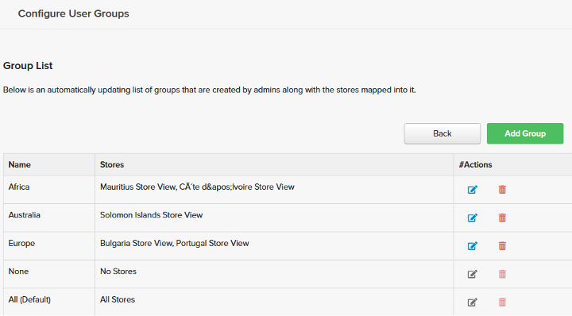
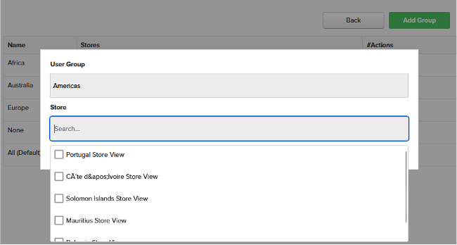

# Avancerad användarhantering

Funktionen [!DNL Advanced User Management] ger förbättrad datainsynlighet och aktiverar logisk datafiltrering baserat på användargrupper (organisationsregioner). Det gör att ni kan skräddarsy datainsynligheten baserat på användargrupper och eliminerar behovet av att skapa en kopia av befintliga kontrollpaneler för att uppfylla regionspecifika rapporteringskrav varje gång verksamheten expanderar till en ny region.

[!DNL Advanced User Management] förenklar delning av instrumentpaneler och synlighet av data samtidigt som säkerhet och skalbarhet garanteras för stora organisationer. Flexibiliteten att konfigurera användargrupper, roller och behörigheter gör Commerce Intelligence till ett kraftfullt verktyg för krav på företagsnivå.

När [!DNL Advanced User Management] är aktiverat har bara administratörsanvändare åtkomst till följande inställningar:

- Mått
- Visual Report Builder
- SQL-baserade rapporter
- E-postsammanfattning
- Råexport

## Funktionsmatris

[!DNL Advanced User Management] påverkar flera funktioner i Commerce Intelligence. I följande tabell beskrivs funktioner, behörigheter och deras tillgänglighet för olika roller beroende på vilken funktion som aktiveras eller inaktiveras.

<table><thead>
  <tr>
    <th colspan="3" rowspan="2">Commerce Intelligence Features</th>
    <th colspan="6">Funktioner för avancerad användarhantering (AUM)</th>
  </tr>
  <tr>
    <th colspan="3">Handikappade</th>
    <th colspan="3">Aktiverad</th>
  </tr></thead>
<tbody>
  <tr>
    <td>Funktionsgrupp</td>
    <td>Funktion</td>
    <td>Behörigheter</td>
    <td>Administratör</td>
    <td>Standard</td>
    <td>Skrivskyddad</td>
    <td>Administratör</td>
    <td>Standard</td>
    <td>Skrivskyddad</td>
  </tr>
  <tr>
    <td rowspan="7">Hantera användare (tillgängliga för alla administratörer och påverkar alla roller)</td>
    <td>Konfigurera användargrupper</td>
    <td></td>
    <td></td>
    <td></td>
    <td></td>
    <td>✓</td>
    <td></td>
    <td></td>
  </tr>
  <tr>
    <td>Bjud in användare</td>
    <td></td>
    <td>✓</td>
    <td></td>
    <td></td>
    <td>✓</td>
    <td></td>
    <td></td>
  </tr>
  <tr>
    <td>Fliken Behörigheter - rollmappning</td>
    <td></td>
    <td>✓</td>
    <td></td>
    <td></td>
    <td>✓</td>
    <td></td>
    <td></td>
  </tr>
  <tr>
    <td>Fliken Behörigheter - mappning av användargrupp (AUM)</td>
    <td></td>
    <td></td>
    <td></td>
    <td></td>
    <td>✓</td>
    <td></td>
    <td></td>
  </tr>
  <tr>
    <td>Fliken Behörigheter - lagrar delmängdsmappning (AUM)</td>
    <td></td>
    <td></td>
    <td></td>
    <td></td>
    <td>✓</td>
    <td></td>
    <td></td>
  </tr>
  <tr>
    <td>Fliken Metrisk</td>
    <td></td>
    <td>✓</td>
    <td></td>
    <td></td>
    <td>✓</td>
    <td></td>
    <td></td>
  </tr>
  <tr>
    <td>Fliken Delade instrumentpaneler</td>
    <td></td>
    <td>✓</td>
    <td></td>
    <td></td>
    <td>✓</td>
    <td></td>
    <td></td>
  </tr>
  <tr>
    <td rowspan="2">Report Builder</td>
    <td>Visual Report Builder</td>
    <td></td>
    <td>✓</td>
    <td>✓</td>
    <td></td>
    <td>✓</td>
    <td></td>
    <td></td>
  </tr>
  <tr>
    <td>SQL REPORT BUILDER</td>
    <td></td>
    <td>✓</td>
    <td></td>
    <td></td>
    <td>✓</td>
    <td></td>
    <td></td>
  </tr>
  <tr>
    <td rowspan="2">E-postsammanfattning</td>
    <td>Skapa e-postsammanfattningar utan datapartitionering</td>
    <td></td>
    <td>✓</td>
    <td>✓</td>
    <td></td>
    <td>✓</td>
    <td></td>
    <td></td>
  </tr>
  <tr>
    <td>Skapa e-postsammanfattningar med datapartitionering (AUM)</td>
    <td></td>
    <td></td>
    <td></td>
    <td></td>
    <td>✓</td>
    <td></td>
    <td></td>
  </tr>
  <tr>
    <td rowspan="4">Kontrollpaneler  - Dela</td>
    <td>Dela instrumentpanelen med användare över roller</td>
    <td></td>
    <td>✓</td>
    <td>✓</td>
    <td></td>
    <td></td>
    <td></td>
    <td></td>
  </tr>
  <tr>
    <td>Dela Dashboard med användargrupper och administratörer (AUM)</td>
    <td></td>
    <td></td>
    <td></td>
    <td></td>
    <td>✓</td>
    <td></td>
    <td></td>
  </tr>
  <tr>
    <td rowspan="2">Dela instrumentpanel - behörigheter</td>
    <td>Redigera</td>
    <td>✓</td>
    <td>✓</td>
    <td></td>
    <td></td>
    <td></td>
    <td></td>
  </tr>
  <tr>
    <td>Visa</td>
    <td>✓</td>
    <td>✓</td>
    <td></td>
    <td>✓</td>
    <td></td>
    <td></td>
  </tr>
  <tr>
    <td rowspan="18">Kontrollpaneler - Visa (öppna delad instrumentpanel med behörighet)</td>
    <td rowspan="2">Dela en delad instrumentpanel</td>
    <td>Redigera</td>
    <td>✓</td>
    <td>✓</td>
    <td></td>
    <td></td>
    <td></td>
    <td></td>
  </tr>
  <tr>
    <td>Visa</td>
    <td></td>
    <td></td>
    <td></td>
    <td></td>
    <td></td>
    <td></td>
  </tr>
  <tr>
    <td rowspan="2">Datumfilter (utan funktionsflagga för REDIGERA TID-alternativ)</td>
    <td>Redigera</td>
    <td>✓</td>
    <td>✓</td>
    <td>✓</td>
    <td></td>
    <td></td>
    <td></td>
  </tr>
  <tr>
    <td>Visa</td>
    <td></td>
    <td></td>
    <td></td>
    <td>✓</td>
    <td></td>
    <td></td>
  </tr>
  <tr>
    <td rowspan="2">Datumfilter (med funktionsflagga för REDIGERA TID-alternativ)</td>
    <td>Redigera</td>
    <td>✓</td>
    <td>✓</td>
    <td>✓</td>
    <td></td>
    <td></td>
    <td></td>
  </tr>
  <tr>
    <td>Visa</td>
    <td>✓</td>
    <td>✓</td>
    <td></td>
    <td>✓</td>
    <td>✓</td>
    <td>✓</td>
  </tr>
  <tr>
    <td rowspan="2">Butiksfilter (utan funktionsflagga för REDIGERA TIME-alternativ)</td>
    <td>Redigera</td>
    <td>✓</td>
    <td>✓</td>
    <td>✓</td>
    <td></td>
    <td></td>
    <td></td>
  </tr>
  <tr>
    <td>Visa</td>
    <td>✓</td>
    <td>✓</td>
    <td></td>
    <td>✓</td>
    <td>✓</td>
    <td></td>
  </tr>
  <tr>
    <td rowspan="2">Butiksfilter (med funktionsflagga för REDIGERA TID-alternativ)</td>
    <td>Redigera</td>
    <td>✓</td>
    <td>✓</td>
    <td>✓</td>
    <td></td>
    <td></td>
    <td></td>
  </tr>
  <tr>
    <td>Visa</td>
    <td>✓</td>
    <td>✓</td>
    <td></td>
    <td>✓</td>
    <td>✓</td>
    <td></td>
  </tr>
  <tr>
    <td rowspan="2">Kontrollpanelsdata - Filtrera rapportdata baserat på användargruppsmappning (AUM)</td>
    <td>Redigera</td>
    <td></td>
    <td></td>
    <td></td>
    <td></td>
    <td></td>
    <td></td>
  </tr>
  <tr>
    <td>Visa</td>
    <td></td>
    <td></td>
    <td></td>
    <td>✓</td>
    <td>✓</td>
    <td>✓</td>
  </tr>
  <tr>
    <td rowspan="2">Rapport - redigera</td>
    <td>Redigera</td>
    <td>✓</td>
    <td>✓</td>
    <td></td>
    <td>✓</td>
    <td></td>
    <td></td>
  </tr>
  <tr>
    <td>Visa</td>
    <td></td>
    <td></td>
    <td></td>
    <td>✓</td>
    <td></td>
    <td></td>
  </tr>
  <tr>
    <td rowspan="2">Rapportexport (CSV, XLSX)</td>
    <td>Redigera</td>
    <td>✓</td>
    <td>✓</td>
    <td>✓</td>
    <td>✓</td>
    <td></td>
    <td></td>
  </tr>
  <tr>
    <td>Visa</td>
    <td>✓</td>
    <td>✓</td>
    <td>✓</td>
    <td>✓</td>
    <td>✓</td>
    <td>✓</td>
  </tr>
  <tr>
    <td rowspan="2">Rapport - råexport</td>
    <td>Redigera</td>
    <td>✓</td>
    <td>✓</td>
    <td></td>
    <td>✓</td>
    <td></td>
    <td></td>
  </tr>
  <tr>
    <td>Visa</td>
    <td>✓</td>
    <td>✓</td>
    <td></td>
    <td></td>
    <td></td>
    <td></td>
  </tr>
</tbody></table>

## Administratörskontroll

Administratörsanvändare kan hantera följande uppgifter:

- Konfigurera användargrupper
- Tilldela roll och användargrupp till enskilda användare
- Dela kontrollpaneler med användargrupper eller andra administratörer med behörigheter på kontrollpanelnivå
- Schemalägg e-postsammanfattningar med datafiltrering på användargruppnivå

### Konfigurera användargrupper

Användargrupper är logiska grupperingar av regioner som är mappade till specifika butiksfilter (t.ex. användargrupper som skapas baserat på namn på kontinenter, länder och regioner).

Så här konfigurerar du användargrupper:

1. Gå till [!UICONTROL **Hantera användare**] > [!UICONTROL **User Groups]** om du vill visa befintliga användargrupper.

   

1. Med [!UICONTROL **Lägg till grupp**] kan administratörer skapa en ny användargrupp:

   - Ange ett namn för gruppen (till exempel&quot;Nord- och Sydamerika&quot;).

   - Välj butiker eller filter som är relevanta för användargruppen.

   - Spara konfigurationen.

     

1. Administratörer kan:

   - Redigera användargrupper för att uppdatera butiksmappningar eller ändra namn på dem för att få tydlighet.

   - Ta bort användargrupper när de inte längre behövs. Administratörer måste manuellt tilldela om befintliga användare som är mappade till den borttagna användargruppen.

1. Standardgrupper:

   - [!UICONTROL **None]**: En reservgrupp för användare som ännu inte har mappats till en viss grupp. Dessa användare kan inte se några data förrän de har tilldelats en lämplig grupp.

   - [!UICONTROL **Alla**]: Ger obegränsad åtkomst till alla data (vanligtvis reserverade för administratörsanvändare).

### Tilldela användare till användargrupper

Administratörer kan mappa nya användare till relevanta grupper under introduktionen genom att använda [!UICONTROL **Bjud in en användare**]. Befintliga användare kan mappas om till användargrupper baserat på affärskrav.

>[!TIP]
>
>- Tills en [!UICONTROL **Standard**] - eller [!UICONTROL **skrivskyddad**] -användare har tilldelats en relevant användargrupp är det säkert att tilldela dem till [!UICONTROL **Inget**] för att se till att de inte kommer åt några instrumentpanelsdata av misstag.
>
>- Vid tilldelning av behörigheter till en användare, baserat på verksamhetskrav, finns det en möjlighet att begränsa specifika butiker i en grupp för att få bättre kontroll.

Administratörsanvändare mappas alltid till [!UICONTROL **Alla**]-arkiv som standard, vilket gör att de kan visa instrumentpaneler i den fullständiga butiksvyn.

### Dela instrumentpaneler

[!DNL Advanced User Management] innehåller kraftfulla alternativ för att dela instrumentpaneler samtidigt som datasäkerheten upprätthålls.

- Administratörer kan dela kontrollpaneler med användargrupperna samt med andra administratörsanvändare för att samarbeta. Detta möjliggör centraliserad hantering av kontrollpaneler och förenklar hanteringen för stora organisationer.

  

- Delningsbehörigheterna för instrumentpanelen omfattar:

   - [!UICONTROL **Redigera**]: Endast tillgängligt för administratörsanvändare när det gäller att ändra instrumentpaneler, filtrera data, ändra rapporter eller exportera data.

   - [!UICONTROL **Visa**]: Tillgängligt för användare i alla roller med (vissa begränsningar).

   - [!UICONTROL **Ingen**]: Återkallar åtkomst till instrumentpanelen för vissa användargrupper eller administratörer.

  >[!NOTE]
  >
  >Se [funktionsmatrisen](#feature-matrix) för användbarhet av olika Commerce Intelligence-funktioner baserat på regel- och instrumentpanelsbehörigheter för att förstå olika kombinationer.

#### Instrumentpanelsvyer

Administratörsanvändare kan visa instrumentpanelsdata med tillgång till alla butiker.

Användarna kan dock visa kontrollpanelsdata som filtreras baserat på de arkiv som mappas till dem under användarkonfigurationen.

>[!TIP]
>
>Administratörer kan aktivera datumfilter för delade instrumentpaneler, så att användare kan visa data över olika datumintervall i stället för det standardtidsintervall som anges när rapporter skapas. Den här funktionen kan aktiveras och inaktiveras beroende på affärsbehov.

### Schemalägg e-postsammanfattningar

[!DNL Advanced User Management] utökar datafiltreringsfunktionerna till e-postsammanfattningar. Beroende på målgruppen kan administratörsanvändare ange användargrupper för vilka de markerade rapporterna måste filtreras.

