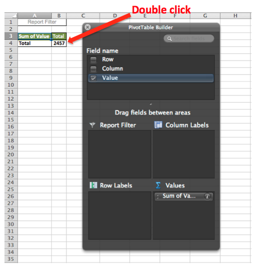

# Formatera och importera ekonomiska data

I det här avsnittet beskrivs det bästa sättet att importera finansiella data för analys i [!DNL Adobe Commerce Intelligence].

En tvådimensionell datatabell med flera flikar är ofta det format som används för finansiella data. När värden kategoriseras efter etiketter i både kolumner och rader kan den här typen av layout vara enkel att visa med mänskliga ögon och kalkylbladsverktyg, men den är inte anpassad för databaser.

Importera och analysera dessa data i [!DNL Commerce Intelligence]måste tabellen förenklas till en endimensionell lista. Vid förenkling kategoriseras varje datavärde av flera etiketter som alla finns på en rad, där varje rad är unik eller har en unik identifierare, till exempel en primärnyckelkolumn.

## Formatera Excel-filer för import

Förenkla en tvådimensionell tabell med en [!DNL Excel] pivottabell:

1. Öppna filen med den tvådimensionella datatabellen.
1. Öppna Pivottabellguiden. I [!DNL Windows], kortkommandot är `Alt-D`. I [!DNL Mac OS], ange `Command-Option-P`.
1. Välj **[!UICONTROL Multiple consolidated ranges]** och klicka **[!UICONTROL Next]**.
1. Välj **[!UICONTROL I will create the page fields]** och klicka **[!UICONTROL Next]**.
1. Markera hela datauppsättningen i den tvådimensionella tabellen, inklusive etiketterna. Se till att `0` väljs för antalet önskade sidfält och klickar **[!UICONTROL Next]**.
1. Skapa pivottabellen i ett nytt blad och klicka på **[!UICONTROL Finish]**.
1. Avmarkera kolumn- och radfälten i fältlistan.
1. Dubbelklicka på det resulterande numeriska värdet för att visa de separerade källdata i ett nytt blad.
   
1. Spara som `CSV` -fil.

## Radbrytning

Datatabellen har konverterats till ett listformat och bevarar all ursprunglig information. Den kan nu konverteras [importerat till [!DNL Commerce Intelligence]](../data-analyst/importing-data/connecting-data/using-file-uploader.md) för analys.
