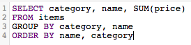

# Optimera dina SQL-frågor

Med [!DNL SQL Report Builder] kan du fråga efter och upprepa dessa frågor när du vill. Detta är användbart när du behöver ändra en fråga utan att behöva vänta på att en uppdateringscykel ska slutföras innan en kolumn eller rapport som du har skapat realiseras och behöver uppdateras.

Innan en fråga körs uppskattar [[!DNL Commerce Intelligence] dess kostnad](https://experienceleague.adobe.com/docs/commerce-knowledge-base/kb/troubleshooting/miscellaneous/sql-queries-explain-cost-errors.html?lang=sv-SE). Kostnad anger hur lång tid och hur många resurser som krävs för att köra en fråga. Om kostnaden anses vara för hög eller om antalet returnerade rader överstiger [!DNL Commerce Intelligence]-gränserna misslyckas frågan. Adobe rekommenderar följande för att fråga din [Data Warehouse](../data-analyst/data-warehouse-mgr/tour-dwm.md), som ser till att du skriver de mest effektiva frågorna.

## Använda SELECT eller Markera alla kolumner

Om du markerar alla kolumner blir frågan inte aktuell och enkel att köra. Frågor som använder `SELECT *` kan ta lång tid att köra, särskilt om tabellen har många kolumner.

Därför rekommenderar Adobe att du undviker att använda `SELECT *` där det är möjligt och endast inkluderar de kolumner du behöver:

| **Istället för detta..** | **Prova det här!** |
|-----|-----|
|  |  |

{style="table-layout:auto"}

## Använda fullständiga yttre hörn

Yttre kopplingar markerar hela tabellen som kopplas, vilket ökar frågans beräkningskostnad. Det innebär att det tar längre tid att köra frågan och att den troligtvis misslyckas eftersom det kan ta längre tid än vad som krävs för att returnera resultatet.

I stället för att använda den här typen av förening bör du använda en inre eller vänster koppling. Inre kopplingar returnerar bara resultat när det finns en kolumnmatchning mellan tabeller (till exempel finns `order_id` i både en typisk `customers` - och `orders` -tabell). Vänsterfogar returnerar alla resultat från den vänstra (första) tabellen tillsammans med matchande resultat i den högra (andra) tabellen.

Se hur du kan skriva om en FULL OUTER JOIN-fråga:

| **Istället för detta..** | **Prova det här!** |
|-----|-----|
|  |  |

{style="table-layout:auto"}

De här frågorna är identiska på alla sätt förutom den typ av JOIN som de använder.

## Använda flera hörn

Även om du kan ta med flera kopplingar i frågan måste du komma ihåg att det kan leda till högre kostnader för frågan. Adobe rekommenderar att man undviker att uppnå kostnadströskeln genom att undvika flera kopplingar där det är möjligt.

## Använda filter

Använd filter när det är möjligt. `WHERE`- och `HAVING`-satser filtrerar dina resultat och ger dig bara de data du verkligen vill ha.

## Använda filter i JOIN-satser

Om du använder ett filter när du gör en koppling måste du använda det på båda tabellerna i kopplingen. Även om det är överflödigt minskar detta beräkningskostnaderna för frågan och minskar körningstiden.

| **Istället för detta..** | **Prova det här!** |
|-----|-----|
|  |  |

{style="table-layout:auto"}

## Använda operatorer

När du skriver frågor bör du överväga att använda operatorer som är så dyra som möjligt. Varje fråga har en beräkningskostnad som bestäms av de funktioner, operatorer och filter som frågan består av. Vissa operatorer kräver mindre datorarbete, vilket gör dem billigare än andra operatorer.

Jämförelseoperatorer (>, &lt;, = och så vidare) är de som är minst dyra, följt av [LIKE. LIKNANDE operatorer och POSIX-operatorer ](https://www.postgresql.org/docs/9.5/functions-matching.html), som är de mest dyra operatorerna.

## Använda EXIST jämfört med IN

Användningen av `EXISTS` jämfört med `IN` beror på vilken typ av resultat du försöker returnera. Om du bara är intresserad av ett enda värde använder du `EXISTS`-satsen i stället för `IN`. `IN` används med listor med kommaavgränsade värden, vilket ökar frågans beräkningskostnad.

När `IN` frågor körs måste systemet först bearbeta underfrågan (programsatsen `IN`) och sedan hela frågan baserat på relationen som anges i programsatsen `IN`. `EXISTS` är mycket effektivare eftersom frågan inte behöver köras flera gånger - ett sant/falskt värde returneras när relationen som anges i frågan kontrolleras.

Kort sagt: systemet behöver inte bearbeta så mycket när `EXISTS` används.

| **Istället för detta..** | **Prova det här!** |
|-----|-----|
|  |  |

{style="table-layout:auto"}

## Använda ORDER BY

`ORDER BY` är en dyr funktion i SQL och kan avsevärt öka kostnaden för en fråga. Om du får ett felmeddelande om att EXPLAIN-kostnaden för din fråga är för hög kan du försöka ta bort `ORDER BY` från din fråga om det inte behövs.

Detta innebär inte att `ORDER BY` inte kan användas - bara att det bara ska användas när det är nödvändigt.

## Använda GROUP BY och BESTÄLL AV

Det kan finnas situationer där detta tillvägagångssätt inte överensstämmer med vad du försöker göra. Den allmänna regeln är att om du använder en `GROUP BY` och `ORDER BY` bör du placera kolumnerna i båda satserna i samma ordning. Exempel:

| **Istället för detta..** | **Prova det här!** |
|-----|-----|
|  |  |

{style="table-layout:auto"}

## Radbrytning

Det bästa sättet att lära sig skriva SQL - och göra det effektivt - är genom testversioner och fel. Om du vill hitta det som fungerar bäst för dig kan du försöka återskapa några rapporter med enbart SQL-redigeraren.
