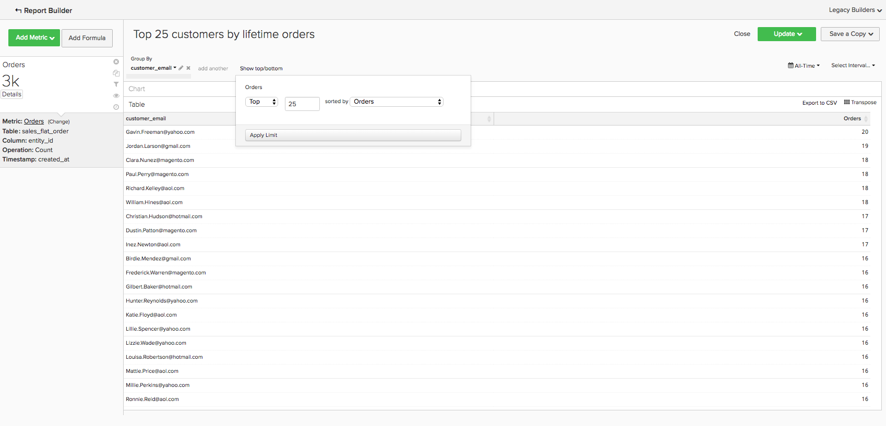
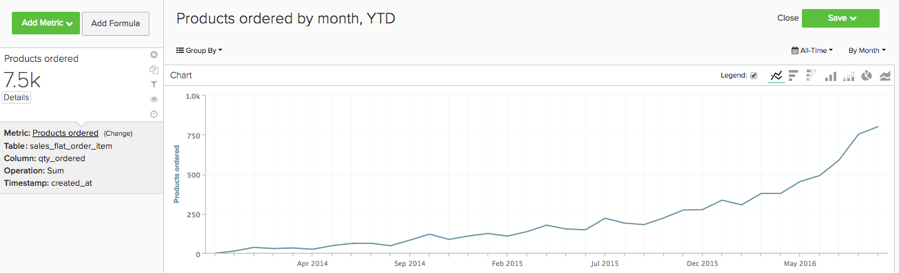

# Grundläggande analyser

När du känner till plattformen [!DNL Adobe Commerce Intelligence] och har en grundläggande förståelse för verktyget, vill du börja skapa rapporter. En av de vanligaste frågorna du kanske har är &quot;Vad ska jag titta på?&quot;

Informationen nedan sammanfattar några av de gemensamma mätvärdena och rapporterna som du kan finna värdefulla. Vissa av de här rapporterna finns på ditt konto, så kontrollera att du granskar mätvärden och rapporter som finns på ditt konto för att undvika att skapa dubbletter.

## Tabeller och kolumner som du vill förstå

När du bygger upp ett mätresultat måste du känna till fyra informationsdelar:

1. Tabellen som data finns på,
1. Den specifika åtgärd som du vill utföra,
1. Kolumnen som du vill utföra åtgärden på och
1. Tidsstämpeln som du vill använda för att spåra data.

De tabellnamn som används i dessa exempel skiljer sig förmodligen något från kolumn- och tabellnamnen i databasen eftersom varje databas är unik. Använd definitionerna nedan om du behöver hjälp med att identifiera en motsvarande tabell eller kolumn i databasen.

## Kundregister

Tabellen innehåller viktig information om varje kund, till exempel ett unikt kund-ID, e-postadress osv. I exemplen nedan används **[!UICONTROL customer_entity]** som namn på en exempelkundtabell.

Om några av dessa beräkningar inte finns i databasen kan alla administratörsanvändare på kontot skapa dem. Du måste också se till att de här dimensionerna är grupperbara för alla relevanta mått.

**Dimensioner**

* **[!UICONTROL Entity_id]**: En unik identifierare för varje kund. Det kan också vara ett unikt kundnummer eller en e-postadress till kunden, och det bör fungera som referensnyckel till ordertabellen.
* **[!UICONTROL Created_at]**: Det datum då kundens konto skapades och lades till i din databas.
* **[!UICONTROL Customer's lifetime revenue]**: Den totala livstidsintäkten som genererats av en kund.
* **[!UICONTROL Customer's first 30-day revenue]**: Det totala intäktsbelopp som genererats av en kund under de första 30 dagarna.
* **[!UICONTROL Customer's lifetime number of orders]**: Antalet order som en kund har lagt under sin livstid.
* **[!UICONTROL Customer's lifetime number of coupons]**: Det totala antalet kuponger som används av en kund under deras livstid.
* **[!UICONTROL Customer's first order date]**: Datumet för en kunds första order. Detta kan skilja sig från datumet created_at om en kund inte gjorde en beställning när de skapades.

**Accepterar du gästbeställningar?**

*I så fall kanske den här tabellen inte innehåller alla dina kunder. Kontakta [supportteamet](https://experienceleague.adobe.com/docs/commerce-knowledge-base/kb/troubleshooting/miscellaneous/mbi-service-policies.html?lang=sv-SE) för att se till att dina kundanalyser omfattar alla kunder.*

*Är du inte säker på om du godkänner gästbeställningar? Mer information finns i [det här avsnittet](../data-warehouse-mgr/guest-orders.md)!*

## Orderregister

I den här tabellen representerar varje rad en ordning. Kolumnerna i den här tabellen innehåller grundläggande information om varje order, t.ex. orderns ID, skapandedatum, status, ID:t för kunden som beställde ordern osv. I exemplen nedan används **[!UICONTROL sales_flat_order]** som namn på en exempelordningstabell.

**Dimensioner**

* **[!UICONTROL Customer_id]**: En unik identifierare för kunden som lade ordern. Detta används ofta för att flytta information mellan kund- och orderregister. I de här exemplen förväntar du att customer_id i tabellen **[!UICONTROL sales_flat_order]** ska justeras mot tabellen **[!UICONTROL entitiy_id]** i tabellen **[!UICONTROL customer_entity]**.
* **[!UICONTROL Created_at]**: Det datum då ordern skapades eller placerades.
* **[!UICONTROL Customer_email]**: E-postadressen till kunden som beställde. Detta kan också vara den unika identifieraren för kunden.
* **[!UICONTROL Customer's lifetime number of orders]**: En kopia av kolumnen med samma namn i tabellen `Customers`.
* **[!UICONTROL Customer's order number]**: Kundens sekventiella ordernummer som är associerat med ordern. Om raden du tittar på till exempel är en kunds första beställning är den här kolumnen&quot;1&quot;, men om det var kundens 15:e beställning visar den här kolumnen&quot;15&quot; för den här beställningen. Om den här dimensionen inte finns i din `Customers`-tabell ber du [supportteamet](https://experienceleague.adobe.com/docs/commerce-knowledge-base/kb/troubleshooting/miscellaneous/mbi-service-policies.html?lang=sv-SE) att hjälpa dig att skapa den.
* **[!UICONTROL Customer's order number (previous-current)]**: En sammanfogning av två värden i kolumnen **[!UICONTROL Customer's order number]**. Den används i en exempelrapport nedan för att visa den förflutna tiden mellan två order. Tiden mellan en kunds första orderdatum och dess andra orderdatum är till exempel&quot;1-2&quot; med den här beräkningen.
* **[!UICONTROL Coupon_code]**: Visar vilka kuponger som användes på varje order.
* **[!UICONTROL Seconds since previous order]**: Tiden (i sekunder) mellan en kunds order.

## Orderartikelregister

I den här tabellen representerar varje rad en artikel som har sålts. Tabellen innehåller information om de artiklar som säljs i varje beställning, t.ex. referensnummer, produktnummer, kvantitet och så vidare. I exemplen nedan används `sales_flat_order_item` som namn på en exempelordningsposttabell.

**Dimensioner**

* **[!UICONTROL Item_id]**: Den unika identifieraren för varje rad i tabellen.
* **[!UICONTROL Order_id]**: Referensnyckeln till din `Orders`-tabell som anger vilka objekt som köpts i samma ordning. Om en order innehåller flera artiklar upprepas det här värdet.
* **[!UICONTROL Product_id]**: Om du vill ha information om den specifika produkt som köpts (till exempel färg, storlek) använder du den här kolumnen för att hämta informationen från produkttabellen.
* **[!UICONTROL Order's created_at]**: Tidsstämpeln som ordern placerades i kopierades vanligtvis till din `order line items`-tabell från tabellen `Orders`.
* **[!UICONTROL Order's coupon_code]**: Den här kolumnen kopieras från din ordertabell, ungefär som för dimensionen `Order's created_at`.

## Abonnemangstabell

Tabellen används för att hantera din prenumerationsinformation, t.ex. prenumerations-ID, prenumerantens e-postadress, prenumerationens startdatum osv.

**Dimensioner**

* **[!UICONTROL Customer_id]**: En unik identifierare för kunden som lade ordern. Detta är ett vanligt sätt att skapa en sökväg mellan tabellen Kunder och tabellen Beställningar. I de här exemplen förväntar du att customer_id i tabellen **sales_flat_order** ska justeras mot tabellen `entitiy_id` i tabellen `customer_entity`.
* **[!UICONTROL Start date]**: Det datum då en kunds prenumeration startades.

## Utgiftsregister för marknadsföring

När du analyserar dina marknadsföringsutgifter kan du inkludera [!DNL Facebook], [!DNL Google AdWords] eller andra källor i dina analyser. Om du har flera marknadsföringsresurser kontaktar du [Managed Services Team](https://business.adobe.com/products/magento/fully-managed-service.html) för att få hjälp med att skapa en konsoliderad tabell för dina marknadsföringskampanjer.

**Dimensioner**

* **[!UICONTROL Spend]**: De totala annonskostnaderna. I [!DNL Facebook] är det här utgiftskolumnen i tabellen `facebook_ads_insights_####`. För [!DNL Google AdWords] är detta kolumnen `adCost` i tabellen `campaigns####`.
* `####` som bifogas till var och en av de här tabellerna hör till det specifika konto-ID:t för ditt [!DNL Facebook]- eller [!DNL Google AdWords]-konto.
* **[!UICONTROL Clicks]**: Det totala antalet klick. I [!DNL Facebook] är det här klickkolumnen i tabellen `facebook_ads_insights_####`. I [!DNL Google AdWords] är detta kolumnen adClicks i tabellen `campaigns####`.
* **[!UICONTROL Impressions]**: Totalt antal visningar. I [!DNL Facebook] är detta avtryck i tabellen `facebook_ads_insights_####`. I [!DNL Google AdWords] är det här avtrycken av tabellen `campaigns####`.
* **[!UICONTROL Campaign]**: Det totala antalet klick. I [!DNL Facebook] är detta kolumnen campaign_name i tabellen `facebook_ads_insights_####`. I [!DNL Google AdWords] är detta kampanjkolumnen i tabellen `campaigns####`.
* **[!UICONTROL Date]**: Den tid och det datum som aktiviteten (utgifter, klick eller visningar) inträffade för en viss kampanj. I [!DNL Facebook] är detta kolumnen `date_start` i tabellen `facebook_ads_insights_####`. I [!DNL Google AdWords] är detta datumkolumnen i tabellen `campaigns####`.
* **[!UICONTROL Customer's first order's source]**: Orderns källa från en kunds första order. Kontrollera först om du har en kolumn med namnet `customer's first order's source` i ditt konto. Om den här kolumnen inte visas kan du skapa den med hjälp av dessa instruktioner.
* **[!UICONTROL Customer's first order's medium]**: Orderns medium från en kunds första order. Kontrollera först om du har en kolumn med namnet `customer's first order's source` i ditt konto. Om den här kolumnen inte visas kan du skapa den med hjälp av dessa instruktioner.
* **[!UICONTROL Customer's first order's campaign]**: Orderns kampanj från en kunds första order. Kontrollera först om du har en kolumn med namnet `customer's first order's source` i ditt konto. Om den här kolumnen inte visas kan du skapa den med hjälp av dessa instruktioner.

## Vanliga rapporter och mätvärden

Här är några vanliga exempel på rapporter och mätvärden som du kan använda:

* [Kundanalys](#customeranalytics)
* [Orderanalys](#orderanalytics)
* [Marknadsföringsanalys](#mktgspendanalytics)

## Kundanalys {#customeranalytics}

### Nya användare

* **Beskrivning**: Ett antal av det totala antalet nyförvärvade användare under en angiven period. `New Users` skiljer sig från `Unique Customers` eftersom `New Users` har tidsstämpeln som ett konto skapades med din tjänst (detta betyder inte att de nödvändigtvis har gjort en beställning) medan `Unique Customers` har gjort minst en beställning.
* **Måttdefinition**: Det här måttet utför **Antal** av `entity_id` från `customer_entity` tabell som sorterats av `created_at`.
* **Rapportexempel**: Antal nya användare som skapades förra månaden
   * **[!UICONTROL Metric]**: `New Users`
   * **[!UICONTROL Time Range]**: `Last Month`
   * **[!UICONTROL Time Interval]**: `By Day`

<!--{: width="929"}-->

### Unika kunder

* **Beskrivning**: Antal distinkta kunder under en viss period. Detta skiljer sig från `New Users` eftersom det bara spårar kunder som har gjort minst en beställning. En viss kunds rapport spårar bara en kund en gång i ett givet tidsintervall. Om du anger tidsintervallet till `By Day` och en kund gör mer än ett köp den dagen räknas kunden bara en gång. Om du vill se det totala antalet köp generellt, titta på `Number of Orders`.
* **Måttdefinition**: Det här måttet utför ett **räkningsdistinkt** för `customer_id` från `sales_flat_order`-tabell som ordnats av `created_at`.
* **Rapportexempel**: Distinkta kunder per vecka under de senaste 90 dagarna
   * **[!UICONTROL Metric]**: `Distinct Customers`
   * **[!UICONTROL Time Range]**: `Moving range > Last 90 Days`
   * **[!UICONTROL Time Interval]**: `By Day`

<!--{: width="929"}-->

### Nya prenumeranter

* **Beskrivning**: Antal nya prenumeranter som har förvärvats under en viss period.
* **Måttdefinition**: Det här måttet utför ett **räkningsdistinkt** för `customer_id` från `subscriptions`-tabell som ordnats av `start_date`.
* **Rapportexempel**: Nya prenumeranter detta år per månad
   * **[!UICONTROL Metric]**: `New Subscribers`
   * **[!UICONTROL Time Range]**: `1 Year Ago to 0 Days Ago`
   * **[!UICONTROL Time Interval]**: `By Month`

<!--{: width="929"}-->

### Upprepa kunder

* **Beskrivning**: Det totala antalet kunder som har gjort mer än en beställning under en period. I en rapport om återkommande kunder kan du använda måtten `Distinct Customers` och `Customer's Order Number`-dimensionen från din `orders`-tabell.
* **Mått som används**: `Distinct Customers`
* **Rapportexempel**: Antal andra och tredje köp som gjordes förra året
   * **[!UICONTROL Metric]**: `Distinct Customers`
   * **[!UICONTROL Time Range]**: `Moving Range > Last Year`
   * **[!UICONTROL Time Interval]**: `By Month`
   * **[!UICONTROL Group By]**: `Customer's Order Number`, välj sedan `2` och `3`

  

* **Rapportexempel 2**: Antalet upprepade kunder under de senaste åren
   * **[!UICONTROL Metric]**: `Distinct Customers`
   * **[!UICONTROL Filters]**: `Customer's Order Number Greater Than 1`
   * **[!UICONTROL Time Range]**: `Moving range > Last Year`
   * **[!UICONTROL Time Interval]**: `By Month`

  <!--{: width="929"}-->

### De vanligaste kunderna efter antal order som gäller hela livet

* **Beskrivning**: En lista över de största kunderna baserat på deras totala antal order. Detta ger er en direkt lista över era mest frekventa kunder.
* **Mått som används**: `Orders`
* **Rapportexempel**: De 25 största kunderna per antal order under hela livstiden
   * **[!UICONTROL Metric]**: `Orders`
   * **[!UICONTROL Time Range]**: `All Time`
   * **[!UICONTROL Time Interval]**: `None`
   * **[!UICONTROL Group By]**: `customer_email`
   * **[!UICONTROL Show Top/Bottom]**: De 25 högsta sorterade efter order

  <!--{: width="929"}-->

### De främsta kunderna efter livstidsintäkter

* **Beskrivning**: En lista över de största kunderna baserat på livstidsintäkter.
* **Mått som används**: `Average Lifetime Revenue`
* **Rapportexempel**: De 25 största kunderna per livstidsintäkt
   * **[!UICONTROL Metric]**: `Average Lifetime Revenue`
   * **[!UICONTROL Time Range]**: `All time`
   * **[!UICONTROL Time Interval]**: `None`
   * **[!UICONTROL Group By]**: `customer_email`
   * **[!UICONTROL Show Top Bottom]**: De 25 viktigaste sorterade efter livstidsintäkt

  <!--{: width="929"}-->

### Genomsnittlig intäkt för livstid per kohort

* **Beskrivning**: Spåra den [genomsnittliga livstidsintäkten för distinkta kohorter](../dev-reports/lifetime-rev-cohort-analysis.md) för användare över tid för att identifiera de kohorter som presterar bäst. Kohorter grupperas efter ett vanligt datum, t.ex. första orderdatum eller skapandedatum.
* **Mått som används**: `Revenue`
* **Rapportexempel**: Genomsnittlig avkastning för kundlivstid per kohort
   * **[!UICONTROL Metric]**: `Revenue`
   * **[!UICONTROL Cohort Date]**: `Customer's first order date`
   * **[!UICONTROL Time Interval]**: `Month`
   * **[!UICONTROL Time Period]**: Flyttar kohorter för de senaste åtta kohorterna med minst fyra månaders data
   * **[!UICONTROL Duration]**: `12 Month(s)`
   * **[!UICONTROL Table]**: `Customer_entity`
   * **[!UICONTROL Perspective]**: Ackumulerat medelvärde per kohortmedlem

  <!--{: width="929"}-->

### Kunder efter kuponganvändning

* **Beskrivning**: Antal köpta kunder som har använt en kupong/rabattkod. Detta kan hjälpa er att få en tydlig bild av era rabattsökande jämfört med fullprisköparna.
* **Mått som används**: `New Users`
* **Rapportexempel**: Kuponger och icke-kuponger per månad
   * **[!UICONTROL Metric A]**: `Non coupon customers`
   * **[!UICONTROL Metric]**: `New Users`
   * **[!UICONTROL Filters]**: Kundens livstidsantal beställningar som är större än 0 och kundens livstidsantal kuponger som är lika med 0
   * **[!UICONTROL Metric B]**: `Coupon customers`
   * **[!UICONTROL Metric]**: `New Users`
   * **[!UICONTROL Filters]**: Kundernas livstid Antal beställningar som är större än 0 och kundens livstid Antal kuponger som är större än 0
   * **[!UICONTROL Time range]**: `All Time`
   * **[!UICONTROL Time interval]**: `By Month`

  <!--{: width="929"}-->

* **Rapportexempel 2**: Procent av kupong- och icke-kupongkunder per månad
   * **[!UICONTROL Metric A]**: `Non coupon customers` (dölj mått)
      * **[!UICONTROL Metric]**: `New Users`
      * **[!UICONTROL Filters]**: `Customer's Lifetime Number of Orders Greater Than 0` och `Customer's Lifetime Number of Coupons Equal to 0`
   * **[!UICONTROL Metric B]**: `Coupon customers`
      * **[!UICONTROL Metric]**: `New Users`
      * **[!UICONTROL Filters]**: `Customers Lifetime Number of Orders Greater Than 0` och `Customer's Lifetime Number of Coupons Greater Than 0`
   * **[!UICONTROL Time Range]**: `All Time`
   * **[!UICONTROL Time Interval]**: `By Month`
   * **[!UICONTROL Formula]**: `B/(A+B)`

>[!NOTE]
>
> **Dölj alla mått**

<!--{: width="929"}-->

### Genomsnittlig första 30-dagars intäkt

* **Beskrivning**: Det genomsnittliga intäktsbeloppet som genererats av kunder under deras första 30 dagar som kund.
* **Måttbeskrivning**: Det här måttet utför en **Genomsnitt** av `Customer's First 30 Day Revenue` från `customer_entity`-tabell som ordnas av `created_at`.
* **Rapportbeskrivning**: Heltidsgenomsnitt av kundens första 30-dagars intäkter
* **[!UICONTROL Metric]**: `Average First 30 Day Revenue`
* **[!UICONTROL Time Range]**: `All Time`
* **[!UICONTROL Time Interval]**: `None`

<!--{: width="929"}-->

### Genomsnittlig omsättning för kundens livslängd

* **Beskrivning**: Det genomsnittliga intäktsbelopp som dina kunder genererar under sin livstid.
* **Måttbeskrivning**: Det här måttet utför ett **Genomsnitt** av kolumnen `Customer's Lifetime Revenue` i tabellen `customer_entity` baserat på tabellen `created_at`.
* **Rapportbeskrivning**: Heltidsgenomsnitt av kundens livstidsintäkter
   * **[!UICONTROL Metric]**: `Average Customer Lifetime Revenue`
   * **[!UICONTROL Time Range]**: `All Time`
   * **[!UICONTROL Time Interval]**: `None`

<!--{: width="929"}-->

## Orderanalys {#orderanalytics}

### Intäkter

* **Beskrivning**: Inkomstmåttet visar den totala intäkten under en vald tidsperiod.
* Det här måttet utför en **summa** av `grand_total` från `sales_flat_order`-tabell som ordnas av `created_at`.
* **Rapportexempel**: Inkomster per månad, hittills
   * **[!UICONTROL Metric]**: `Revenue`
   * **[!UICONTROL Time Range]**: `1 Year Ago to 1 Month Ago`
   * **Tidsintervall**: `By Month`

>[!TIP]
>
>Kontrollera att beräkningen av dina intäkter överensstämmer med definitionen som du diskuterar internt. Du kanske vill räkna av intäkter från order som har levererats, konvertera valutor från olika regioner eller exkludera moms. Du kan också använda [filteruppsättningar](../../data-user/reports/ess-manage-data-filters.md) för att säkerställa konsekvens i alla mätvärden som bygger på samma tabell.

<!--{: width="929"}-->

### Beställningar

* **Beskrivning**: Antal order under en angiven period. En orderrapport registrerar förändringar i ordervolym som orsakas av nya erbjudanden, kampanjer eller något annat som kan öka (eller minska) transaktionsvolymen. Ofta vill du segmentera detta mätresultat med hjälp av vissa variabler för att besvara dina frågor.
* **Måttdefinition**: Det här måttet utför **Antal** av `entity_id` från `sales_flat_order` tabell som sorterats av `created_at`.
* **Rapportexempel**: Beställningar per månad, hittills i år
   * **[!UICONTROL Metric]**: `number of orders`
   * **[!UICONTROL Time Range]**: `1 Year Ago to 1 Month Ago`
   * **[!UICONTROL Time Interval]**: `By Month`

>[!TIP]
>
>Precis som intäktsmåttet bör du ha [filteruppsättningar](../../data-user/reports/ess-manage-data-filters.md) på plats för att exkludera ofullständiga, testade eller returnerade order.

<!--{: width="929"}-->

### Beställda produkter

* **Beskrivning**: De beställda produkterna anger hur många artiklar som sålts under en viss tidsperiod.
* **Måttdefinition**: Det här måttet utför en **summa** av `qty_ordered` från `sales_flat_order_item` tabell som ordnas av `created_at`.
* **Exempel på rapport**: Artiklar som sålts per månad, hittills i år
   * **[!UICONTROL Metric]**: `Products ordered`
   * **[!UICONTROL Time Range]**: `1 Year Ago to 1 Month Ago`
   * **[!UICONTROL Time Interval]**: `By Month`

  <!--{: width="929"}-->

* Kombinera det här måttet med antalet order för att beräkna antalet artiklar per order. Därefter lägger du till kupongkoder i rapporten för att avgöra hur era kampanjer påverkar kundvagnsstorlek eller segmentera efter nya eller upprepade order för att bättre förstå kundbeteendet.
* **Rapportexempel**: Produkter per order: första ordern kontra upprepade order
   * **[!UICONTROL Metric A]**: Beställda produkter: första beställningen
      * **[!UICONTROL Metric]**: `Products ordered`
      * **[!UICONTROL Filter]**: `Customer's order number = 1`
   * **[!UICONTROL Metric B]**: Order: first order
      * **[!UICONTROL Metric]**: `Orders`
      * **[!UICONTROL Filter]**: `Customer's order number = 1`
   * **[!UICONTROL Metric C]**: Beställda produkter: upprepade order
      * **[!UICONTROL Metric]**: `Products ordered`
      * **[!UICONTROL Filter]**: `Customer's order number > 1`
   * **[!UICONTROL Metric D]**: Beställningar: Upprepa order
      * **[!UICONTROL Metric]**: `Orders`
      * **[!UICONTROL Filter]**: `Customer's order number > 1`
   * **[!UICONTROL Time Range]**: `1 Year Ago to 1 Month Ago`
   * **[!UICONTROL Time Interval]**: `By Week`
   * **[!UICONTROL Formula 1]**: `A/B`
   * **[!UICONTROL Formula 2]**: `C/D`

>[!NOTE]
>
>Avmarkera `Multiple Y-Axes box` och `Hide` alla mått

<!--{: width="929"}-->

### Genomsnittligt ordervärde

* **Beskrivning**: Spåra det genomsnittliga värdet för order som lagts över en period. Använd detta mätvärde för att snabbt avgöra hur ert genomsnittliga ordervärde (AOV) har fluktuerat till följd av era marknadsföringssatsningar, erbjudanden och/eller andra förändringar i ert företag.
* **Måttdefinition**: Det här måttet utför ett **genomsnitt** av `grand_total` från `sales_flat_order` tabell som ordnats av `created_at`.
* **Rapportexempel**: AOV jämfört med föregående år, hittills i år
   * **[!UICONTROL Metric]**: `Average order value`
   * **[!UICONTROL Time Range]**: `1 Year Ago to 1 Month Ago`
   * **[!UICONTROL Time Interval]**: `By Month`
   * **[!UICONTROL Perspective]**: `Amount Change vs Previous Year`

  <!--{: width="929"}-->

### Produkter som köpts mest med kuponger

* **Beskrivning**: Den här rapporten innehåller information om vilka produkter som säljs när du erbjuder kampanjer eller kuponger.
* **Metrisk använd**: Beställda produkter
* **Rapportexempel**: Produkter som köpts mest med kuponger
   * **[!UICONTROL Metric]**: `Products ordered`
   * **[!UICONTROL Filter]**: `Order's coupon_code Is Not \[NULL\]`
   * **[!UICONTROL Time Range]**: `All-Time`
   * **[!UICONTROL Time Interval]**: `None`
   * **[!UICONTROL Group By**]: `name` (eller `SKU`, eller någon annan produkt-id)
   * **[!UICONTROL Show top/bottom]**: De 25 viktigaste sorterade efter beställda produkter

  <!--{: width="929"}-->

### Tid mellan order

* **Beskrivning**: Testa dina antaganden och förväntningar om dina kunders inköpscykler med en **tid mellan beställningarna**-analys som tittar på medelvärdet (eller medianen!) tidsåtgång mellan inköp. I tabellen nedan ser du att era bästa kunder - de som beställer mer än tre - gör sitt andra köp på mindre än sex månader. Kunder som inte gjort en fjärde beställning väntar 14 månader innan de gör ett andra köp.
* **Måttdefinition**: Det här måttet utför ett **genomsnitt** av `Time since previous order` från `sales_flat_order` som har ordnats av `created_at`.
* **Rapportexempel**:
   * **Mått 1**: ≤ 3 order
      * **[!UICONTROL Metric]**: `Average time between orders`
      * **[!UICONTROL Filter]**: `Customer's lifetime number of orders ≤ 3`
   * **Mått 2**: > 3 order
      * **[!UICONTROL Metric]**: `Average time between orders`
      * **[!UICONTROL Filter]**: `Customer's lifetime number of orders > 3`
   * **[!UICONTROL Time Range]**: `All-Time`
   * **[!UICONTROL Time Interval]**: `None`
   * **[!UICONTROL Group By]**:` Customer's order number (previous-current)`

>[!NOTE]
>
>Avmarkera kryssrutan `Multiple Y-Axes`.

<!--{: width="929"}-->

## Analys av marknadsföringsutgifter {#mktgspendanalytics}

### Annonsutgift

* **Beskrivning**: Du kan analysera dina marknadsföringsutgifter över olika tidsperioder och intervall, med kampanjer, annonsuppsättningar eller andra segmenteringar.
* **Måttdefinition**: Det här måttet utför en summa på utgiftskolumnen i tabellen `Marketing Spend` som ordnas av kolumnen `date`.
* **Rapportexempel**: Annonsutgift per kampanj
   * **[!UICONTROL Metric]**: `Ad spend`
   * **[!UICONTROL Time Range]**: `All-Time`
   * **[!UICONTROL Time Interval]**: `None`
   * **[!UICONTROL Group By]**: `campaign`

<!--{: width="929"}-->

### Annonsvisningar och reklamklick

* **Beskrivning**: Förutom att analysera annonskostnaderna kan du analysera dina annonsvisningar och annonsklickningar.
* **Måttdefinition**: Det här måttet utför en summering av kolumnen för visningar (eller klickningar) i tabellen `Marketing Spend` som sorteras efter datumkolumnen.
* **Rapportexempel**: Lägg till visningar och annonsklickningar per dag
   * **[!UICONTROL Metric A]**: `Ad impressions`
   * **[!UICONTROL Metric B]**: `Ad clicks`
   * **[!UICONTROL Time Range]**: `1 Year Ago to 3 Months Ago`
   * **[!UICONTROL Time Interval]**: `By Day`

  <!--{: width="929"}-->

### Klickfrekvens (CTR)

* **Beskrivning**: Med hjälp av de mått för annonsvisningar och annonsklickningar du har skapat ovan kan du analysera hur klickfrekvens du har haft för olika kampanjer över tiden.
* **Rapportexempel**: CTR per kampanj
   * **[!UICONTROL Metric A]**: `Ad impressions`
   * **[!UICONTROL Metric B]**: `Ad clicks`
   * **[!UICONTROL Time Range]**:`All-Time`
   * **[!UICONTROL Time Interval]**: `None`
   * **[!UICONTROL Formula]**: `B/A`
   * Välj alternativet `%`.
   * **[!UICONTROL Group By]**: `campaign`

>[!NOTE]
>
>Du kan **titel** formeln som `CTR` och **dölja** alla mått.

<!--{: width="929"}-->

### Kostnad per klick (CPC)

* **Beskrivning**: Med hjälp av mätvärden för annonsering och annonsklickning som du skapade ovan kan du analysera kostnaden per klick med olika kampanjer över tid.
* **Rapportexempel**: CPC per kampanj
   * **[!UICONTROL Metric A]**: `Ad spend`
   * **[!UICONTROL Metric B]**: `Ad clicks`
   * **[!UICONTROL Time Range]**: `All-Time`
   * **[!UICONTROL Time Interval]**: `None`
   * **[!UICONTROL Formula]**: `A/B`
   * Välj alternativet `currency`
   * **[!UICONTROL Group By]**: `campaign`

>[!NOTE]
>
>Du kan **titel** formeln som `CPC` och **dölja** alla mått.

<!--{: width="929"}-->

### Kunder efter anskaffningskälla

* **Beskrivning**: Om du spårar källan, mediet och kampanjen för en order med [!DNL Google eCommerce] kan du analysera kunderna utifrån deras anskaffningskälla. Detta hjälper dig att identifiera vilka marknadsföringskällor som förvärvar kunder och svara på frågor som&quot;gör de flesta av dina kunder sina första beställningar via [!DNL Google], [!DNL Facebook] eller någon annan källa?&quot;
* **Rapportera exempel**: Kunder efter anskaffningskälla
   * **[!UICONTROL Metric Used]**: `New Customers`
   * **[!UICONTROL Time Range]**: `All-Time`
   * **[!UICONTROL Time Interval]**: `By Month`
   * **[!UICONTROL Group By]**: `Customer's first order's source`

>[!NOTE]
>
>Kolla in [den här artikeln](../analysis/most-value-source-channel.md) om du vill ha fler exempel på rapporter som använder anskaffningskälla.

<!--{: width="929"}-->

### Kunder per förvärvsmedium och förvärvskampanj

* **Beskrivning**: På samma sätt som när du analyserar kunder efter anskaffningskälla kan du även analysera dina kunder utifrån deras första beställningsmedium och kampanj. Detta kan hjälpa er att svara på frågor som&quot;vilka kampanjer lockar nya kunder?&quot;
* **Rapportexempel**: Kunder efter anskaffningskampanj med betalt medium
   * **[!UICONTROL Metric Used]**: `New customers`
   * **[!UICONTROL Filter]**: `Customer's first order's medium IN ppc`
   * **[!UICONTROL Time Range]**: `All-Time`
   * **[!UICONTROL Time Interval]**: `None`
   * **[!UICONTROL Group By]**: `Customer's first order's campaign`

>[!NOTE]
>
>För filtret i `New Customers`-måttet kan du lägga till andra medier som betraktas som&quot;betalda&quot; medier för ditt företag, till exempel cpc eller betalsökningar.

<!--{: width="929"}-->

### Kundanskaffningskostnad (CAC) eller kostnad per förvärv (CPA)

* **Beskrivning**: Ett sätt att analysera kostnaden för en kampanj är att tilldela alla kostnader till enbart de kunder som du har köpt genom kampanjen.
* **Rapportexempel**: CAC efter kampanj
   * **[!UICONTROL Metric A]**: `New customers`
   * **[!UICONTROL Filter]**: `Customer's first order's medium IN ppc`
   * **[!UICONTROL Metric B]**: `Ad Spend`
   * **[!UICONTROL Time Range]**: `All-Time`
   * **[!UICONTROL Time Interval]**: `None`
   * **[!UICONTROL Formula]**: `B/A`
   * Välj alternativet `currency`
   * **[!UICONTROL Group By]**:
      * Välj `Customer's first order's campaign` för måttet `A`
      * Välj `campaign` för måttet `B`

  

>[!NOTE]
>
>Du kan **titel** formeln som `CTR` och **dölja** alla mått. Mer information finns även i [den här artikeln](../analysis/roi-ad-camp.md).

### Livstidsvärde per anskaffningskälla, medium och kampanj

* **Beskrivning**: Förutom att analysera antalet kunder som förvärvats av varje kampanj kan du analysera de genomsnittliga intäkterna för dessa kunder under hela livscykeln. Detta hjälper dig att identifiera:
   * Om vissa kampanjer lockar många kunder, men dessa kunder har en låg livstid.
   * Om vissa kampanjer lockar ett lågt antal kunder, men dessa kunder har ett högt livstidsvärde.
* **Rapportexempel**: Lägg först till måttet `New customers`. Lägg sedan till måttet `Average lifetime revenue`. Markera önskad tidsram och välj `interval` som `None`. Slutligen väljer du alternativet `group by` som `Customer's first order's campaign`.
   * **[!UICONTROL Metric A]**: `New Customers`
   * **[!UICONTROL Filter A]**: `Customer's first order's source` SOM &#39;%google%&#39;
   * **[!UICONTROL Filter B]**: `Customer's first order's medium IN ppc`
   * **[!UICONTROL Metric B]**: `Average lifetime revenue`
   * **[!UICONTROL Filter A]**: `Customer's first order's source` SOM &#39;%google%&#39;
   * **[!UICONTROL Filter B]**: `Customer's first order's medium IN ppc`
   * **[!UICONTROL Time Range]**: `All-Time`
   * **[!UICONTROL Time Interval]**: `None`
   * **[!UICONTROL Group By]**: `Customer's first order's campaign`

>[!NOTE]
>
>För de två filtren kan du lägga till andra medier som betraktas som&quot;betalda&quot; medier för ditt företag (till exempel cpc eller betalsökningar). Du kan också lägga till andra källor som du vill analysera, till exempel Facebook. Läs [den här artikeln](../analysis/roi-ad-camp.md) om du vill ha mer information om CAC, LTV och ROI.

<!--{: width="929"}-->

### Avkastning på investering

* **Beskrivning**: Ett sätt att beräkna ROI per kampanj är att analysera alla order som läggs genom kampanjen. Men en alternativ metod är att analysera livstidsvärdet för kunder som förvärvats via en kampanj. För att analysera avkastningen är det viktigt att kampanjnamnen är enhetliga i alla era utgiftsdata och transaktionsdata. Om du skapar följande rapport och det inte finns några ROI-värden på grund av kampanjnamn som inte matchar, kanske du måste undersöka [UTM-taggningen](../../best-practices/utm-tagging-google.md) som du har implementerat.
* **Rapportexempel**: ROI per kampanj
   * **[!UICONTROL Metric A]**: `New Customers`
   * **[!UICONTROL Filter A]**: `Customer's first order's source` SOM &#39;%google%&#39;
   * **[!UICONTROL Filter B]**: `Customer's first order's medium IN ppc`
   * **[!UICONTROL Metric B]**: `Average lifetime revenue`
   * **[!UICONTROL Filter A]**: `Customer's first order's source` SOM &#39;%google%&#39;
   * **[!UICONTROL Filter B]**: `Customer's first order's medium IN ppc`
   * **[!UICONTROL Metric C]**: `Ad spend`
   * **[!UICONTROL Time Range]**: `All-Time`
   * **[!UICONTROL Time Interval]**: `None`
   * **[!UICONTROL Formula]**: `(B-(C/A))/(C/A)`
   * Välj alternativet `% `
   * **[!UICONTROL Group By]**:
      * För måtten `A` och `B` väljer du `Customer's first order's campaign`
      * Välj `campaign` för måttet `C`

>[!NOTE]
>
>Du kan namnge formeln som&quot;ROI&quot; och dölja alla mått. Dessutom kan du justera filtren i mätvärdena för att analysera alternativa källor och medier. Läs även [det här avsnittet](../analysis/roi-ad-camp.md) för mer information om CAC, LTV och ROI.

<!--{: width="929"}-->

<!--{: width="929"}-->
