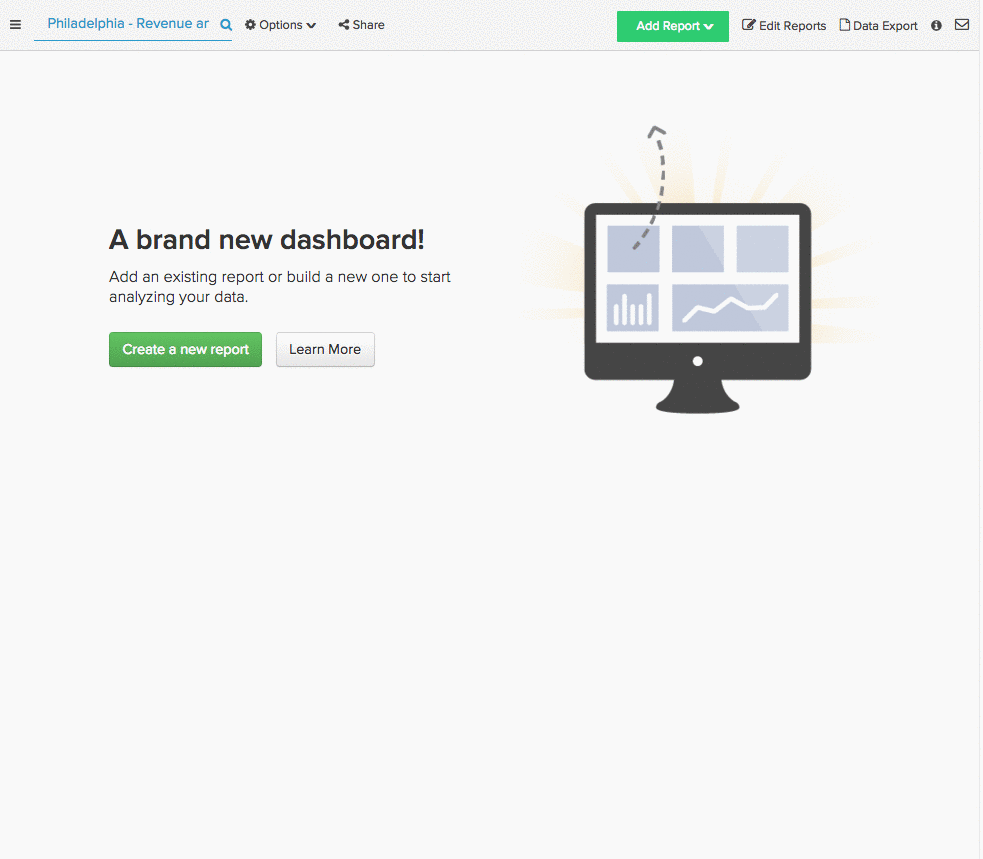

# Identifiera framgångsrika marknadsföringskällor

Ni har undersökt er målgrupp, skapat kampanjen och investerat i några marknadsföringskanaler. Nu när tiden har gått, hur fungerar dessa kanaler? Vilken kanal har de senaste användarna fått? Vilken källa har bidragit mest till dina totala intäkter?

Med [!DNL Adobe Commerce Intelligence] kan du enkelt segmentera intäkter och användare utifrån hänvisningskälla, oavsett om det motsvarar [!DNL [Google Analytics' UTM fields]](https://support.google.com/analytics/answer/1191184?hl=en) eller anpassade datafält. Denna segmentering gör att ni kan hitta de kanaler som presterar bäst och investera er marknadsföringsbudget bättre.

I det här avsnittet beskrivs några rapporter som du kan använda för att identifiera dina mest värdefulla marknadsföringskanaler:

* [Nya användare efter källor](#newusersbysource)
* [Genomsnittlig intäkt för livstid per användarkälla](#avglifetimerev)
* [Genomsnittligt ordervärde per användarkälla](#avgorderval)
* [Intäkter per registreringsdatum och källa](#revbyregdateandsource)
* [Upprepa order efter användarkälla](#repeatordersbysource)

## Förutsättningar {#prereqs}

För att kunna bygga upp analyserna i det här avsnittet måste du ha tillgång till källdata för marknadsföring/referens. Om du inte redan spårar den måste du hämta [källdata för orderreferens från  [!DNL Google ECommerce]](../importing-data/integrations/google-ecommerce.md) till [!DNL Adobe Commerce Intelligence] innan du kan fortsätta. Genom att lägga till information om användarenheter i analyserna kan du också se vilken teknik som används i dina hänvisningar.

## Nya användare efter källa {#newusersbysource}

Att utvärdera hur hänvisningskällorna fungerar är avgörande för att avgöra vilka kanaler som är mest värdefulla. I den här rapporten visas antalet nyregistrerade användare, per anskaffningskälla, över tiden, vilket gör att du kan spåra hur hänvisningskällor fungerar när du skaffar nya registrerade användare.

Om du vill skapa den här rapporten i [Report Builder](../../tutorials/using-visual-report-builder.md) lägger du till måttet **Nya användare** (eller ett motsvarande mått som räknar antalet nya användare över tiden) i rapporten. Gör sedan följande:

1. Ange den registreringsperiod som du vill analysera för [!UICONTROL Time Period].
1. Ange [!UICONTROL Interval] till månadsvis.
1. Ange [!UICONTROL Group By] som hämtningskälla (eller hänvisningskälla) och välj de källor som du vill inkludera.
1. I det här exemplet används `stacked columns` [!UICONTROL chart type].

Här är en genomgång:

## Genomsnittlig intäkt för livstid per användarkälla {#avglifetimerev}

Det är viktigt att hitta de kanaler som ger nya användare, men hur värdefulla är hänvisningarna generellt sett? Den här rapporten visar de genomsnittliga intäkterna för användarens livstid från specifika förvärvskällor över tiden. Det innebär att du kan se om användare som har förvärvats från en viss källa spenderar mer med dig under sin livstid än en grupp användare som har förvärvats från en annan källa.

Om du vill skapa den här rapporten i Report Builder lägger du till måttet **för genomsnittlig livslängd** i rapporten. Gör sedan följande:

1. Ange [!UICONTROL Time Period] till den tidsperiod som du vill analysera.
1. Ange [!UICONTROL Interval] till månadsvis.
   [!UICONTROL Group By] till anskaffningskälla (eller hänvisningskälla) och välj de källor som du vill inkludera.
1. I det här exemplet används typen `line chart`.

Här är en genomgång:

.

I det här exemplet undersöks endast livstidsintäkterna, men du kan också replikera den här analysen för att titta på [!UICONTROL Number of orders] eller [!UICONTROL Distinct buyers] efter hänvisningskälla.

## Genomsnittligt ordervärde per användarkälla {#avgorderval}

Om du vill få en bättre uppfattning om hur mycket pengar användare får från en viss anskaffningskälla kan du skapa en rapport som tittar på deras genomsnittliga ordervärde. På så sätt kan du spåra om användare som förvärvats från en viss källa spenderar mer per order än användare från en annan källa.

Om du vill skapa den här rapporten i Report Builder lägger du till måttet **Genomsnittlig order** och sedan gör du följande:

1. Ange den registreringsperiod som du vill analysera för [!UICONTROL Time Period].
1. Ange [!UICONTROL Time Interval] till månadsvis.
1. Ange [!UICONTROL Group By] som hämtningskälla (eller hänvisningskälla) och välj de källor som du vill inkludera.
1. I det här exemplet används diagramtypen **staplade kolumner**.

Här är en genomgång:

## Totala intäkter per registreringsdatum och källa {#revbyregdateandsource}

Med den analys av livstidsintäkten som gjordes tidigare kan du se de genomsnittliga livstidsintäkterna för användare som förvärvats från olika källor, men hur blir det med de totala livstidsintäkterna? Med den här rapporten kan du identifiera hur mycket av de totala intäkterna som användare registrerade under en viss tid och från en viss källa genererar.

Om du vill skapa den här rapporten i Report Builder lägger du till måttet `Revenue by user registration date`. Om du inte redan har [skapat det här måttet](../../data-user/reports/ess-manage-data-metrics.md) kan du göra det genom att replikera måttet `Revenue` och ändra `time stamp` till användarens `creation date`. När du har lagt till måttet gör du följande:

1. Ange den registreringsperiod som du vill analysera för [!UICONTROL Time Period].
1. Ange [!UICONTROL Time Interval] till månadsvis.
1. Ange [!UICONTROL Group By] som hämtningskälla (eller hänvisningskälla) och välj de källor som du vill inkludera.
1. I det här exemplet används diagramtypen `stacked columns`.

Här är en genomgång:

## Upprepa order efter användarkälla {#repeatordersbysource}

I rapporten för genomsnittligt ordervärde visas i genomsnitt hur många användare som har förvärvats från en viss källa när en order läggs. Den här rapporten visar dock inte om samma användare är återkommande kunder. Men med Källor för att upprepa beställningar kan du se om användare från en viss källa gör mer eller mindre upprepade inköp.

Om du vill skapa den här rapporten i [Report Builder](../../tutorials/using-visual-report-builder.md) lägger du till måttet **Antal order** och sedan gör du följande:

1. Ange den registreringsperiod som du vill analysera för [!UICONTROL Time Period].
1. Ange [!UICONTROL Time Interval] till månadsvis.
1. Lägg till en [!UICONTROL filter] så att endast användare med upprepade order inkluderas:

   Användarens ordernummer är större än 1

1. Ange [!UICONTROL Group By] som hämtningskälla (eller hänvisningskälla) och välj de källor som du vill inkludera.
1. I det här exemplet används diagramtypen `stacked columns`.

Här är en genomgång:

## Radbrytning {#wrapup}

Det här avsnittet handlar bara om några analyser du kan använda för att analysera värdet av era förvärv- och marknadsföringskanaler, men det här är bara toppen av isberget.

## Relaterad {#related}

* [Referenskälla för spårningsorder via  [!DNL Google ECommerce]](../importing-data/integrations/google-ecommerce.md)
* [Ansluter ditt [!DNL Google Adwords] konto](../importing-data/integrations/google-adwords.md)
* [Bygger [!DNL Google ECommerce] dimensioner med order och kunddata](../data-warehouse-mgr/bldg-google-ecomm-dim.md)
* [Bästa tillvägagångssätt för UTM-taggning i  [!DNL Google Analytics]](../../best-practices/utm-tagging-google.md)
