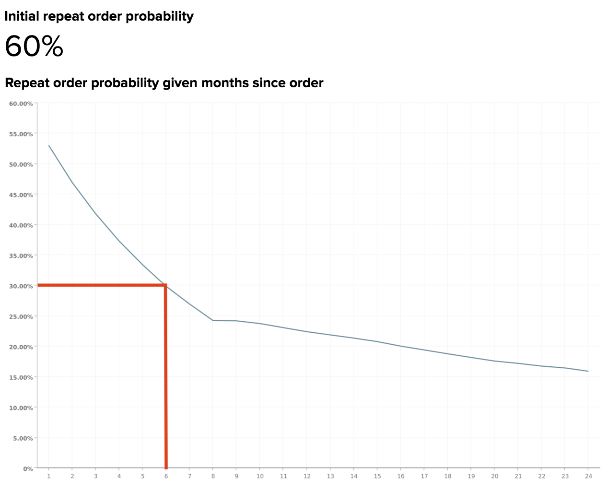

# Sannolikhet för upprepad minskning och belastning

Om en del av era intäkter kommer från återkommande inköp är ni antagligen medvetna om det enorma värdet av en lojal kundbas. Därför är det viktigt att förstå hur tidsrymden mellan order och när kunderna förväntas försvinna.

I det här avsnittet beskrivs de analyser som kan hjälpa dig att besvara följande frågor:

* Hur sannolikt är det att en kund gör ett nytt inköp?
* Hur varierar sannolikheten för upprepade order med tiden sedan kundens senaste köp?
* När ska en kund anses vara bortkastad? Och därför, när ska en reaktiveringskampanj starta?

## Rekommenderade mått

När du analyserar upprepad sannolikhetsminskning och -minskning bör du överväga att använda ([eller bygga](../../data-user/reports/ess-manage-data-metrics.md)) dessa mått:

### Sannolikhet för inledande upprepad order

Detta mått definieras som det totala antalet upprepade order, i procent av den totala ordern. Om man fasar ut en annan metod är det sannolikt att en order kommer att följas upp av en annan order. När denna sannolikhet är över 50 % innebär det att mer än hälften av alla order följs av en efterföljande order.

### Sannolikhet för upprepade order som har angetts månader sedan ordern

Denna åtgärd visar sannolikheten för att en användare beställer igen med tanke på antalet månader som har gått sedan den senaste beställningen. Formeln som används för att generera det här måttet förenklar:

Beroende på din affärsmodell kan sannolikheten för återkommande order antingen upphöra omedelbart efter det att kunden har gjort en beställning och fortsätter att minska under de följande månaderna, eller så kan den visa säsongsvariationer och krascher.

I båda fallen kan ni förstå hur stor procentandel av kunderna som förväntas göra upprepade inköp och hur trenderna över tiden gör att ni kan inrikta er på kunderna med kritiska intervall för att maximera sannolikheten för ett återkommande köp. När sannolikheten för återkommande inköp minskar kan du alltså välja en tid för att identifiera kunden som bortkastad och växla från lojalitet till reaktivering.

## Dagens exempel

Ta en titt på en återkommande sannolikhetsminskning för ett typiskt e-handelsföretag.

### Sannolikhet för inledande upprepad order

I det här exemplet är sannolikheten för att en order kommer att följas upp av en annan ordning 60 %. Det innebär att 60 % av alla order som läggs i den här verksamheten följs av en efterföljande order.

### Sannolikhet för upprepade order som har angetts månader sedan ordern

Den här rapporten visar sannolikheten för en kundbeställning igen med tanke på att det har gått ett antal månader sedan den senaste beställningen. Även om det inte finns någon enda definition för tröskelvärdet för bortfall med tanke på den här rapporten rekommenderar vi att man definierar bortfall som den punkt där sannolikhetsminskningen korsar värdet som är hälften av den inledande upprepningssannolikhetsgraden.

Eftersom den initiala upprepningssannolikhetsgraden för det här exemplet är 60 %, skulle förändringsdatumet vara den tidpunkt då sannolikhet för upprepad order sjunker till under 60 %/2 = 30 %, eller vid ungefär 6 månader. Av de 60 % av beställningarna som följdes upp med en annan order placerades hälften av dem inom de första sex månaderna.

Om en kund skulle lägga en uppföljningsorder är det troligare att de har gjort det inom 6 månader efter den sista ordern än efter 6-månadersperioden. Om kunden inte har köpt produkten på nytt efter sex månader bör en omaktiveringskampanj startas för att få tillbaka kunden.

Beroende på din affärsmodell kanske du i stället vill välja ett annat tröskelvärde, som den punkt där sannolikheten för upprepad order sjunker till under 50 % eller 10 %. Om dina interna kunskaper tyder på ett annat tal bör du använda det!

I slutändan är målet att välja tröskeln där det är rimligt att gå över från reaktivering till reaktivering. Kvarhållandet kan innefatta e-postmeddelanden för att återengagera befintliga kunder med förslag på uppföljningsköp, medan återaktivering kan inbegripa e-postmeddelanden till förfallna kunder med kuponger och erbjudanden.

## Vilka frågor ska jag överväga?

För att du ska få en bättre förståelse för sannolikheten för upprepade beställningar när det gäller ditt företag föreslår vi att du tar hänsyn till dessa frågor när du utforskar dina egna data:

* Förväntas den initiala sannolikheten för upprepad order? Om inte, varför tycker du att det borde vara högre eller lägre?
* Finns det några stora minskningar av sannolikheten för upprepade order för specifika månader sedan den senaste ordern? Förväntas i så fall dessa ändringar?
* Vad är ditt nuvarande tröskelvärde för bortfall?
* Anpassar ditt aktuella tröskelvärde för bortfall till ett av värdena i din sannolikhet för upprepad order som har angetts månader sedan den senaste orderrapporten?
* Betyder ert nuvarande tröskelvärde era reklamsatsningar från lojalitet till reaktivering?
* Är det vettigt för företaget att ändra tröskelvärdet till den månad där sannolikhetsminskningen korsar värdet som är hälften av den initiala upprepningssannolikhetsgraden?

## Vad mer ska jag analysera?

När du har skapat analysen ovan och fastställt ett tröskelvärde för bortfall, kan du skapa fler analyser för att identifiera vanliga trender för bortfallna användare. Är till exempel kunder som har köpt produkter på köpet under samma tidsperiod, eller har de köpt liknande produkter i sin senaste beställning? När ett tröskelvärde för bortfall har fastställts kan ni ytterligare fördjupa er i specifika egenskaper hos dessa kunder.

Om ni erbjuder mer än en produkt undrar ni antagligen hur kunder som köper en viss produkt beter sig annorlunda över tiden jämfört med andra kunder. Vill du veta mer? Titta på den här självstudiekursen för att utforska hur kundkohorter fungerar hela livet baserat på specifika produkter som de har köpt.

Denna bästa praxis tillhandahålls av [!DNL MBI] Data Analysis Services (DAS). Vi ser fram emot att få svara på dina specifika företagsfrågor! [Kontakta support](../../guide-overview.md) för mer information.

### Relaterad

* [Analysera kupongpåverkan på kundvärvning och kundunderhåll](../analysis/coupon-impact.md)
* [Analysera beteende vid återköp av kunder](../analysis/repurchase-behavior.md)
