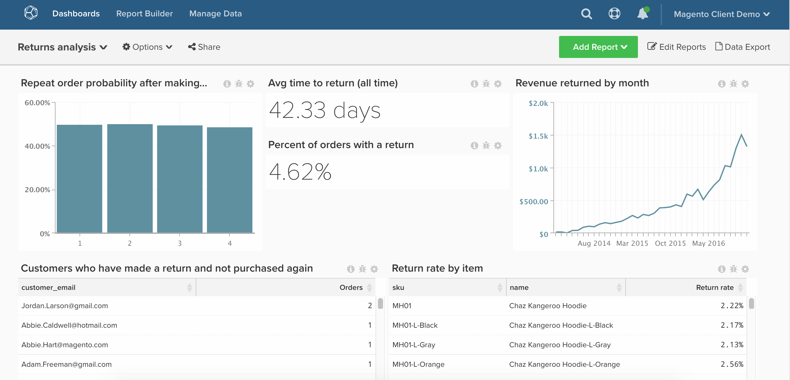

# Returnerade order

I det här avsnittet visas hur du konfigurerar en kontrollpanel som innehåller en detaljerad analys av butikens resultat.

Innan du börjar måste du vara en [Adobe Commerce](https://business.adobe.com/products/magento/magento-commerce.html) kund och bör se till att företaget använder `enterprise\_rma` register för returer.

Denna analys innehåller [avancerade beräknade kolumner](../data-warehouse-mgr/adv-calc-columns.md).

## Komma igång

Kolumner att spåra

* **`enterprise_rma`** eller **`rma`** table
* **`entity_id`**
* **`status`**
* **`order_id`**
* **`customer_id`**
* **`date_requested`**

* **`enterprise_rma_item_entity`** eller **`rma_item_entity`** table
* **`entity_id`**
* **`rma_entity_id`**
* **`qty_returned`**
* **`status`**
* **`order_item_id`**
* **`product_name`**
* **`product_sku`**

Filteruppsättningar att skapa

* **`enterprise_rma`** table
* Filteruppsättningsnamn: `Returns we count`
* Filteruppsättningslogik:
   * Platshållare - ange din egna logik här

* **`enterprise_rma_item_entity`** table
* Filteruppsättningsnamn: `Returns items we count`
* Filteruppsättningslogik:
   * Platshållare - ange din egna logik här

### Beräknade kolumner

Kolumner att skapa

* **`enterprise_rma`** table
* **`Order's created at`**
* Välj en definition: `Joined Column`
* [!UICONTROL Create Path]:
* 
  [!UICONTROL Many]: `enterprise_rma.order_id`
* 
  [!UICONTROL One]: `sales_flat_order.entity_id`

* Välj en [!UICONTROL table]: `sales_flat_order`
* Välj en [!UICONTROL column]: `created_at`
   * `enterprise_rma.order_id = sales_flat_order.entity_id`

* **`Customer's order number`**
* Välj en definition: `Joined Column`
* Välj en [!UICONTROL table]: `sales_flat_order`
* Välj en [!UICONTROL column]: `Customer's order number`
   * `enterprise_rma.order_id = sales_flat_order.entity_id`

* **`Time between order's created_at and date_requested`** skapas av en analytiker som en del av `[RETURNS ANALYSIS]` biljett

* **`enterprise_rma_item_entity`** table
* **`return_date_requested`**
* Välj en definition: `Joined Column`
* [!UICONTROL Create Path]:
   * 
     [!UICONTROL Many]: `enterprise_rma_item_entity.rma_entity_id`
   * 
     [!UICONTROL One]: `enterprise_rma.entity_id`

* Välj en [!UICONTROL table]: `enterprise_rma`
* Välj en [!UICONTROL column]: `date_requested`
   * `enterprise_rma_item_entity.rma_entity_id = enterprise_rma.entity_id`

* **`Return item total value (qty_returned * price)`** skapas av en analytiker som en del av `[RETURNS ANALYSIS]` biljett

* **`sales_flat_order`** table
* **`Order contains a return? (1=yes/0=No)`**
* Välj en definition: `Exists`
* Välj en [!UICONTROL table]: `enterprise_rma`
   * `enterprise_rma.order_id = sales_flat_order.entity_id`

* **`Customer's previous order number`** skapas av en analytiker som en del av `[RETURNS ANALYSIS]` biljett
* **`Customer's previous order contains return? (1=yes/0=no)`** skapas av en analytiker som en del av `[RETURNS ANALYSIS]` biljett

>[!NOTE]
>
>Om du bara är intresserad av att analysera arbetstider för sekunder till upplösning eller sekunder till första svar, ska du meddela analytikern när du begär biljetten.

### Mått

* **Returnerar**
* I **`enterprise_rma`** table
* Detta mått utför en **Antal**
* På **`entity_id`** kolumn
* Beställd av **`date_requested`**
* [!UICONTROL Filter]: `Returns we count`

* **Returnerade artiklar**
* I **`enterprise_rma_item_entity`** table
* Detta mått utför en **Summa**
* På **`qty_approved`** kolumn
* Beställd av **`return date_requested`**
* [!UICONTROL Filter]: `Returns we count`

* **Returnerat artikeltotalvärde**
* I **`enterprise_rma_item_entity`** table
* Detta mått utför en **Summa**
* På **`Returned item total value (qty_returned * price)`** kolumn
* Beställd av **`return date_requested`**
* [!UICONTROL Filter]: `Returns we count`

* **Genomsnittlig tid mellan order och retur**
* I **`enterprise_rma`** table
* Det här måttet utför en **Genomsnittlig**
* På **`Time between order's created_at and date_requested`** kolumn
* Beställd av **`date_requested`**
* [!UICONTROL Filter]: `Returns we count`

>[!NOTE]
>
>Se till att [lägga till alla nya kolumner som dimensioner till mått](../data-warehouse-mgr/manage-data-dimensions-metrics.md) innan du skapar nya rapporter.

### Rapporter

* **Sannolikhet för upprepad order efter att ha gjort en retur**
* Mått `A`: `Number of orders with returns`
* [!UICONTROL Metric]: `Number of orders`
* [!UICONTROL Filter]:
   * `Order contains a return? (1=yes/0=No) = 1`
   * `Is in current month? = No`

* Mått `B`: `Non-last orders with returns`
* [!UICONTROL Metric]: `Number of orders`
* [!UICONTROL Filter]:
   * `Is customer's last order? (1=yes/0=no) = 0`
   * `Order contains a return? (1=yes/0=No) = 1`

* Formel: Sannolikhet för upprepad order
* [!UICONTROL Formula]: `B / A`
* 
  [!UICONTROL Format]: `Percentage`

* [!UICONTROL Time period]: `All time`
* 
  [!UICONTROL-intervall]: `None`
* [!UICONTROL Group by]: `Customer's order number`
* 
  [!UICONTROL-diagramtyp]: `Bar`

* **Genomsnittlig tid för retur (hela tiden)**
* Mått `A`: `Avg time between order and return`
* [!UICONTROL Metric]: `Avg time between order and return`

* [!UICONTROL Time period]: `All time`
* 
  [!UICONTROL-intervall]: `None`
* 
  [!UICONTROL-diagramtyp]: `Number`

* **Procent av order med returvärde**
* Mått `A`: `Number of orders`
* [!UICONTROL Metric]: `Number of orders`

* Mått `B`: `Orders w/ return`
* [!UICONTROL Metric]: `Number of orders`
* [!UICONTROL Filter]:
   * `Order contains a return? (1=yes/0=No) = 1`

* Formel: % av beställningar med avkastning
* [!UICONTROL Formula]: `B / A`
* 
  [!UICONTROL Format]: `Percentage`

* [!UICONTROL Time period]: `All time`
* 
  [!UICONTROL-intervall]: `None`
* [!UICONTROL Chart Type]: `Number - % of orders with return`

* **Intäkter per månad**
* Mått `A`: `Returned item total value`
* [!UICONTROL Metric]: `Returned item total value`

* [!UICONTROL Time period]: `All time`
* [!UICONTROL Interval]: `By month`
* 
  [!UICONTROL-diagramtyp]: `Line`

* **Kunder som har gjort en retur och inte köpt igen**
* Mått `A`: `Number of orders with returns`
* [!UICONTROL Metric]: `Number of orders`
* [!UICONTROL Filter]:
   * `Order contains a return? (1=yes/0=No) = 1`
   * `Is customer's last order? (1=yes/0=no) = 1`

* [!UICONTROL Time period]: `All time`
* 
  [!UICONTROL-intervall]: `None`
* 
  [!UICONTROL Group by]: `Customer_email`
* 
  [!UICONTROL-diagramtyp]: `Table`

* **Returränta per artikel**
* Mått `A`: `Returned items` (Dölj)
* [!UICONTROL Metric]: Returnerade artiklar

* Mått `B`: `Items sold` (Dölj)
* [!UICONTROL Metric]: `Number of orders`
* [!UICONTROL Filter]:

* [!UICONTROL Formula]: `Return %`
* [!UICONTROL Formula]: `B / A`
* 
  [!UICONTROL Format]: `Percentage`

* [!UICONTROL Time period]: `All time`
* 
  [!UICONTROL-intervall]: `None`
* [!UICONTROL Group by]: `product_sku AND/OR product_name`
* 
  [!UICONTROL-diagramtyp]: `Table`

När du har kompilerat alla rapporter kan du ordna dem på kontrollpanelen som du vill. Resultatet kan se ut som kontrollpanelen ovan.

Om du stöter på några frågor när du skapar den här analysen eller vill engagera Professional Services-teamet, [kontakta support](https://experienceleague.adobe.com/docs/commerce-knowledge-base/kb/troubleshooting/miscellaneous/mbi-service-policies.html).
