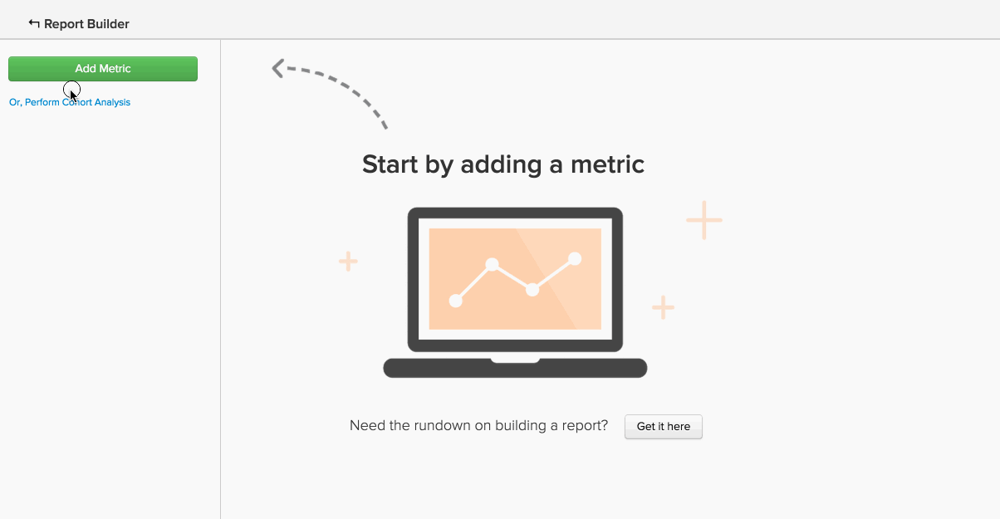

# Avancerade beräknade kolumntyper

Många analyser du kan försöka skapa är bland annat en **ny kolumn** som du vill `group by` eller `filter by`. The [Skapar beräknade kolumner](../data-warehouse-mgr/creating-calculated-columns.md) I självstudiekursen beskrivs grunderna för de flesta användningsfall, men du kanske vill ha en beräknad kolumn som är lite mer komplex än vad Data warehouse Manager kan skapa.
{: #top}

Den här typen av kolumner kan skapas av vårt team med Data warehouse-analytiker. Ange följande information om du vill definiera en ny beräknad kolumn:

1. The **`definition`** i den här kolumnen (inklusive indata, formler eller formatering)
1. The **`table`** som du vill skapa kolumnen på
1. Alla **`example data points`** som beskriver vad kolumnen ska innehålla

Här är några vanliga exempel på avancerade beräknade kolumner som användarna ofta tycker är användbara:

* [Ordna (eller rangordna) händelse sekventiellt](#compareevents)
* [Hitta tiden mellan två händelser](#twoevents)
* [Jämför sekventiella händelsevärden](#sequence)
* [Konvertera valuta](#currency)
* [Konvertera tidszoner](#timezone)
* [Något annat](#else)

## Jag försöker beställa händelser sekventiellt {#compareevents}

Vi kallar det här **händelsenummer** beräknad kolumn. Det innebär att vi försöker hitta den sekvens i vilken händelser inträffade för en viss händelseägare, som en kund eller användare.

Här är ett exempel:

| **`event\_id`** | **`owner\_id`** | **`timestamp`** | **`Owner's event number`** |
|-----|-----|-----|-----|
| 1 | `A` | 2015-01-01 00:00:00 | 1 |
| 2 | `B` | 2015-01-01 00:30:00 | 1 |
| 3 | `A` | 2015-01-01 02:00:00 | 2 |
| 4 | `A` | 2015-01-02 13:00:00 | 3 |
| 5 | `B` | 2015-01-03 13:00:00 | 2 |

{style=&quot;table-layout:auto&quot;}

En kolumn för beräkning av händelsenummer kan användas för att observera skillnader i beteende mellan förstagångshändelser, upprepningshändelser och nth-händelser i dina data.

Vill du se hur kundens kolumn med ordernummer fungerar? Klicka på bilden för att se den användas som en grupp efter dimension i en rapport.

<!--{: style="max-width: 500px;"}-->

För att skapa den här typen av beräknad kolumn måste vi känna till:

* Tabellen som du vill skapa den här kolumnen för
* Det fält som identifierar händelsens ägare (`owner\_id` i det här exemplet)
* Det fält som du vill ordna händelserna efter (`timestamp` i det här exemplet)

[tillbaka till början](#top)

## Jag försöker hitta tiden mellan två händelser. {#twoevents}

Vi kallar det här `date difference` beräknad kolumn. Det innebär att vi försöker hitta tiden mellan två händelser som tillhör en enda post, baserat på händelsens tidsstämplar.

Här är ett exempel:

| `id` | `timestamp\_1` | `timestamp\_2` | `Seconds between timestamp\_2 and timestamp\_1` |
|-----|-----|-----|-----|
| `A` | 2015-01-01 00:00:00 | 2015-01-01 12:30:00 | 45000 |
| `B` | 2015-01-01 08:00:00 | 2015-01-01 10:00:00 | 7200 |

{style=&quot;table-layout:auto&quot;}

En beräknad datumdifferenskolumn kan användas för att skapa ett mått som beräknar medeltiden eller mediantiden mellan två händelser. Klicka på bilden nedan för att se hur `Average time to first order` mätvärden används i en rapport.

<!--{: style="max-width: 500px;"}-->

För att skapa den här typen av beräknad kolumn måste vi känna till:

* Tabellen som du vill skapa den här kolumnen för
* De två tidsstämplar mellan vilka du vill veta skillnaden

[tillbaka till början](#top)

## Jag försöker jämföra värden för sekventiella händelser. {#sequence}

Vi kallar det här **sekventiell händelsejämförelse**. Det innebär att vi försöker hitta delta mellan ett värde (valuta, nummer, tidsstämpel) och motsvarande värde för ägarens föregående händelse.

Här är ett exempel:

| **`event\_id`** | **`owner\_id`** | **`timestamp`** | **`Seconds since owner's previous event`** |
|-----|-----|-----|-----|
| 1 | `A` | 2015-01-01 00:00:00 | NULL |
| 2 | `B` | 2015-01-01 00:30:00 | NULL |
| 3 | `A` | 2015-01-01 02:00:00 | 7720 |
| 4 | `A` | 2015-01-02 13:00:00 | 126000 |
| 5 | `B` | 2015-01-03 13:00:00 | 217800 |

{style=&quot;table-layout:auto&quot;}

En sekventiell händelsejämförelse kan användas för att hitta den genomsnittliga tiden eller mediantiden mellan varje sekventiell händelse. Klicka på bilden nedan för att se **Genomsnittlig och mediantid mellan order** mätvärden in action.

=<!--{: style="max-width: 500px;"}-->

För att skapa den här typen av beräknad kolumn måste vi känna till:

* Tabellen som du vill skapa den här kolumnen för
* Det fält som identifierar händelsens ägare (`owner\_id` i exemplet)
* Det värdefält som du vill se skillnaden mellan för varje sekventiell händelse (`timestamp` i det här exemplet)

[tillbaka till början](#top)

## Jag försöker konvertera valuta. {#currency}

A **valutakonvertering** beräknad kolumn konverterar transaktionsbelopp från en registrerad valuta till en rapporteringsvaluta, baserat på valutakursen vid händelsetiden.

Här är ett exempel:

| **`id`** | **`timestamp`** | **`transaction\_value\_EUR`** | **`transaction\_value\_USD`** |
|-----|-----|-----|-----|
| `1` | 2015-01-01 00:00:00 | 30 | 33.57 |
| `2` | 2015-01-02 00:00:00 | 50 | 55.93 |

{style=&quot;table-layout:auto&quot;}

För att skapa den här typen av beräknad kolumn måste vi känna till:

* Tabellen som du vill skapa den här kolumnen för
* Transaktionsbeloppskolumnen som du vill konvertera
* Kolumnen som anger valutan som data spelades in i (vanligtvis en ISO-kod)
* Standardrapporteringsvaluta

[tillbaka till början](#top)

## Jag försöker konvertera tidszoner. {#timezone}

A **tidszonskonvertering** beräknad kolumn konverterar tidsstämplarna för en viss datakälla från den registrerade tidszonen till en rapporttidszon.

Här är ett exempel:

| **`id`** | **`timestamp\_UTC`** | **`timestamp\_ET`** |
|-----|-----|-----|
| `1` | 2015-01-01 00:00:00 | 2014-12-31 19:00:00 |
| `2` | 2015-01-01 12:00:00 | 2015-01-01 07:00:00 |

{style=&quot;table-layout:auto&quot;}

För att skapa den här typen av beräknad kolumn måste vi känna till:

* Tabellen som du vill skapa den här kolumnen för
* Den tidsstämpelkolumn som du vill konvertera
* Den tidszon som data spelades in i
* Rekommenderad tidszon för rapportering

[tillbaka till början](#top)

## Jag försöker göra något som inte finns med här. {#else}

Oroa dig inte. Bara för att det inte finns med här betyder det inte att det inte är möjligt. Vårt team med Data warehouse Analysts har det som täcker er.

Om du vill definiera en ny beräknad kolumn [skicka en supportanmälan](https://experienceleague.adobe.com/docs/commerce-knowledge-base/kb/troubleshooting/miscellaneous/mbi-service-policies.html?lang=en) med information om exakt vad du vill bygga.

## Relaterad dokumentation

* [Skapa beräknade kolumner](../data-warehouse-mgr/creating-calculated-columns.md)
* [Beräknade kolumntyper](../data-warehouse-mgr/calc-column-types.md)
* [Byggnad [!DNL Google ECommerce] dimensioner med beställnings- och kunddata](../data-warehouse-mgr/bldg-google-ecomm-dim.md)
