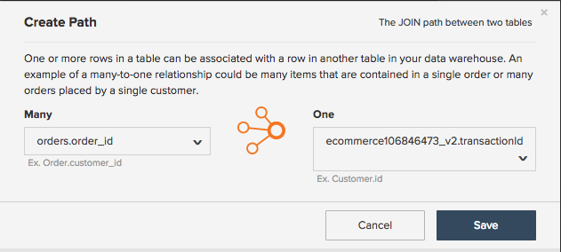
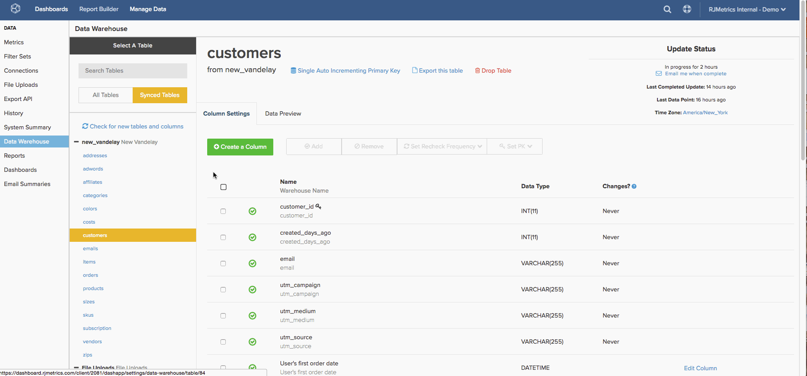

# Skapa [!DNL Google ECommerce] Dimensioner

>[!NOTE]
>
>Kräver [administratörsbehörighet](../../administrator/user-management/user-management.md).

Nu när du är klar med [anslutningen av ditt[!DNL Google ECommerce]-konto](../../data-analyst/importing-data/integrations/google-ecommerce.md), vad kan du göra med dessa data i [!DNL Commerce Intelligence]? I det här avsnittet går vi igenom hur du bygger upp dimensioner som länkar e-handelsdata till dina beställningar och kunddata.

De dimensioner som omfattas ger dig möjlighet att skapa analyser som [besvarar viktiga frågor om era marknadsföringskanaler och kampanjer](../../data-analyst/analysis/most-value-source-channel.md). Hur stor procent av intäkterna kommer från varje källa? Hur skiljer sig livstidsvärdet för [!DNL Facebook] förvärvade kunder från värdet för [!DNL Google]?

## Krav och översikt

Om du vill skapa dimensionerna i det här avsnittet behöver du en [!DNL Google ECommerce]-tabell, en `orders`-tabell och en `customers`-tabell. Tabellerna måste [synkroniseras med din Data Warehouse](../../data-analyst/data-warehouse-mgr/tour-dwm.md) innan dimensioner kan skapas. Tabeller som synkroniseras visas i avsnittet `Synced Tables` i `Data Warehouse Manager`.

Här är en snabbtitt på synkronisering av tabeller och kolumner om du behöver en uppdaterare:

När du har skapat en koppling från tabellen `orders` till tabellen [!DNL Google eCommerce] skapar du de första tre dimensionerna i listan nedan. Därefter använder du de här dimensionerna för att skapa tre användar-/kunddimensioner i tabellen `customers`. För att avsluta kopplar du de kolumnerna till tabellen `orders`.

Här följer de ingående dimensionerna:

* **Beställningstabell**

* Orderkällan [!DNL Google Analytics]
* Orderns [!DNL Google Analytics] medium
* Orderns [!DNL Google Analytics]En kampanj
* Kundens källa för första beställningen: [!DNL Google Analytics]
* Kundens första beställningsmedium för [!DNL Google Analytics]
* Kundens kampanj [!DNL Google Analytics] för första ordern

* **Kundregister**

* Kundens källa för första beställningen: [!DNL Google Analytics]
* Kundens första beställningsmedium för [!DNL Google Analytics]
* Kundens kampanj [!DNL Google Analytics] för första ordern

## Bygga dimensionerna

Om du vill skapa dimensioner öppnar du [Data Warehouse Manager](../data-warehouse-mgr/tour-dwm.md) genom att klicka på **[!UICONTROL Data]** > **[!UICONTROL Data Warehouse]**.

### Ordertabell, rund 1

Det här exemplet bygger **Order [!DNL Google Analytics] Source** -dimensionen.

1. Klicka på den tabell (i det här fallet `orders`) som innehåller din orderinformation i listan över tabeller i Datan Warehouse.
1. Klicka på **[!UICONTROL Create a Column]**.
1. Namnge kolumnen.
1. Välj `Joined Column` i listrutan [definition](../data-warehouse-mgr/calc-column-types.md). Det här exemplet fungerar med en [en-till-en-relation](../data-warehouse-mgr/table-relationships.md) som matchar kolumnen `eCommerce.transactionID` till exakt en rad i tabellen `orders`.
1. Därefter måste du definiera sökvägen eller hur tabellen och kolumnen som används ska kopplas. Klicka på listrutan `Select a table and column`.
1. Sökvägen du behöver är inte tillgänglig, så du måste skapa en ny. Klicka på **[!UICONTROL Create new Path]**.
1. I fönstret som visas anger du `Many` till `orders.order\_id`, eller den kolumn i tabellen `orders` som innehåller order-ID:t.
1. På sidan `One` söker du efter tabellen `Google ECommerce` och anger sedan kolumnen till `transactionID`.

   

1. Klicka på **[!UICONTROL Save]** för att skapa sökvägen.
1. När sökvägen har lagts till klickar du på listrutan **[!UICONTROL Select table and column]** igen.
1. Leta reda på tabellen `ECommerce` och klicka sedan på kolumnen `Source`. Detta knyter ordningarna till källinformationen.
1. När du är tillbaka i tabellschemat klickar du på **[!UICONTROL Save]** igen för att skapa dimensionen.

Här är en titt på hela processen:

Prova sedan att skapa **Beställningens [!DNL Google Analytics] medium** och `campaign`. Det finns inte mycket att ändra för de här dimensionerna, så prova. Men om du fastnar kan du checka ut [slutet av den här artikeln](#stuck) för att se vad som är annorlunda.

### Kundregister {#customers}

Det här exemplet bygger **kundens [!DNL Google Analytics] source** -dimension för den första ordern.

1. Klicka på den tabell (i det här fallet `customers`) som innehåller kundinformationen i listan med tabeller i Datan Warehouse.
1. Klicka på **[!UICONTROL Create a Column]**.
1. Namnge kolumnen.
1. I det här exemplet väljer du definitionen `is MAX` i listrutan [definition](../../data-analyst/data-warehouse-mgr/calc-column-types.md). Definitionen `is MIN` kan också fungera om den används i en textkolumn med endast ett möjligt värde. Det viktiga är att se till att rätt filter ställs in, vilket du gör senare.
1. Klicka på listrutan **[!UICONTROL Select a table and column]**, markera tabellen `orders` och sedan kolumnen `Order's [!DNL Google Analytics] source`.
1. Klicka på **[!UICONTROL Save]**.
1. När du är tillbaka i tabellschemat klickar du på listrutan `Options` och sedan `Filters`.
1. Klicka på **[!UICONTROL Add Filter Set]** och välj sedan uppsättningen `Orders we count`. Du vill bara inkludera order i de order som du räknar filteruppsättningen för, så det är viktigt att den här filteruppsättningen är markerad.
1. Klicka på **[!UICONTROL Add Filter]**. Du vill hitta kundens källa [!DNL Google Analytics] för den första ordern, så du måste lägga till ett filter:

   _order.Kundens ordernummer = 1

   _
1. Klicka på **[!UICONTROL Save]** för att skapa dimensionen.

Sedan kan du försöka skapa **kundens första order, [!DNL Google Analytics] medium** och `campaign`. Det finns inte mycket att ändra för de här dimensionerna, så prova. Men om du fastnar kan du checka ut [slutet av den här artikeln](#stuck) för att se vad som är annorlunda.

### Bonus: Ordertabell, rund 2

Du kan stoppa här om du vill, men det här avsnittet aktiverar ytterligare analys genom att ta med **kundens första beställningsmått [!DNL Google Analytics]** som du skapade i det [sista avsnittet](#customers) i tabellen `orders`. Om du skapar dimensionerna i det här avsnittet kan du analysera alla mätvärden som bygger på din `orders`-tabell - `Revenue`, `Number of orders`, `Distinct buyers` och så vidare - med attributen [!DNL Google Analytics] för en kunds första order.

Det här exemplet kopplar dimensionen `Customer's first order's [!DNL Google Analytics] source` till tabellen `orders`.

1. Klicka på den tabell (i det här fallet `orders`) som innehåller din orderinformation i listan över tabeller i Datan Warehouse.
1. Klicka på **[!UICONTROL Create a Column]**.
1. Namnge kolumnen.
1. Välj `Joined Column` i listrutan för definition. Detta kopplar de kunddimensioner som du skapade i föregående avsnitt till tabellen `orders`.
1. Klicka på listrutan **[!UICONTROL Select a table and column]** och markera sedan tabellen `customers` och kolumnen `Customer's first order's [!DNL Google Analytics] source`.
1. Om en sökväg inte fylls i automatiskt väljer du den sökväg som bäst kopplar samman kund- och ordertabellerna.
1. Klicka på **[!UICONTROL Save]** för att skapa dimensionen.

Här är en titt på hela processen:

Slutför genom att koppla måtten `Customer's first order's` och `campaign` till tabellen `orders`. Anslut till dimensionerna, och om det uppstår problem kan du checka ut [slutet av artikeln](#stuck) om du behöver hjälp.

### Radbrytning

Du är klar med att skapa dimensionerna, vilket betyder att du nu kan skapa kraftfulla analyser som spårar resultatet för olika kanaler och kampanjer. Kom ihåg att de **nya kolumnerna inte är tillgängliga förrän nästa uppdatering har slutförts**.

Några av de populärare dimensionerna behandlas i det här avsnittet, men himlen är gränsen - prova att skapa din egen eller låt oss plocka oss om du vill ha hjälp med att utforska andra alternativ. 

### Ytterligare information

**`Orders`tabell 1**: När du skapar måtten `Order's [!DNL Google Analytics]` och `campaign` är skillnaden de kolumner som är markerade i steg 12. I det här exemplet var kolumnen `Source`.

**`Customers`tabell**: När du skapar dimensionerna `Customer's first order's [!DNL Google Analytics]` och `campaign` är skillnaden de kolumner som är markerade i steg 5. I det här exemplet var kolumnen `Order's [!DNL Google Analytics]` källa.

**`Orders`tabell #2**: När kolumnerna `Customer's first order's [!DNL Google Analytics]` och `campaign` kopplas till tabellen `orders` är skillnaden de kolumner som är markerade i steg 5. I det här exemplet var kolumnen `Customer's first order's [!DNL Google Analytics]` källa.
