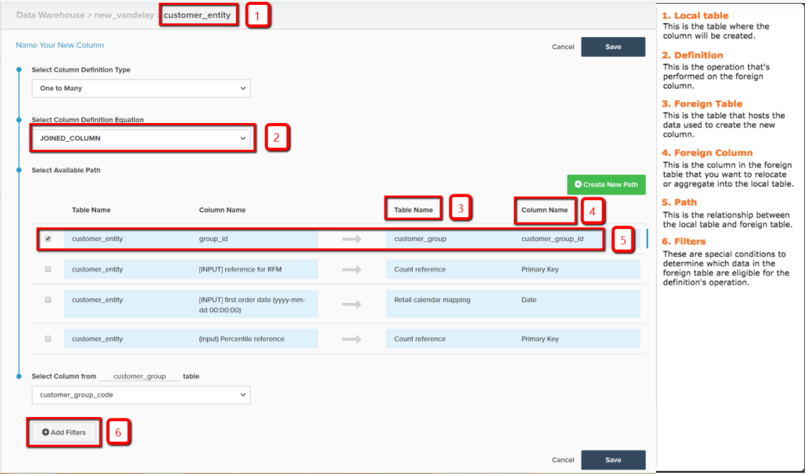

# Beräknade kolumntyper

* [Samma tabellberäkningar](#sametable)
* [En till många beräkningar](#onetomany)
* [Många till en beräkning](#manytoone)
* [Referenskarta](#map)
* [Avancerade beräknade kolumner](#advanced)

I [data warehouse Manager](../data-warehouse-mgr/tour-dwm.md)kan du skapa kolumner för att förbättra och optimera data för analys. [Den här funktionen](../data-warehouse-mgr/creating-calculated-columns.md) kan du komma åt genom att markera en tabell i Data warehouse Manager och klicka på **[!UICONTROL Create New Column]**.

I det här avsnittet beskrivs de typer av kolumner som du kan skapa med Data warehouse Manager. Den innehåller även en beskrivning, en visuell genomgång av den kolumnen och en [referenskarta](#map) av alla indata som krävs för att skapa en kolumn. Det finns tre sätt att skapa beräknade kolumner:

1. [Samma tabellberäknade kolumner](#sametable)
1. [En-till-många beräknade kolumner](#onetomany)
1. [Många-till-ett-beräknade kolumner](#manytoone)

## Samma tabellberäknade kolumner {#sametable}

Dessa kolumner skapas med indatakolumner från samma tabell.

### Ålder {#age}

En kolumn för beräkning av ålder returnerar antalet sekunder mellan den aktuella tiden och en viss indatatid.

Exemplet nedan skapar `Seconds since customer's most recent order` i `customers` tabell. Detta kan användas för att skapa användarlistor för kunder som inte har gjort inköp (kallas ibland för att churning) inom `X days`.

### Valutakonverterare

En kolumn för valutakonvertering som beräknas konverterar den ursprungliga valutan i en kolumn till önskad ny valuta.

Exemplet nedan skapar `base\_grand\_total In AED`, konvertera `base\_grand\_total` från sin ursprungliga valuta till AED i `sales\_flat\_order` tabell. Den här kolumnen fungerar bra för butiker med flera valutor som vill rapportera i sin lokala valuta.

För Commerce-klienter `base\_currency\_code` fältet lagrar vanligtvis inhemska valutor. The `Spot Time` fältet ska matcha det datum som används i mätvärdena.

## En-till-många beräknade kolumner {#onetomany}

`One-to-Many` kolumner [använda en bana mellan två tabeller](../../data-analyst/data-warehouse-mgr/create-paths-calc-columns.md). Den här sökvägen innebär alltid en tabell, där ett attribut finns, och en många tabeller, där attributet flyttas ned till. Sökvägen kan beskrivas som en `foreign key--primary key` relation.

### Kopplad kolumn {#joined}

En kopplad kolumn omlokaliserar ett attribut i en tabell *till* många tabeller. Det klassiska exemplet på en/flera är kunder (en) och beställningar (många).

I exemplet nedan är `Customer's group\_id` dimensionen förenas med `orders` tabell.

## Många-till-ett-beräknade kolumner {#manytoone}

Dessa kolumner använder samma sökvägar som en-till-många-kolumner gör, men de pekar data i motsatt riktning. Kolumnen skapas på den ena sidan av banan, i motsats till många. På grund av den här relationen måste värdet i kolumnen vara en aggregering, det vill säga en matematisk åtgärd som utförs på datapunkterna på många sidor. Det finns många användningsfall för detta, och några av dem visas nedan.

### Antal {#count}

Den här typen av beräknad kolumn returnerar antalet värden i många tabeller *på* en tabell.

I exemplet nedan är dimensionen `Customer's lifetime number of canceled orders` skapas på `customers` tabell (med ett filter för `orders.status`).

{: width=&quot;699&quot; height=&quot;351&quot;}

### Summa {#sum}

En summerad beräknad kolumn är summan av värdena på `many` på bordet.

Detta kan användas för att skapa kundnivådimensioner som `Customer's lifetime revenue`.

### Min eller Max {#minmax}

En minsta eller högsta beräknad kolumn returnerar den minsta eller största posten som finns på många sidor.

Detta kan användas för att skapa kundnivådimensioner som `Customer's first order date`.

### Finns {#exists}

En beräknad kolumn är ett binärt test som fastställer förekomsten av en post på många sidor. Med andra ord returnerar den nya kolumnen ett `1` om banan förbinder minst en rad i varje tabell, och `0` om ingen anslutning kan göras.

Den här typen av dimension kan till exempel avgöra om en kund någonsin köpt en viss produkt. Använda ett hörn mellan en `customers` tabell och `orders` register, ett filter för en viss produkt, en dimension `Customer has purchased Product X?` kan byggas.

## Referenskarta {#map}

Om du har problem med att komma ihåg vad alla indata är när du skapar en beräknad kolumn, bör du behålla referenskartan när du skapar:

## Avancerade beräknade kolumner {#advanced}

I din förfrågan om att analysera och besvara frågor om ditt företag kan du stöta på en situation där du inte kan skapa exakt den kolumn du vill ha.

Adobe rekommenderar att du tar en titt på [Avancerade beräknade kolumntyper](../../data-analyst/data-warehouse-mgr/adv-calc-columns.md) för att se vilka kolumner som supportteamet på Adobe kan bygga. Det avsnittet innehåller även information som du behöver för att skapa kolumnen. Ta med den tillsammans med din begäran.

## Relaterad dokumentation

* [Skapa beräknade kolumner](../../data-analyst/data-warehouse-mgr/creating-calculated-columns.md)
* [Skapa/ta bort banor för beräknade kolumner](../../data-analyst/data-warehouse-mgr/create-paths-calc-columns.md)
* [Förstå och utvärdera tabellrelationer](../../data-analyst/data-warehouse-mgr/table-relationships.md)
