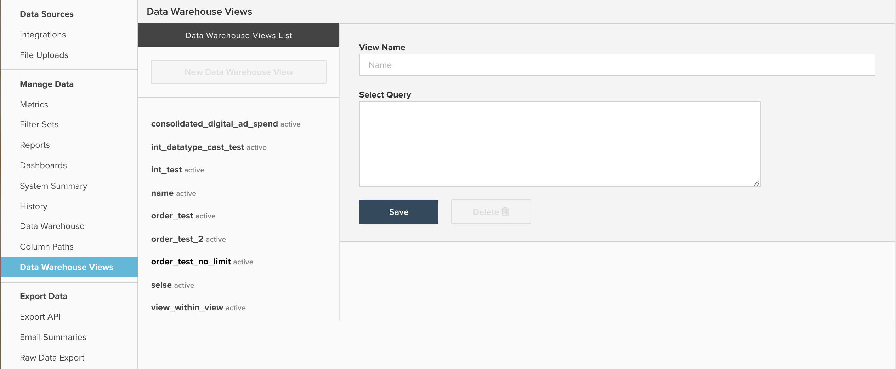

# Arbeta med Data Warehouse

I det här dokumentet beskrivs syftet med och användningsområdena för `Data Warehouse Views` tillgängliga genom att navigera till **[!UICONTROL Manage Data]** > **[!UICONTROL Data Warehouse Views]**. Nedan finns en förklaring av vad det gör och hur du skapar vyer, samt ett exempel på hur du använder `Data Warehouse Views` konsolidera [!DNL Facebook] och [!DNL AdWords] spendera data.

## Allmänt syfte

The `Data Warehouse Views` är en metod för att skapa nya lagrade tabeller genom att ändra en befintlig tabell eller genom att sammanfoga eller konsolidera flera tabeller med hjälp av SQL. En gång en `Data Warehouse View` har skapats och bearbetats av en uppdateringscykel, fylls den i i Datan Warehouse som en ny tabell under `Data Warehouse Views` rullgardinsmeny enligt nedan:


Från och med nu fungerar din nya vy som vilken annan tabell som helst, vilket ger dig möjlighet att skapa nya beräknade kolumner eller bygga mätvärden och rapporter ovanpå.

`Data Warehouse Views` används främst för att konsolidera flera liknande men olika tabeller tillsammans, så att alla rapporter kan baseras på en enda ny tabell. Några vanliga exempel är att konsolidera tabeller från en äldre databas och en livedatabas för att kombinera historiska och aktuella data, eller att kombinera flera olika annonskällor som Facebook och AdWords till en enda `Consolidated ad spend` tabell.

Om du känner till SQL använder båda dessa konsolideringsexempel `UNION` men du kan använda valfri PostgreSQL-syntax och funktioner när du skapar en ny vy.

## Skapa och hantera Data Warehouse

Nytt `Data Warehouse Views` kan skapas och befintliga vyer kan tas bort genom att navigera till **[!UICONTROL Manage Data]** > **[!UICONTROL Data Warehouse Views]**, enligt nedan:



Här kan du skapa en vy genom att följa exempelinstruktionerna nedan:

1. Om du observerar en befintlig vy klickar du **[!UICONTROL New Data Warehouse View]** om du vill öppna ett tomt frågefönster. Om ett tomt frågefönster redan är öppet fortsätter du till nästa steg.
1. Ge vyn ett namn genom att skriva i `View Name` fält. Det namn som anges här avgör visningsnamnet för vyn i Datan Warehouse. `View names` begränsas till gemena bokstäver, siffror och understreck (_). Alla andra tecken tillåts inte.
1. Ange frågan i fönstret `Select Query`, med vanlig PostgreSQL-syntax.

   >[!NOTE]
   >
   >Frågan måste referera till specifika kolumnnamn. Användning av `*`får inte användas för att markera alla kolumner.

1. När du är klar klickar du på **[!UICONTROL Save]** för att spara din vy. Din vy har en `Pending` status tills den bearbetas av nästa fullständiga uppdateringscykel, då statusen ändras till `Active`. När vyn har bearbetats av en uppdatering är den klar att användas i rapporter.

Det är viktigt att notera att den underliggande frågan som användes när den sparades genererade en `Data Warehouse View` kan inte redigeras. Om du behöver justera strukturen för ett `Data Warehouse View`måste du skapa en vy och manuellt migrera beräknade kolumner, mätvärden eller rapporter från den ursprungliga vyn till den nya. När migreringen är klar kan du ta bort den ursprungliga vyn. För `Data Warehouse Views` går inte att redigera, Adobe rekommenderar att du testar frågans utdata med `SQL Report Builder` innan du sparar frågan som en Data Warehouse-vy.

## Exempel: [!DNL Facebook] och [!DNL Google AdWords] data

Titta närmare på ett av de exempel som nämns ovan i den här artikeln: konsolidera [!DNL Facebook] och [!DNL AdWords] lägga in data i en ny konsoliderad annonstabell. Det vanligaste är att konsolidera två tabeller, med exempeldatauppsättningar nedan:

`Ad source: Google AdWords`

`Table name: campaigns67890`

`Sample data:`

| **`_id`** | **`campaign`** | **`adClicks`** | **`date`** | **`impressions`** | **`adCost`** |
|--- |--- |--- |--- |--- |--- |
| 1 | eee | 60 | 2017-05-05 00:00:00 | 2000 | 10.2 |
| 2 | ggg | 40 | 2017-05-23 00:00:00 | 900 | 4.6 |
| 3 | aaa | 22 | 2017-06-12 00:00:00 | 400 | 2.5 |
| 4 | eee | 350 | 2017-06-30 00:00:00 | 14500 | 35 |
| 5 | fff | 280 | 2017-07-10 00:00:00 | 10200 | 28.5 |

`Ad source: Facebook`

`Table name: facebook_ads_insights_12345`

`Sample data:`

| **`_id`** | **`campaign`** | **`adClicks`** | **`date`** | **`impressions`** | **`adCost`** |
|--- |--- |--- |--- |--- |--- |
| 1 | aaa | 25 | 2017-05-01 00:00:00 | 1200 | 5 |
| 2 | ddd | 12 | 2017-05-15 00:00:00 | 800 | 2.5 |
| 3 | aaa | 40 | 2017-05-22 00:00:00 | 2000 | 7 |
| 4 | aaa | 110 | 2017-06-08 00:00:00 | 6000 | 10 |
| 5 | ccc | 5 | 2017-07-06 00:00:00 | 300 | 1.2 |

Så här skapar du en annonsutgivartabell som innehåller båda [!DNL Facebook] och [!DNL Google AdWords] -kampanjer måste du skriva en SQL-fråga och använda `UNION ALL` funktion. A `UNION ALL` -satsen används oftast för att kombinera flera olika SQL-frågor samtidigt som resultatet av varje fråga läggs till i ett enda utdata.

Det finns några krav på `UNION` programsats som är värd att omnämnas enligt PostgreSQL [dokumentation](https://www.postgresql.org/docs/8.3/queries-union.html):

* Alla frågor måste returnera samma antal kolumner
* Motsvarande kolumner måste ha identiska datatyper

När en `UNION` eller `UNION ALL` -programsats, kommer namnen på kolumnerna i det slutliga resultatet att återspegla namngivningen av kolumnerna i den första frågan.

Oftast konsolideras dina [!DNL Facebook] och [!DNL Google AdWords] lägga in data i `Data Warehouse View` kräver att en tabell med sju kolumner skapas, med en fråga som liknar den nedan:

```sql
    SELECT
        "_id" as id,
        'AdWords' as ad_source,
        "date",
        "campaign",
        "adCost" as spend,
        "impressions",
        "adClicks" as clicks
    FROM campaigns67890
    UNION
    SELECT
        "_id" as id,
        'Facebook' as ad_source,
        "date_start" as date,
        "campaign_name" as campaign,
        "spend",
        "impressions",
        "clicks"
    FROM facebook_ads_insights_12345
```

Några viktiga punkter om det ovanstående:

* För tydlighetens skull är alla kolumner kantutjämnade över så att namnen matchar alla frågor. Detta är dock inget krav. Den ordning som kolumnerna anropas i SELECT-frågor avgör hur de justeras.
* En ny kolumn anropas `ad_source` skapas för att göra det enklare att filtrera efter [!DNL AdWords] eller [!DNL Facebook] data. Kom ihåg att den här frågan kombinerar alla data från båda tabellerna. Om du inte skapar en kolumn som `ad_source`, det finns inget enkelt sätt att identifiera utgifter från en viss källa.

Spara frågan ovan som en `Data Warehouse View` skapar en tabell med båda [!DNL Facebook] och [!DNL AdWords] utgifter, liknande de nedan:

| **`id`** | **`ad_source`** | **`date`** | **`campaign`** | **`spend`** | **`impressions`** | **`clicks`** |
|--- |--- |--- |--- |--- |--- |--- |
| **1** | [!DNL Facebook] | 2017-05-01 00:00:00 | aaa | 5 | 1200 | 25 |
| **1** | [!DNL Google AdWords] | 2017-05-05 00:00:00 | eee | 10.2 | 2000 | 60 |
| **2** | [!DNL Facebook] | 2017-05-15 00:00:00 | ddd | 2.5 | 800 | 12 |
| **2** | [!DNL Google AdWords] | 2017-05-23 00:00:00 | ggg | 4.6 | 900 | 40 |
| **3** | [!DNL Facebook] | 2017-05-22 00:00:00 | aaa | 7 | 2000 | 40 |
| **3** | [!DNL Google AdWords] | 2017-06-12 00:00:00 | aaa | 2.5 | 400 | 22 |
| **4** | [!DNL Facebook] | 2017-06-08 00:00:00 | aaa | 10 | 6000 | 110 |
| **4** | [!DNL Google AdWords] | 2017-06-30 00:00:00 | eee | 35 | 14500 | 350 |
| **5** | [!DNL Facebook] | 2017-07-06 00:00:00 | ccc | 1.2 | 300 | 5 |
| **5** | [!DNL Google AdWords] | 2017-07-10 00:00:00 | fff | 28.5 | 10200 | 280 |

I stället för att skapa en separat uppsättning marknadsföringsstatistik för varje annonskälla kan ni skapa en enda uppsättning mätvärden med tabellen ovan för att fånga upp alla era annonser.

**Behöver du mer hjälp?**

Skriver SQL och skapar `Data Warehouse Views` ingår inte i teknisk support. Men [Tjänstteam](https://experienceleague.adobe.com/docs/commerce-knowledge-base/kb/troubleshooting/miscellaneous/mbi-service-policies.html) ger hjälp med att skapa vyer. Allt från att migrera en äldre databas med en ny databas till att skapa en enda Data Warehouse View för en viss analys kan supportteamet hjälpa till.

Oftast skapas en ny `Data Warehouse View` för konsolidering av 2-3 likartat strukturerade tabeller krävs fem timmars tjänstetid, vilket innebär ungefär 1 250 dollar i arbete. Nedan anges dock några vanliga faktorer som kan öka den förväntade investeringen:

* Konsolidering av mer än tre tabeller i en enda vy
* Skapa mer än en Data Warehouse
* Komplexa föreningslogik eller filtervillkor
* Konsolidering av två eller flera tabeller med olika datastrukturer
