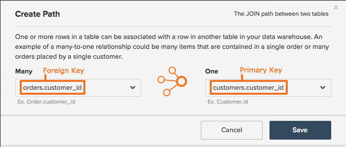

# Skapa eller ta bort banor för beräknade kolumner

## Uppdatera beräknade kolumner

När [skapa beräknade kolumner](../data-warehouse-mgr/creating-calculated-columns.md) i Data warehouse uppmanas du att definiera en sökväg som beskriver hur tabellen som du skapar en kolumn i är relaterad till tabellen som du hämtar information från. För att kunna skapa en bana måste du känna till två saker:

1. Hur tabellerna i databaserna relaterar till varandra
1. Primära och utländska nycklar som definierar relationen

Om du känner till den här informationen kan du enkelt skapa en sökväg enligt instruktionerna i den här artikeln. Vi har gett en översikt över dessa koncept om du känner dig lite osäker, men du kanske vill fråga en teknisk expert i din organisation eller kontakta vårt supportteam.

## Uppdaterar tabellrelationer och nyckeltyper {#refresher}

### Tabellrelationer {#relationships}

Vi behandlade detta koncept ingående i vår [Artikel om att förstå och utvärdera tabellrelationer](../../data-analyst/data-warehouse-mgr/table-relationships.md)Men en snabb sammanfattning skadar ingen, eller hur?

Tabeller kan relateras till varandra på ett av tre sätt:

| **`Relationship Type`** | **`Example`** |
|-----|-----|
| **`one-to-one`** | Förhållandet mellan människor och körkortsnummer. En person kan bara ha ett körkortsnummer, och ett körkortsnummer tillhör en enda person. |
| **`one-to-many`** | Relationen mellan order och artiklar - en order kan innehålla många artiklar, men en artikel tillhör en enda order. I det här fallet är ordertabellen den ena sidan och artikeltabellen den andra sidan. |
| **`many-to-many`** | Förhållandet mellan produkter och kategorier: en produkt kan tillhöra många kategorier och en kategori kan innehålla många produkter. |

{style=&quot;table-layout:auto&quot;}

När en relation mellan två tabeller tolkas kan den användas för att bestämma vilken sökväg som ska skapas för att hämta information från en tabell till en annan. I nästa steg måste du känna till de primära och externa nycklarna som underlättar en tabellrelation.

### Primära och utländska nycklar {#keys}

A `Primary Key` är en oföränderlig kolumn eller en uppsättning kolumner som skapar unika värden i en tabell. När en kund t.ex. gör en beställning på en webbplats läggs en ny rad till i `orders` i kundvagnen med en ny `order_id`. Detta `order_id` låter både kunden och företaget följa utvecklingen av den specifika beställningen. Eftersom order-ID är unikt är det vanligtvis `Primary Key` av `orders` tabell.

A `Foreign Key` är en kolumn som skapats inuti en tabell som länkar till `Primary Key` kolumn i en annan tabell. Sekundära nycklar skapar referenser mellan tabeller så att analytikerna enkelt kan söka efter och länka ihop poster. Låt oss säga att vi ville veta vilka order som tillhör var och en av våra kunder. The `customer id` kolumn (`Primary Key` i `customers` tabellen) och `order_id` kolumn (`Foreign Key` i `customers` tabell, referera till `Primary Key` i `orders` table) kan vi länka och analysera den här informationen. När du skapar en bana ombeds du definiera båda `Primary Key` och `Foreign Key`.

## Skapa en bana {#createpath}

När du skapar en kolumn i data warehouse måste du definiera sökvägen som hämtar information från en tabell till en annan. Ibland fylls banor i i förväg eftersom det redan finns en sökväg mellan tabeller, men om detta inte inträffar måste du skapa en.

Vi använder relationen mellan **kunder** och **order** för att visa hur man gör. Nedbruten:

* Relationen är `one-to-many` - en kund kan ha många order, men en order kan bara ha en kund. Detta anger relationens riktning eller var den beräknade kolumnen ska skapas. I det här fallet betyder det information från `orders` kan läggas in i `customers` tabell.
* The `primary key` vi vill använda är `customers.customerid`eller `customer ID` kolumn i `customers` tabell.
* The `foreign key` vi vill använda är `orders.customerid`eller `customer ID` kolumn i `orders` tabell.

Nu går vi igenom vägen.

1. Klicka **[!UICONTROL Data > Data Warehouse]**.
1. Klicka i tabelllistan på den tabell som du vill skapa kolumnen i. I vårt exempel är det `customers` tabell.
1. Tabellschemat visas. Klicka **[!UICONTROL Create New Column]**.
1. Ge kolumnen ett namn, till exempel `Customer's orders`.
1. Markera kolumndefinitionen. Kolla in [Beräknad kolumnstödlinje](../data-warehouse-mgr/creating-calculated-columns.md) för ett praktiskt kalkylblad.
1. I [!UICONTROL Select table and column] listrutan, klicka på **[!UICONTROL Create new path]** alternativ.

   

1. Använd listrutorna för att välja primär- och sekundärnycklar för varje tabell.

   På `Many` sida, vi väljer `orders.customerid` - Kom ihåg att kunderna kan ha många order.

   På `One` sida, vi väljer `customers.customerid` - en order kan bara ha en kund.

1. Klicka **[!UICONTROL Save]** för att spara banan och slutföra kolumnskapandet.

### Begränsningar för att skapa banor {#limits}

* **[!DNL MBI]kan inte gissa relationer för primär-/sekundärnyckel**. Vi vill inte infoga felaktiga data i ditt konto, så du måste skapa sökvägar manuellt.
* **För närvarande kan sökvägar bara anges mellan två olika tabeller**. Innebär logiken du försöker återskapa mer än två tabeller? Det kan sedan vara bra att (1) förena kolumnerna med en mellanliggande tabell först, sedan med tabellen&quot;slutlig destination&quot; eller (2) rådfråga vårt team för att hitta det bästa sättet att uppnå era mål.
* **En kolumn kan bara vara sekundärnyckelreferens för en bana åt gången**. Om `order_items.order_id` pekar på `orders.id`sedan `order_items.order_id` kan inte peka på något annat.
* **`Many-to-many`banor kan tekniskt sett skapas, men ger ofta dåliga data eftersom ingen sida är sann `one-to-many` sekundärnyckel**. Det bästa sättet att närma sig dessa banor beror alltid på den önskade analysen. Kontakta RJ:s analysteam för att hitta den bästa lösningen.

Om du inte kan skapa en beräknad kolumn på grund av en eller flera av begränsningarna ovan kontaktar du supporten med en beskrivning av kolumnen som du är

## Ta bort en beräknad kolumnsökväg {#delete}

Har du skapat en felaktig sökväg i Data warehouse? Eller kanske du ska göra lite vårrengöring och vill städa upp? Om du behöver ta bort en sökväg från ditt konto kan du [skicka en biljett till våra supportanalytiker](../../guide-overview.md). **Var noga med att ta med namnet på sökvägen!**

## Radbrytning {#wrapup}

Nu bör du känna dig bekväm med att skapa banor för beräknade kolumner i Data warehouse. Om du fortfarande är osäker på en viss bana kan du alltid klicka **[!UICONTROL Support]** i [!DNL MBI] för att få hjälp.

## Relaterad

* [Förstå och utvärdera tabellrelationer](../data-warehouse-mgr/table-relationships.md)
* [Skapa banor för beräknade kolumner](../data-warehouse-mgr/create-paths-calc-columns.md)
* [Beräknade kolumntyper](../data-warehouse-mgr/calc-column-types.md) försöker skapa.
