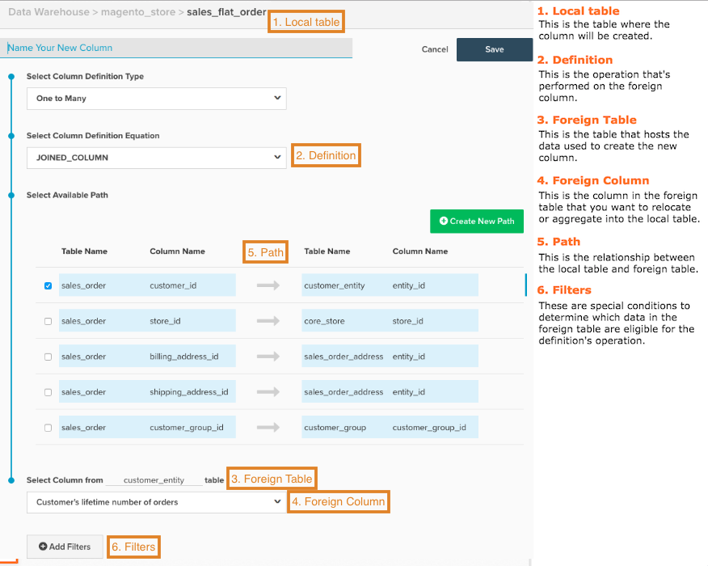

# Skapa beräknade kolumner

När du analyserar data är det praktiskt att konsolidera data från olika källor. Vill du gruppera intäkter genom att hämta källan, länka data från din `orders`-tabell och [!DNL Google Analytics]-data? Kanske vill ni gruppera intäkterna efter kundkön eller koppla ett kundattribut till transaktionsdata för segmentering. Det här avsnittet handlar om hur man gör just det.

Innan du börjar rekommenderar Adobe att du läser [handboken Beräknade kolumntyper](../../data-analyst/data-warehouse-mgr/calc-column-types.md) för att få information om vilka typer av Data Warehouse du kan skapa i kolumnhanteraren, samt definitioner och exempel för dem.

1. Klicka på **[!DNL Manage Data > Data Warehouse]** för att komma igång.

1. Klicka på den tabell där du vill skapa en kolumn. Om du till exempel vill skapa en `Customer Gender`-kolumn för intäktssegmentering väljer du tabellen `sales_flat_order`.

1. Tabellschemat visas. Klicka på **[!UICONTROL Create New Column]**.

1. Ge kolumnen ett namn. Exempel: `Customer Gender`.

1. Markera definitionen för kolumnen. Här är handboken [Beräknade kolumntyper](../data-warehouse-mgr/calc-column-types.md) användbar!

1. För vissa typer av kolumner krävs lite mer information för att kolumnen ska kunna skapas:

   * För `One to Many` (kopplade) och `Many to One` (aggregerade) kolumner måste du markera tabellerna och kolumnerna.

   * För `Same Table calculation` måste du välja önskat datumfält i listrutan.

Om du skapar en `One to Many`-kolumn (kopplad) eller `Many to One`-kolumn (sammanställd) måste du välja en sökväg för att ansluta de två tabellerna. I det här steget kan du antingen använda en befintlig bana eller skapa en.

>[!NOTE]
>
>Kom ihåg att definiera tabellen som antingen många eller ett.

* Om du vill kan du använda [filter](../../data-user/reports/ess-manage-data-filters.md) på den nya kolumnen.

* När du är klar klickar du på **[!UICONTROL Save]**.

Den nya kolumnen visas i den aktuella tabellen med statusen `Pending`. När nästa uppdatering är klar är kolumnen tillgänglig för användning i mätvärden och rapporter.

## Referenskarta {#map}

Om du har problem med att komma ihåg vad alla indata är när du skapar en beräknad kolumn, kan du försöka behålla referenskartan när du skapar:

## Relaterad dokumentation

* [Beräknade kolumntyper](../data-warehouse-mgr/calc-column-types.md)
* [Avancerade beräknade kolumntyper](../data-warehouse-mgr/adv-calc-columns.md)
* [Bygger [!DNL Google ECommerce] dimensioner med order- och kunddata](../data-warehouse-mgr/bldg-google-ecomm-dim.md)
