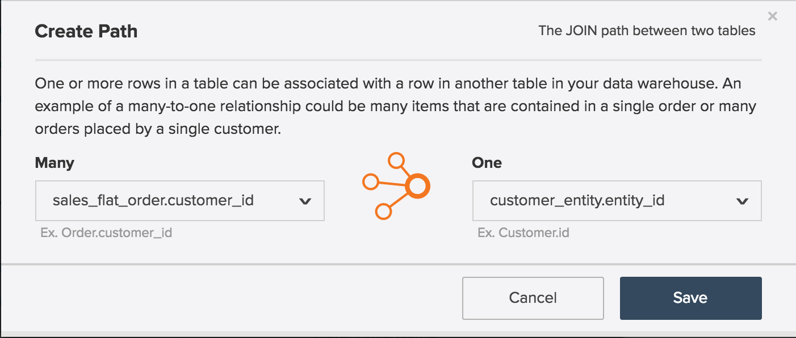
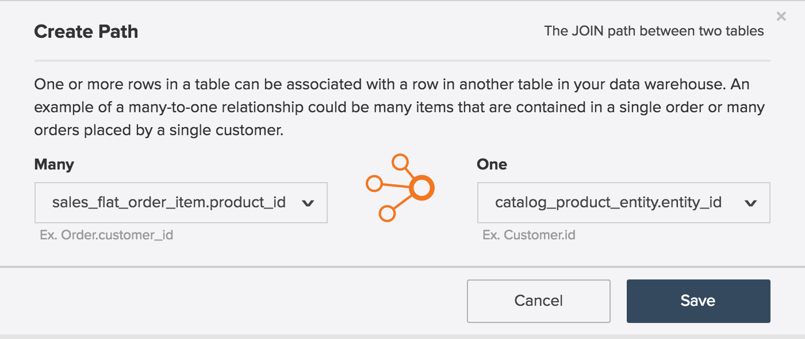

# Entitetsrelationsdiagram

Vad är en **[!UICONTROL entity relationship (ER) diagram]**? Ett [!UICONTROL ER]-diagram är en visualisering av tabeller i en databas och hur de relaterar till varandra. Det här avsnittet innehåller några [!UICONTROL ER] diagram som hjälper dig att visualisera relationen mellan några vanliga databastabeller i Adobe Commerce.

>[!NOTE]
>
>I hela det här avsnittet visas orden **join**, **relationship** och **path**. De här orden används för att beskriva hur två tabeller är sammankopplade.

## Commerce [!UICONTROL ER]-huvuddiagram

Det här `ER`-diagrammet representerar relationerna mellan bastabellerna i en Commerce-databas. Genom att visa flera relationer samtidigt kan du se hur data skulle kunna relateras i flera tabeller.

Avsnitten nedan innehåller `ER` diagram som är specifika för två tabeller i taget. Om du vill visa ett diagram och tillhörande beskrivning klickar du på rubriken för det avsnittet.

## `customer\_entity & sales\_flat\_order`

En kund kan göra många beställningar. Relationen mellan de här två tabellerna är `customer\_entity.entity\_id = sales\_flat\_order.customer\_id`

>[!IMPORTANT]
>
>`customer\_entity.entity\_id` är inte lika med `sales\_flat\_order.entity\_id`. Den första kan betraktas som en `customer\_id` och den andra som en `order\_id.`

Om sökvägen mellan de här två tabellerna inte finns i [!DNL Commerce Intelligence] kan du [skapa sökvägen](../data-warehouse-mgr/create-paths-calc-columns.md) på fliken Data Warehouse. När du är redo att skapa banan definieras den så här:

## `sales\_flat\_order & sales\_flat\_order\_item`

En order kan innehålla många artiklar. Relationen mellan de här två tabellerna är `sales\_flat\_order.entity\_id = sales\_flat\_order\_item.order\_id`.

Om sökvägen mellan de här två tabellerna inte finns i [!DNL Commerce Intelligence] kan du [skapa sökvägen](../data-warehouse-mgr/create-paths-calc-columns.md) på fliken Data Warehouse. När du är redo att skapa banan definierar du den enligt nedan.

## `catalog\_product\_entity & sales\_flat\_order\_item`

En produkt kan köpas för många artiklar. Relationen mellan de här två tabellerna är `catalog\_product\_entity.entity\_id = sales\_flat\_order\_item.product`.

Om sökvägen mellan de här två tabellerna inte finns i [!DNL Commerce Intelligence] kan du [skapa sökvägen](../data-warehouse-mgr/create-paths-calc-columns.md) på fliken Data Warehouse. När du är redo att skapa banan definierar du den enligt nedan.

