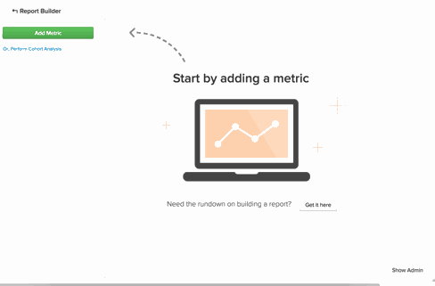

# [!DNL Google Analytics] använder anskaffningskällor

## Vad är kanaler? {#channels}

Att skapa anpassade segment för att se hur olika trafik fungerar och observera trender är en av de mest kraftfulla användningsområdena för [!DNL Google Analytics]. En segmentklass som finns som standard i [!DNL Google Analytics] är `Channels`. Kanaler är en gruppering av vanliga sätt som folk kommer till din webbplats.  [!DNL Google Analytics] sorterar automatiskt de olika sätt som du köper en användare på - sociala medier, betala per klick, e-post eller hänvisningslänkar - och paketerar dem i en bucket eller kanal.

## Varför visas inte min `channels` i Commerce Intelligence? {#nochannels}

`Channels` är enkla, sammansatta dataområden. Om du vill sortera dina förvärv i kanalintervall anger [!DNL Google] distinkta regler och definitioner med hjälp av specifika parametrar: en kombination av förvärvet [Source](https://support.google.com/analytics/answer/1033173?hl=en) (trafikens ursprung) och förvärvet [Medium](https://support.google.com/analytics/answer/6099206?hl=en) (källans allmänna kategori).

Även om dessa bucklar kan hjälpa er att förstå var trafiken kommer ifrån är dessa data inte taggade efter kanal utan efter en kombination av Source och Medium. Eftersom [!DNL Google] skickar kanalinformation som två separata datapunkter visas inte kanalgrupperingar automatiskt i [!DNL Commerce Intelligence].

## Vilka är standardkanalgrupperingarna? Hur skapas de?

Som standard konfigurerar [!DNL Google] åtta olika kanaler. Reglerna som bestämmer hur kanaler skapas är nedan.

| **Kanal** | **Vad är det?** | **Hur skapas det?** |
|---|---|---|
| Direkt | Alla som kommer in direkt på er webbplats. | Source = `Direct` AND Medium = `(not set); OR Medium = (none)` |
| Organic Search | Trafik som har rankats organiskt i obetalda sökmotorer. | Medium = `organic` |
| Hänvisning | Trafik som kommer från en extern länk som inte är en organisk sökning eller från webbplatser som inte är sociala nätverk. | Medium = `referral` |
| Betalsökning | Trafik som har en UTM-spårningskod där mediet är antingen &quot;cpc&quot;, &quot;ppc&quot; eller &quot;paidsearch&quot; OCH är ett annonsdistributionsnät som inte matchar &quot;Content&quot;. | Medium = `^(cpc|ppc|paidsearch)$` AND Ad Distribution Network ≠ `Content` |
| Social | Hänvisningstrafik som kommer från något av ungefär [400 sociala nätverk](https://www.annielytics.com/blog/analytics/sites-google-analytics-includes-in-social-reports/) och som inte är taggad som annonser. | Social Source-referens = `Yes` OR Medium = `^(social|social-network|social-media|sm|social network|social media)$` |
| E-post | Trafik från sessioner som är taggade med ett medium av &quot;e-post&quot;. | UTM-spårningskod för Medium = `email` |
| Visa | Trafik som har en UTM-spårningskod där mediet antingen visas eller är kpm. Innehåller även AdWords-interaktion där annonsens distributionsnätverk matchar&quot;Content&quot; | Medium = `^(display|cpm|banner)$` OR Ad Distribution Network = `Content` AND Ad Format ≠ `Text` |
| Övriga | Sessioner från andra annonskanaler (exklusive betald sökning) som är taggade med mediet &quot;cpc&quot;, &quot;ppc&quot;, &quot;cpm&quot;, &quot;cpv&quot;, &quot;cpa&quot;, &quot;cpp&quot;, &quot;affiliate&quot;. | Medium = `^(cpv|cpa|cpp|content-text)$` |

{style="table-layout:auto"}

## Hur återskapar jag de här kanalgrupperingarna i min Data Warehouse? {#recreate}

Nu när du vet att kanaler bara är kombinationer av källor och medier är det en enkel process i tre steg att återskapa dessa grupperingar i din Data Warehouse.

1. **Aktivera [!DNL Google ECommerce]integreringen**

   [När det är aktiverat](../importing-data/integrations/google-ecommerce.md) kontrollerar du att fälten [sync]&#x200B;(../{{ site.baseurl }}/data-analyst/data-warehouse-mgr/tour-dwm.html#syncing) **medium** och **source** i din Data Warehouse är . När detta är klart hämtas data om medium- och källinhämtning till din Data Warehouse.

1. **Överför en mappning av Google kanalgrupperingar**

   Adobe Commerce skapar en tabell med standardgrupperingarna mappade som en fil som du kan [hämta](../../assets/ga-channel-mapping.csv).

   Om du är [!DNL Google Analytics]-proffs och har skapat egna kanaler vill du lägga till dina specifika regler i mappningstabellen innan du överför filen till [!DNL Commerce Intelligence].

   Hämta in den i din Data Warehouse som en [filöverföring](../importing-data/connecting-data/using-file-uploader.md).

   

1. **Upprätta en relation mellan[!DNL Google ECommerce]och överföring av mappningsfil**

   Om du vill upprätta en relation mellan [!DNL Google ECommerce] och mappningstabellen [skickar du en supportförfrågan](../../guide-overview.md#Submitting-a-Support-Ticket) till ditt Data Analyst-team och refererar till det här avsnittet. Analytikern skapar en ny beräknad kolumn med namnet **Channel** i ECommerce-tabellen. **Efter en fullständig uppdateringscykel** kan den här kolumnen användas i en `Filter` eller `Group by`.

Du har nu [!DNL Google Analytics Channel] grupperingar i din Data Warehouse, vilket innebär att du kan analysera dina data från ett nytt perspektiv:

I det här exemplet började du enkelt med att segmentera måttet **Antal order** efter **Kanal**. Testa din nya kolumn och se vilka trender du kan identifiera i dina [!DNL Google Analytics Channel]-data!

## Relaterad dokumentation

* [Använda Report Builder](../../tutorials/using-visual-report-builder.md)
* [[!DNL Google ECommerce]data förväntades](../importing-data/integrations/google-ecommerce-data.md)
* [Bygger[!DNL Google ECommerce]dimensioner med order- och kunddata](../data-warehouse-mgr/bldg-google-ecomm-dim.md)
* [Vilka är era mest värdefulla förvärvskällor och kanaler?](../analysis/most-value-source-channel.md)
