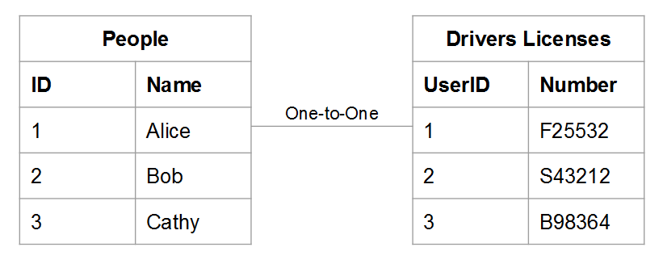

# Förstå och utvärdera tabellrelationer

När du utvärderar relationen mellan två angivna tabeller måste du förstå hur många möjliga förekomster i en tabell som kan tillhöra en enhet i en annan, och vice versa. Använd till exempel en `users`-tabell och en `orders`-tabell. I det här fallet vill du veta hur många **order** som en viss **användare** har placerat och hur många möjliga **användare** och **order** kan tillhöra.

Förhållanden är avgörande för att dataintegriteten ska kunna upprätthållas, eftersom det påverkar noggrannheten i dina [beräknade kolumner](../data-warehouse-mgr/creating-calculated-columns.md) och [dimensioner](../data-warehouse-mgr/manage-data-dimensions-metrics.md). Mer information finns i [relationstyper](#types) och [Så här utvärderar du tabellerna i din Data Warehouse.](#eval)

## Relationstyper {#types}

Det finns tre typer av relationer mellan två tabeller:

1. [&quot;en-till-en&quot;](#onetoone)
1. [&quot;en-till-många&quot;](#onetomany)
1. [&quot;många-till-många&quot;](#manytomany)

### `One-to-One` {#onetoone}

I en `one-to-one`-relation tillhör en post i tabellen `B` bara en post i tabellen `A`. En post i tabellen `A` tillhör bara en post i tabellen `B`.

I förhållandet mellan människor och körkortsnummer kan en person t.ex. bara ha ett körkortsnummer och ett körkortsnummer tillhör endast en person.

### `One-to-Many` {#onetomany}

I en `one-to-many`-relation kan en post i tabellen `A` eventuellt tillhöra flera poster i tabellen `B`. Fundera på relationen mellan `orders` och `items` - en order kan innehålla många objekt, men ett objekt tillhör en enda order. I det här fallet är tabellen `orders` den ena sidan och tabellen `items` den andra.

### `Many-to-Many` {#manytomany}

I en `many-to-many`-relation kan en post i tabellen `B` eventuellt tillhöra flera poster i tabellen `A`. Och vice versa, en post i tabellen `A` kan eventuellt tillhöra flera poster i tabellen `B`.

Fundera på relationen mellan **produkter** och **kategorier**: en produkt kan tillhöra många kategorier, och en kategori kan innehålla många produkter.

## Utvärdera dina tabeller {#eval}

Med tanke på vilka typer av relationer som finns mellan tabeller kan du lära dig att utvärdera tabellerna i din Data Warehouse. När de här relationerna utformar hur flertabellskalkylerade kolumner definieras är det viktigt att du förstår hur du identifierar tabellrelationer och vilken sida - `one` eller `many` - som tabellen tillhör.

Det finns två metoder som du kan använda för att utvärdera relationen mellan ett givet tabellpar i din Data Warehouse. Den första metoden använder ett [konceptuellt ramverk](#concept) som tar hänsyn till hur tabellens entiteter interagerar med varandra. Den andra metoden använder [tabellens schema](#schema).

### Använda konceptuella ramverk {#concept}

Den här metoden använder ett konceptuellt ramverk för att beskriva hur enheter i de två tabellerna kan interagera med varandra. Det är viktigt att förstå att detta ramverk bedömer vad som är möjligt, med tanke på relationen.

När du till exempel tänker på användare och beställningar bör du tänka på allt som är möjligt i relationen. En registrerad användare får inte göra några beställningar, bara en beställning eller flera beställningar under sin livstid. Om du har startat din verksamhet och inga beställningar har gjorts är det möjligt att en viss användare kan göra många beställningar under sin livstid. Tabellerna är byggda för att passa detta.

Så här använder du den här metoden:

1. Identifiera den enhet som beskrivs i varje tabell. **Tips! Det är vanligtvis ett substantiv**. Tabellerna `user` och `orders` beskriver till exempel användare och order explicit.

1. Identifiera ett eller flera verb som beskriver hur dessa enheter interagerar. När man jämför användare med order lägger man order. I den andra riktningen&quot;tillhör&quot; beställningarna användare.

Den här typen av ramverk kan användas för alla tabellpar i din Data Warehouse. På så sätt kan du enkelt identifiera relationstypen och vilken tabell som är en sida och vilken tabell som är en många.

När du har identifierat terminologin som beskriver hur de två tabellerna interagerar bildruta interaktionen i båda riktningarna genom att överväga hur en viss instans av den första entiteten relaterar till den andra. Här är några exempel på varje relation:

### `One-to-One`

En person kan bara ha ett körkortsnummer. En förares körkortsnummer tillhör endast en person.

Det här är en `one-to-one`-relation där varje tabell är en sida.

### `One-to-Many`

En viss order kan innehålla många artiklar. En given artikel tillhör endast en order.

Det här är en `one-to-many`-relation där ordertabellen är den ena sidan och artikeltabellen är många.

### `Many-to-Many`

En viss produkt kan eventuellt tillhöra många kategorier. En viss kategori kan innehålla många produkter.

Det här är en `many-to-many`-relation där varje tabell är på många sidor.

### Använda tabellens schema {#schema}

Den andra metoden använder tabellschemat. Schemat definierar vilka kolumner som är nycklarna [`Primary`](https://en.wikipedia.org/wiki/Unique_key) och [`Foreign`](https://en.wikipedia.org/wiki/Foreign_key). Du kan använda de här tangenterna för att länka samman tabeller och för att fastställa relationstyper.

När du har identifierat kolumnerna som länkar samman två tabeller använder du kolumntyperna för att utvärdera tabellrelationen. Här är några exempel:

### `One-to-one`

Om tabellerna är länkade med `primary key` i båda tabellerna beskrivs samma unika enhet i varje tabell och relationen är `one-to-one`.

En `users`-tabell kan t.ex. hämta de flesta användarattribut (t.ex. namn) medan en extra `user_source`-tabell hämtar källor för användarregistrering. I varje tabell representerar en rad en användare.

### `One-to-many`

>[!NOTE]
>
>Tar ni emot gästorder? Se [Gästbeställningar](../data-warehouse-mgr/guest-orders.md) om du vill veta hur gästbeställningar kan påverka dina tabellrelationer.

När tabeller länkas med en `Foreign key` som pekar på en `primary key`, beskriver den här inställningen en `one-to-many`-relation. Den ena sidan är tabellen som innehåller `primary key` och den andra sidan är tabellen som innehåller `foreign key`.

### `Many-to-many`

Om något av följande stämmer är relationen `many-to-many`:

* `Non-primary key` kolumner används för att länka två tabeller
  
* En del av en sammansatt `primary key` används för att länka två tabeller

## Nästa steg

En korrekt bedömning av tabellrelationerna är avgörande för att data ska kunna modelleras korrekt. Nu när du förstår hur tabeller är relaterade till varandra kan du läsa [vad du kan göra med Data Warehouse Manager](../data-warehouse-mgr/tour-dwm.md).
