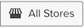

# Bred filtrering på kontrollpanelen

Med filtrering på hela kontrollpanelen kan du göra massredigeringar av alla rapporter på en specifik kontrollpanel. Du kan snabbt visa samma analys över olika tidsperioder eller för olika butiker. Du kan enkelt jämföra prestanda för ett föregående år, en månad eller en vecka per butik. Dessutom kan ni uppdatera en hel kontrollpanel för att passa en ny kampanj.

## Datumfilter

Om du vill ändra datumintervall eller intervall för rapporter på en kontrollpanel klickar du på kalenderikonen i det övre högra hörnet ().

Du kan välja att visa data med en `Fixed Date Range` eller en mängd förberäknade `Moving Date Ranges`:

The `Last Full...` alternativ för rörligt intervall representerar det senast slutförda intervallet, medan `This...` är det aktuella, pågående intervallet. Om det till exempel är juni, `Last Full Month` är _1 maj-31 maj_, while `This Month` är _1 juni - nu_.

Eller skapa en egen `Custom Moving Range`\:

Välj att ändra intervallet också. Välja standardknapp () innebär att endast datumintervallet ändras:

Om du vill återställa alla rapporter till det ursprungliga datumintervallet och intervallet klickar du på **[!UICONTROL Restore Defaults]** eller klicka **[!UICONTROL Cancel]**.

När du anger ett datumfilter för en kontrollpanel tillämpas det filtret endast på den instrumentpanelen. Det används inte när du navigerar till andra instrumentpaneler.

>[!NOTE]
>
>För närvarande `Cohort Reports` och `SQL Reports` tas inte med när du tillämpar ändringar på kontrollpanelsnivå.

## Butiksfilter

Om du vill analysera hur en viss butik fungerar klickar du på butiksikonen i det övre högra hörnet (). Som standard `Store Filter` är inställd på `All Stores`, som visar data från alla [butiksvyer](https://experienceleague.adobe.com/docs/commerce-admin/stores-sales/site-store/store-views.html) som finns på din Commerce-webbplats.

>[!NOTE]
>
>Ett arkivfilter är aktiverat eller inaktiverat för en hel [!DNL MBI] konto. Om en kontrollpanel innehåller rapporter som inte påverkas av filtret, t.ex. rapporter som inte baseras på några Commerce-data, uppdateras inte dessa rapporter när arkivfiltret används. Du kan [kontakta support](https://experienceleague.adobe.com/docs/commerce-knowledge-base/kb/troubleshooting/miscellaneous/mbi-service-policies.html?lang=en) om du anser att en rapport ska uppdateras baserat på val av butik eller om du tror att ditt kontoarkivfilter har inaktiverats av misstag.

När du väljer en butik på `Store Filter`behåller filtret markeringen när du navigerar mellan kontrollpaneler. Om du behåller markeringen kan du visa data för den valda butiken överallt tills du väljer `All Stores`.

## Filter för delade instrumentpaneler

Om en användare konfigurerar datumfiltret för delade instrumentpaneler ser andra användare med åtkomst till kontrollpanelen att samma filter tillämpas. Butiksfiltret gäller dock inte i det här fallet. Om instrumentpanelens ägare konfigurerar arkivfiltret och delar instrumentpanelen, kommer det konfigurerade arkivfiltret inte att finnas kvar för en annan användare. En användare måste ha [redigera åtkomst](../../data-user/dashboards/share-dashboard-with-users.md) till en kontrollpanel för att justera kontrollpanelsfiltren.
