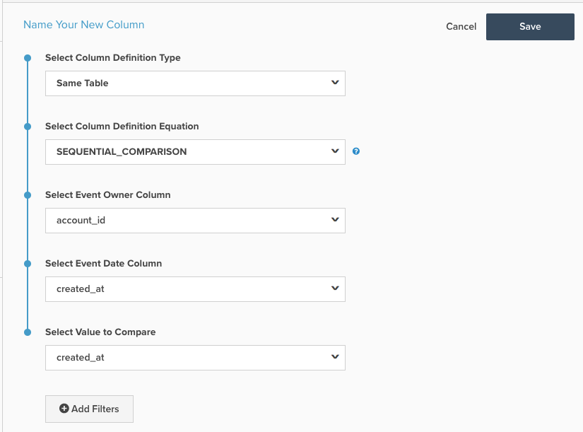

# Beräknad kolumn för sekventiell jämförelse

I det här avsnittet beskrivs syftet med och användningsområdena för den beräknade kolumnen `Sequential Comparison` som är tillgänglig på sidan **[!DNL Manage Data > Data Warehouse]**. Nedan visas en förklaring av vad det gör, följt av ett exempel och hur det fungerar.

**Förklaring**

Kolumntypen `Sequential Comparison`: söker efter skillnaden mellan efterföljande händelser. Den vanligaste typen för kolumnen `Sequential Comparison` är kolumnen `Seconds since previous order`. Det finns tre indata som behövs för den här kolumnen:

1. `Event Owner`: Den här inmatningen avgör för vilken enhet rader grupperas. I kolumnen `Seconds since previous order` är till exempel händelseägaren kunden eftersom du vill hitta antalet sekunder sedan den föregående ordern från samma kund.
1. `Event Date`: Den här inmatningen tvingar händelsesekvensen. I fallet `Seconds since previous order` ska kolumnen som innehåller tidsstämpeln för ordern vara `Event Date`. Den här inmatningen är alltid en tidsstämpel.
1. `Value to Compare`: Den här inmatningen är det faktiska värde som ska jämföras. Den subtraherar föregående rads värde från den aktuella radens värde. En kolumn som identifierar tidsskillnaden mellan efterföljande order för en kund kallas därför `Seconds since previous order`. Den här inmatningen behöver inte vara en tidsstämpel. Ett exempel på icke-tidsstämpel är att hitta skillnaden i ordervärde mellan på varandra följande order från en kund.

**Exempel**

| **`event_id`** | **`owner_id`** | **`timestamp`** | **`Seconds since owner's previous event`** |
|--- |--- |--- |--- |
| **`1`** | A | 2015-01-01 00:00:00 | NULL |
| **`2`** | B | 2015-01-01 00:30:00 | NULL |
| **`3`** | A | 2015-01-01 02:00:00 | 7200 |
| **`4`** | A | 2015-01-02 13:00:00 | 126000 |
| **`5`** | B | 2015-01-03 13:00:00 | 217800 |

I ovanstående exempel är `Seconds since owner's previous event` den `Sequential Comparison` beräknade kolumnen. För `owner_id = A` identifierar den först en sekvens baserad på kolumnen `timestamp` och subtraherar sedan den föregående händelsens `timestamp` från den aktuella händelsens tidsstämpel. I den tredje raden i tabellen - den andra raden för `owner_id A` - är värdet `Seconds since owner's previous event` antalet sekunder mellan &#39;2015-01-01 02:00&#39; och &#39;2015-01-01 00:00:00&#39;. Skillnaden är lika med två timmar = 7 200 sekunder.

För den här beräknade kolumntypen har raden som motsvarar ägarens första händelse ett `NULL`-värde.

**Mekanik**

Så här skapar du en **Event Number**-kolumn:

1. Navigera till sidan **[!DNL Manage Data > Data Warehouse]**.

1. Navigera till tabellen som du vill skapa den här kolumnen för.

1. Klicka på **[!UICONTROL Create New Column]** i det övre högra hörnet.

1. Välj `Same Table` som `Definition Type` (om kolumnerna som du vill jämföra inte finns i samma tabell kan du behöva flytta dem).

1. Välj `SEQUENTIAL_COMPARISON` som `Column Definition Equation`.

1. Välj indata enligt ovan:
   - `Event Owner`
   - `Event Date`
   - `Value to Compare`

1. Du kan också lägga till filter för att utesluta rader från övervägandet. De uteslutna raderna har ett `NULL`-värde för den här kolumnen.

1. Ange ett namn för kolumnen högst upp på sidan och klicka på **[!UICONTROL Save]**.

1. Kolumnen kan användas *omedelbart*.

