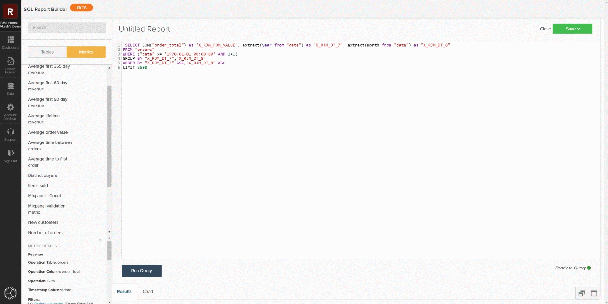

# [!DNL SQL Report Builder]

[!DNL SQL Report Builder] används främst för att skapa nya rapporter och iterera på analyser, men kan också användas för att effektivt granska data och mätvärden. I följande information förklaras hur du granskar data och mätvärden med [!DNL SQL Report Builder] så att du kan jämföra resultaten med data från din lokala databas.

## Fråga ett mått

Öppna [!DNL SQL Report Builder] genom att gå till **[!UICONTROL Report Builder > SQL Report Builder > Create Report]** för att komma igång. Du kan använda sidofältet i [!DNL SQL]-redigeraren för att infoga ett mätvärde direkt i frågan genom att hålla markören över mätvärdet och klicka på **[!UICONTROL Insert]**. Då läggs frågedefinitionen för det måttet till i redigeraren. Definitionen innehåller följande komponenter:

- Den **metriska åtgärd** som utförs, vilket anges av `SUM()` i exemplet nedan.
- Tabellen **på** som måttet byggs på, vilket anges av satsen `FROM`.
- Alla **filter (och filteruppsättningar)** som har lagts till i måttet, vilket anges av `WHERE` -satsen i exemplet nedan.
- Komponenten för **timestamp** (year, month) som data ska beställas på, vilket anges av `ORDER BY` -satsen i exemplet nedan.

Om du vill få en tydligare bild av frågan kan du formatera om hur den visas i frågefältet. Välj `Run Query` när du är klar. Resultatet fylls i som en tabell i rapportpanelen nedanför frågan.

## Begränsa frågan

Om du försöker hitta en viss diskrepans eller datauppsättning bör du begränsa frågan till ett visst prov för att kontrollera mot den lokala databasen. Du kan göra detta genom att redigera frågan så att den matchar dina önskade begränsningar. I följande exempel begränsar du frågan till att endast inkludera intäkter från 1 januari 2013 eller senare. När du har uppdaterat frågan väljer du **[!UICONTROL Run Query]** igen för att uppdatera resultatet.

## Spara och exportera

När rapporten uppfyller dina behov ger du rapporten ett tydligt namn, klickar på **[!UICONTROL Save]** och väljer den typ av rapport som du vill spara och instrumentpanelen. När du granskar mätvärden rekommenderar Adobe att du sparar rapporten som `Table` och sparar den på en testkontrollpanel.

När rapporten har sparats går du till den instrumentpanelen genom att välja `Go to Dashboard`. Därifrån kan du exportera data genom att hitta rapporten och välja **[!UICONTROL Options gear > Full `.csv`Exportera]** eller **[!UICONTROL Full Excel Export]**.

## Egna frågor

Du kan också skriva egna frågor och exportera resultaten som ska jämföras med den lokala databasen. Följ [riktlinjerna för frågeoptimering](../../best-practices/optimizing-your-sql-queries.md) och skriv en fråga i SQL-redigeraren. Du kan använda knapparna högst upp i sidofältet för att växla mellan listor med tabeller och mätvärden som är tillgängliga för användning i [!DNL SQL Report Builder] och lägga till dem i din fråga. När din anpassade fråga passar dina behov kan du spara rapporten och exportera dessa data från kontrollpanelen.

>[!NOTE]
>
>Om du upptäcker diskrepanser efter att ha granskat dina data kan du läsa mer om vad du ska göra härnäst i [Kontakta support: datadiskrepanser](https://experienceleague.adobe.com/docs/commerce-knowledge-base/kb/troubleshooting/miscellaneous/mbi-data-discrepancies.html?lang=sv-SE).
