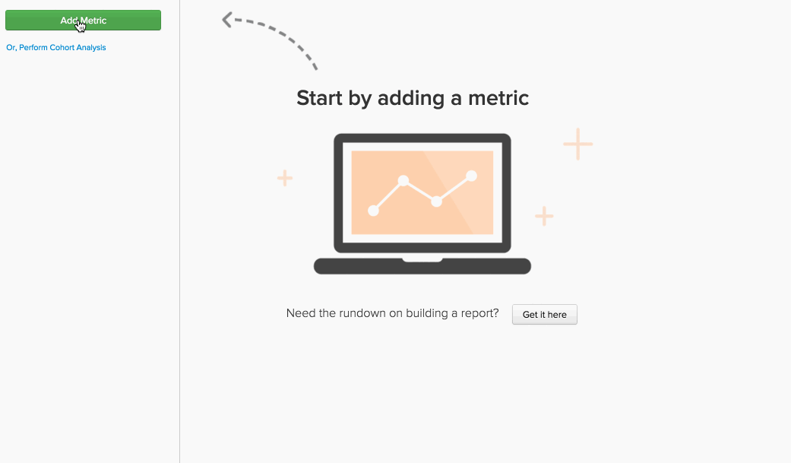

# Formler i `Report Builder`

I [`Report Builder`](../../tutorials/using-visual-report-builder.md)kan du skapa kraftfulla visualiseringar med [definierade mått](../../data-user/reports/ess-manage-data-metrics.md) i ditt konto. Genom att kombinera dessa mätvärden i en formel kan ni få ytterligare insikter från era data. I den här artikeln kan vi fördjupa oss i hur formler kan användas i `Report Builder` - hoppar in!

## Vad är en `formula`? {#what}

I `Report Builder`, a `formula` är bara en kombination av en eller flera mätvärden som bygger på någon matematisk logik. Ett typiskt exempel ser ut så här:

I det här exemplet använder vi en `Number of orders metric (A)` och `Distinct buyers metric (B)`och vårt mål är att svara på frågan: Hur många order gör mina köpare i genomsnitt varje månad? Formelns parametrar är:

* `Definition`: Här använder du matematik på indatavärden. I det här exemplet kan vi se det genomsnittliga antalet order genom att dividera antalet order med antalet distinkta köpare. Definitionen är därför (A/B).

* `Format`: Returnerar din formel ett tal, en tidsperiod eller ett valutabelopp? Bredvid formelns definition finns en listruta som du kan använda för att ange returens format. I det här fallet är det ett tal.

* `Miscellaneous`: Formelns tidsstämpel, grupperingar, perspektiv och filter ärvs alla av dess indatavärden. Det finns ingenting att göra här!

## Hur kan jag använda `formulas` i mina rapporter? {#how}

Nu när vi har gått igenom grunderna ska vi ta en titt på några exempel.

### Exempel: Jag vill veta hur stor procentandel av min intäkt som kan tillskrivas förstagångsbeställningar.

I det här exemplet använde vi `Revenue` och `Revenue (first time orders)` mätvärden. Genom att dela upp `Revenue (first time orders)(B)` mått efter `Revenue metric (A)` och ange returformatet till `Percent`hittar vi den procentandel av intäkterna som kan hänföras till förstagångsbeställningar.

### Exempel: Jag vill veta vad de genomsnittliga intäkterna per order är när jag gör det och inte erbjuder en `promo code`.

I det här exemplet använde vi `Revenue` och `Number of orders` mätvärden. Svaret på den här frågan är två steg - dela upp `Revenue (A)` av `Number of orders (B)` och ange returformatet till `Currency`. Sedan tillät vi endast formelresultatet (`Avg. Revenue per order`) för att visa och gruppera resultaten efter `Promo code`.

### Exempel: Jag vill veta hur mina nya kunders UTM-källor distribueras.

Att hitta svaret på den här frågan innehåller några steg:

1. Först lade vi till `New Customers` och sedan grupperas efter `utm_source - all`. Detta är ett mått `A`, eller `New Customers (grouped)`.

1. Sedan duplicerade vi `New Customers (grouped)` mätvärden och ange att de ska använda en oberoende dimension. Mått `B` - `New customers (ungrouped)` - visar det totala antalet nya kunder.

1. När vi har dolt båda mätvärdena anger vi formeldefinitionen till `A/B`. Detta delar upp `New customers (grouped)` av `New Customers (ungrouped)`.

1. Sedan ställer vi in resultatformatet på `Percent`.

I vårt exempel använde vi `Stacked Columns` för att visa resultaten per månad. På så sätt kan vi jämföra distributionen av nya kunder månadsvis.

## Radbrytning {#wrapup}

Observera i exemplen ovan att formeln `timestamp`, `groupings`, `perspectives`och `filters` ärvs från indatavärden? Kom ihåg att formler kan användas `perspectives` och [oberoende tidsalternativ](../../tutorials/time-options-visual-rpt-bldr.md){: target=&quot;_blank&quot;}, precis som mätvärden kan.

Om du har ytterligare frågor om hur du använder formler i `Report Builder`, [kontakta support](../../guide-overview.md).
