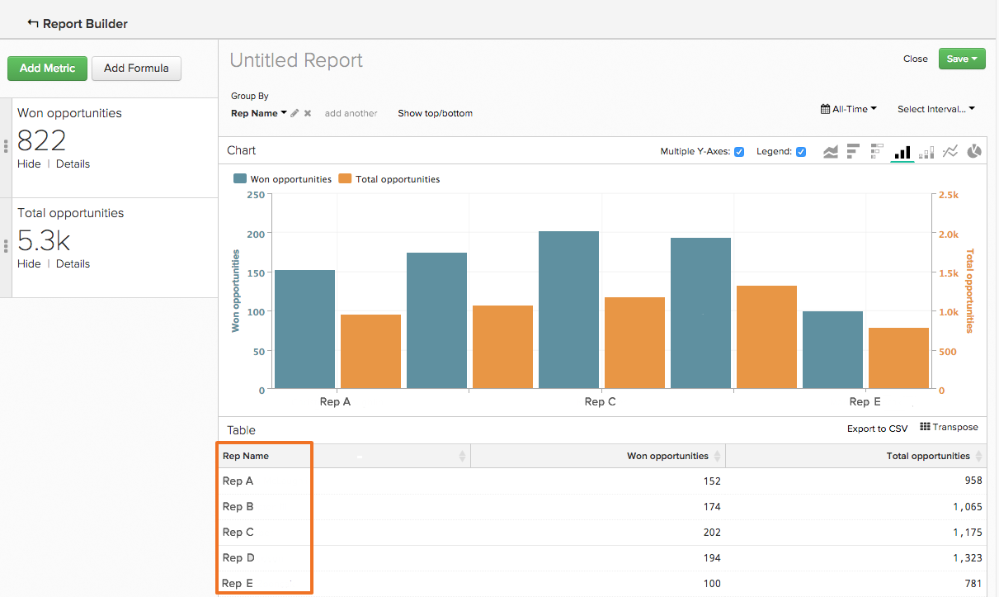

# Beställa data med funktionen `Show Top/Bottom`

Du kan göra mer i `Visual Report Builder` än att skapa analyser som visar en tendens över tiden. Du kan t.ex. skapa en rapport som visar hur värdefulla era förvärv- och marknadsföringskanaler är, men du kan också skapa en rapport som bara visar de fem främsta prestationerna. På samma sätt kan ni fokusera om era marknadsföringssatsningar genom att skapa en rapport som visar vilka lägen som genererar störst intäkter.

Den här sorteringen och sorteringen av data kan göras i rapporter som använder både en `Group By` och en `Time Interval of None`. När båda dessa element finns i en rapport visas funktionen `Show Top/Bottom` ovanför förhandsvisningen av diagrammet. Med den här funktionen kan du se de översta (högsta till lägsta) och understa (lägsta till högsta) datapunkterna baserat på de parametrar som du anger.

## Hur använder jag den här? {#how}

Klicka på **[!UICONTROL Show Top/Bottom link]** för att ange visnings- och sorteringsparametrar. Talet i textrutan kan antingen vara ett heltal (som `5`) eller `ALL`. Därefter kan du välja att sortera rapporten antingen efter måttet ELLER efter grupperingen.

Om du till exempel vill visa de fem hänvisningskällorna som gav störst intäkter är det så här du gör:

1. Lägg till måttet `Revenue` i rapporten.

1. Lägg till en `Group By` för att segmentera måttet efter hänvisningskälla.

1. Ange `Time Interval` till `None`.

1. I inställningarna för `Show Top/Bottom` anger du att visningen ska vara `5` så att endast hänvisningskällor med de fem högsta totala intäktsbeloppen inkluderas i rapporten.

>[!NOTE]
>
>Eftersom rapporten inte har `Time Interval` kan värdena - i det här fallet de fem främsta hänvisningskällorna - ändras över tiden. Om en hänvisningskälla överstiger en annan vad gäller intäkter, ändras den ordning i vilken källorna visas.

## Hur är det med att använda flera mätvärden? {#multiplemetrics}

Det blir komplicerat att använda den här funktionen när det finns mer än ett mått i en rapport, eftersom varje mätvärde bara kan sorteras för sig själv eller av en av grupperingarna.

Anta att du har skapat en rapport med både `Revenue`- och `Number of orders`-måtten, grupperade efter hänvisningskälla. `Revenue` kan bara sorteras efter `Revenue` eller hänvisningskälla och `Number of orders` kan bara sorteras efter `Number of orders` eller hänvisningskälla.

Detta innebär att du, även om du kan visa `Revenue` från endast de `5` främsta inkomstgenererande hänvisningskällorna, inte kan visa antalet order även av de `5` översta inkomstgenererande hänvisningskällorna. Kort sagt: när det finns flera mätvärden är det bästa valet att sortera varje mätvärde efter grupperingen.

Nedan visas ett exempel på ett diagram som sorterade måttet `Revenue` separat i stället för efter grupperingen. Som du ser har ingen sortering av måtten efter grupperingen skapat en märklig (och i slutändan oanvändbar) rapport:

Om du hade sorterat båda måtten efter grupperingen skulle diagrammet se ut så här:

## Hur sorteras värden som standard? {#defaultsorting}

När endast ett mätvärde ingår i en rapport med en `Group by` och en `Time Interval` av `None` är standardordningen i `Visual Report Builder` att visa de översta värdena baserat på måttet. I den här instansen är funktionen `Show Top/Bottom` kanske inte nödvändig om det passar dina behov.

I det här exemplet visas hur många möjligheter som säljarna har stängt. Tabellen sorteras automatiskt från högsta till lägsta baserat på måttet, i det här fallet `Won Opportunities`.

När ett andra mätvärde läggs till är standardinställningen att ordningen för det översta baseras på grupperingen. När mätvärden och grupperingar läggs till, baseras standardsorteringen på den första grupperingen, den andra grupperingen och så vidare.

## Radbrytning {#wrapup}

Vissa grundläggande funktioner beskrivs här, men den här funktionen har många intressanta användningsområden.

Fundera på föregående säljare och exempel på affärsmöjligheter. Genom att ta bort `Time Interval`, tillämpa en `Group By` och sortera data baserat på grupperingen kunde vi få en detaljerad bild av varje återgivnings antal vunna möjligheter. Med funktionen `Show Top/Bottom` kan vi även identifiera vilka som har högst prioritet.
