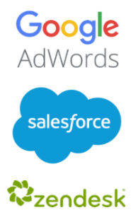

# Koppla samman data

I [!DNL Adobe Commerce Intelligence] kallas datakällor för `integrations`. När en `integration` har anslutits kan du bläddra bland de tabeller som är tillgängliga för synkronisering i Data Warehouse Manager.

Integreringar läggs till och hanteras med sidan `Connections`, som du kommer åt genom att klicka på **[!UICONTROL Manage Data** > **Connections]**. Här ser du:

* en lista över alla integreringar som är anslutna till ditt konto

* integrationstypen

* status ([!DNL Google Analytics] och [!DNL Data Import API] anslutningar har tomma statusfält)

* senaste gången ett anslutningstest (`Last Connection Started` kolumn) utfördes

## Integrationstyper

Det finns fyra sätt att hämta data till [!DNL Commerce Intelligence]: ansluta en databas, ansluta en SaaS-integrering, överföra en `.csv`-fil eller använda Adobe API.

## Databasintegreringar

[!DNL Commerce Intelligence] stöder SQL-baserade och NoSQL-databaser som [MySQL](../../importing-data/integrations/mysql-via-ssh-tunnel.md), [Microsoft SQL](../integrations/microsoft-sql-server.md), [MongoDB](../integrations/mongodb-via-ssh-tunnel.md) och [PostgreSQL](../integrations/postgresql.md).

Du kan ansluta din databas direkt till [!DNL Commerce Intelligence] med hjälp av databasautentiseringsuppgifter, men Adobe rekommenderar att du använder en beprövad krypteringsmetod som SSH-tunnel. Detta garanterar att dina data förblir säkra och säkra när de kommer in i din Data Warehouse.

Beroende på anslutningsmetod och typ av databas kan viss teknisk expertis behövas för att slutföra konfigurationen.

## `SaaS` integreringar

spree-commerce-logo.png

`SaaS`-integreringar är tjänster som [[!DNL Google Adwords]](../integrations/google-adwords.md), [[!DNL Salesforce]](../integrations/salesforce.md) och [[!DNL Zendesk]](../integrations/zendesk.md). Eftersom data från tredje part finns på leverantörens server, kan du inte komma åt dem direkt på samma sätt som du kan med data i din databas.

Vanligtvis är det lika enkelt att konfigurera en integrering i [!DNL Commerce Intelligence] som att bara ange dina kontoinloggningsuppgifter. Vissa tjänster kan kräva en API-nyckel för att slutföra auktoriseringen. Gå till avsnittet [integreringar](../integrations/integrations.md) för instruktioner om hur du genererar de autentiseringsuppgifter du behöver.

## Filöverföring

Vet du inte hur man hämtar data från en extra källa till Data Warehouse? [Att använda `File Upload` feature](../connecting-data/using-file-uploader.md) är ett bra sätt att hämta in data som du inte behöver för det dagliga beslutsfattandet. Om du följer formateringsreglerna kan du snabbt överföra `.csv` filer till din Data Warehouse och koppla dem till andra datakällor.

## [!DNL Commerce Intelligence] `Import API`

Om du hellre vill automatisera datahämtningen från en av dina egna källor kan du använda [!DNL Commerce Intelligence] `Import API`. Om den inte finns i en databas eller en `SaaS`-integrering är funktionen `Import API` det bästa valet.

Det krävs en del teknisk expertis för att använda API:t - någon som känner sig bekväm med att skriva och underhålla ett litet Ruby- eller PHP-skript är mer än kvalificerad.

Mer information om hur du kommer igång med `Import API` finns på [utvecklarwebbplatsen](https://developer.adobe.com/commerce/services/reporting/) och [hur du genererar en API-nyckel](https://developer.adobe.com/commerce/services/reporting/import-api/).

## Lägg till en integrering

Om du vill lägga till en integrering klickar du på **[!UICONTROL Manage Data** > **Connections]** och sedan på **[!UICONTROL Add a New Data Source]**. Klicka på ikonen för den integrering som du vill lägga till och följ instruktionerna i hjälpavsnitten för att konfigurera saker:

* [Vanliga frågor om integrering](https://support.magento.com/hc/en-us/sections/360003161871-Integration-FAQ)
* [Tillgänglig ](../integrations/integrations.md)
* [Konsoliderar dina tabeller](../../../best-practices/consolidating-your-tables.md)
* [Begränsa åtkomst till databasen](../../../administrator/account-management/restrict-db-access.md)

**Hittar du ingen integrering?** Vissa integreringar måste aktiveras för att de ska kunna visas på ditt konto. Om du letar efter något som [!DNL Facebook] men det inte finns med i listan, [skickar du en supportanmälan](https://experienceleague.adobe.com/docs/commerce-knowledge-base/kb/troubleshooting/miscellaneous/mbi-service-policies.html).

**Om du ser felstatus för en integrering** kan du få hjälp i avsnittet [Felsökning](https://support.magento.com/hc/en-us/sections/360003078151).

## Övervaka uppdateringshälsa (valfritt)

När du har anslutit källor kanske du vill automatisera en grundläggande hälsokontroll för att bekräfta att fullständiga uppdateringar har slutförts. Använd [API:t för uppdateringscykelstatus](https://developer.adobe.com/commerce/services/reporting/update-cycle-status-api/) i utvecklardokumentationen för att hämta den senaste slutförda uppdateringscykeln för din klient och visa den i interna instrumentpaneler eller varningar.
