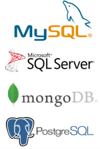

# Koppla samman data

I [!DNL Adobe Commerce Intelligence], kallas datakällor `integrations`. Efter en `integration` är ansluten kan du bläddra bland de tabeller som är tillgängliga för synkronisering i Data warehouse Manager.

Integreringar läggs till och hanteras med `Connections` som du kommer åt genom att klicka **[!UICONTROL Manage Data** > **Connections]**. Här ser du:

* en lista över alla integreringar som är anslutna till ditt konto

* integrationstypen

* status ([!DNL Google Analytics] och [!DNL Data Import API] anslutningar har tomma statusfält)

* senaste gången ett anslutningstest (`Last Connection Started` kolumn) utfördes

## Integrationstyper

Det finns fyra sätt att få in data på [!DNL Commerce Intelligence]: ansluta en databas, ansluta en SaaS-integrering, överföra en `.csv` eller använd Adobe API.

## Databasintegreringar

[!DNL Commerce Intelligence] stöder SQL-baserade och NoSQL-databaser som [MySQL](../../importing-data/integrations/mysql-via-ssh-tunnel.md), [Microsoft SQL](../integrations/microsoft-sql-server.md), [MongoDB](../integrations/mongodb-via-ssh-tunnel.md)och [PostgreSQL](../integrations/postgresql.md).

Du kan ansluta databasen direkt till [!DNL Commerce Intelligence] om du använder databasautentiseringsuppgifter rekommenderar Adobe att du använder en beprövad krypteringsmetod, som en SSH-tunnel. Detta garanterar att dina data förblir säkra och säkra när de kommer in i Data warehouse.

Beroende på anslutningsmetod och typ av databas kan viss teknisk expertis behövas för att slutföra konfigurationen.

## `SaaS` Integreringar

spree-commerce-logo.png

`SaaS` integreringar är tjänster som [[!DNL Google Adwords]](../integrations/google-adwords.md), [[!DNL Salesforce]](../integrations/salesforce.md)och [[!DNL Zendesk]](../integrations/zendesk.md). Eftersom data från tredje part finns på leverantörens server, kan du inte komma åt dem direkt på samma sätt som du kan med data i din databas.

Vanligtvis konfigurerar du en integrering i [!DNL Commerce Intelligence] är lika enkelt som att bara ange dina kontouppgifter. Vissa tjänster kan kräva en API-nyckel för att slutföra auktoriseringen. Kolla in [integreringsavsnitt](../integrations/integrations.md) för instruktioner om hur du genererar de autentiseringsuppgifter du behöver.

## Filöverföring

Vet du inte hur man får in data från en extra källa i Data warehouse? [Använda `File Upload` funktion](../connecting-data/using-file-uploader.md) är ett bra sätt att hämta in data som ni inte behöver för det dagliga beslutsfattandet. Om du följer formateringsreglerna kan du snabbt överföra `.csv` filer i Data warehouse och koppla dem till andra datakällor.

## [!DNL Commerce Intelligence] `Import API`

Om du hellre vill automatisera datahämtningen från en av dina egna källor kan du använda [!DNL Commerce Intelligence] `Import API`. Om den inte finns i en databas eller en `SaaS` integrering, `Import API` funktionen är ditt bästa val.

Det krävs en del teknisk expertis för att använda API:t - någon som känner sig bekväm med att skriva och underhålla ett litet Ruby- eller PHP-skript är mer än kvalificerad.

Läs mer om hur du kommer igång med `Import API`, kolla in [Utvecklarwebbplats](https://developer.adobe.com/commerce/services/reporting/) och [hur du genererar en API-nyckel](https://developer.adobe.com/commerce/services/reporting/import-api/).

## Lägg till en integrering

Om du vill lägga till en integrering klickar du på **[!UICONTROL Manage Data** > **Connections]** och sedan klicka **[!UICONTROL Add a New Data Source]**. Klicka på ikonen för den integrering som du vill lägga till och följ instruktionerna i hjälpavsnitten för att konfigurera saker:

* [Vanliga frågor om integrering](https://support.magento.com/hc/en-us/sections/360003161871-Integration-FAQ)
* [Tillgänglig ](../integrations/integrations.md)
* [Konsoliderar tabeller](../../../best-practices/consolidating-your-tables.md)
* [Begränsa åtkomst till databasen](../../../administrator/account-management/restrict-db-access.md)

**Ser du ingen integrering?** Vissa integreringar måste aktiveras för att de ska visas på ditt konto. Om du letar efter något som [!DNL Facebook] men den finns inte med [skicka en supportanmälan](https://experienceleague.adobe.com/docs/commerce-knowledge-base/kb/troubleshooting/miscellaneous/mbi-service-policies.html).

**Om du ser en felstatus för en integrering**, kolla in [Felsökningsavsnitt](https://support.magento.com/hc/en-us/sections/360003078151) om du behöver hjälp.
