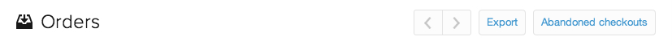

# Importera [!DNL CJ Affiliate]-data

Om du vill importera [!DNL CJ Affiliate (Commission Junction)]-data till [!DNL Adobe Commerce Intelligence] följer du bara stegen nedan och bifogar resultatfilen till en [supportbiljett](https://experienceleague.adobe.com/docs/commerce-knowledge-base/kb/troubleshooting/miscellaneous/mbi-service-policies.html). Adobe konfigurerar datatabellen för ditt konto och låter dig fortsätta överföra data oberoende av varandra.

## Exportera [!DNL CJ Affiliate]-data

1. Gå till fliken [!DNL CJ Affiliate] i ditt `Reports`-konto.

1. Välj `Performance` på fliken `Report Options`.

1. Ange `Performance By` som lika med `Program`, `Trend` som är lika med `Daily` och `Date Range` som är lika med det datumintervall som granskas.

   <!--{:.zoom}-->

1. Välj `Run Report`.

1. Välj `File Format` i listrutan `CSV`.  Klicka på **[!UICONTROL Download]**.

   <!--{:.zoom}-->

1. När du har hämtat filen kan du [överföra filen](../connecting-data/using-file-uploader.md) till din [!DNL Commerce Intelligence] Data Warehouse.

   Detta skapar en tabell i din [!DNL Commerce Intelligence] Data Warehouse som du kan fortsätta överföra färska data till regelbundet. När du överför filen följer du formateringskraven som anges i [Använda filöverföringsprogrammet](../connecting-data/using-file-uploader.md).
