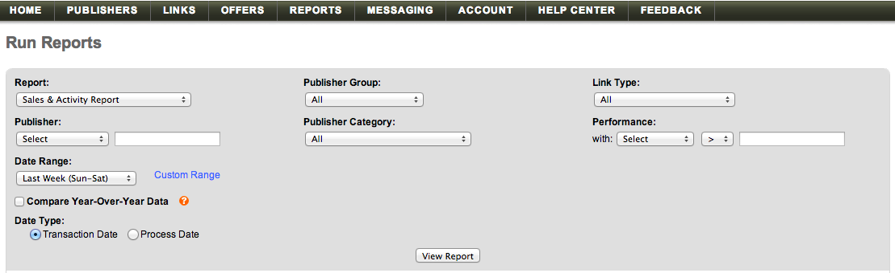

# Importera [!DNL Linkshare]-data

Om du vill överföra dina [!DNL Linkshare]-data till [!DNL Adobe Commerce Intelligence] måste du göra två saker:

1. [Exportera länkdelningsdata i ](#export)
1. [Överför kalkylbladet till  [!DNL Commerce Intelligence]](../connecting-data/using-file-uploader.md)

## Exportera data från Länkshare {#export}

1. Gå till **[!UICONTROL Reports** > **Run Reports]i ditt [!DNL Linkshare]-konto.**

1. Välj **[!UICONTROL Sales & Activity Report]** i listrutan `Report`.

1. Låt alla andra alternativ i listrutan vara standardval.

1. I listrutan `Date Range` väljer du det alternativ (`Sun - Sat`, `Mon - Sun`) som matchar dina `Start of Week`-inställningar i [!DNL Commerce Intelligence].

1. Avmarkera kryssrutan `Compare Year-Over-Year Data`.

1. Välj `Transaction Date` under `Data Type`.

   

1. Klicka på **[!UICONTROL View Report]**.

1. Klicka på **[!UICONTROL Download]**.

   Nu har en `.csv`-fil laddats ned.

När filen har laddats ned kan du överföra den till [!DNL Commerce Intelligence] med [`File Upload` feature ](../connecting-data/using-file-uploader.md) .
