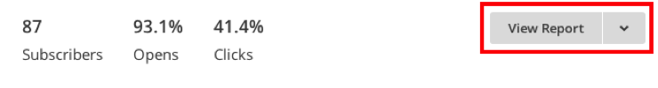

# Importera [!DNL Mailchimp]-data

Om du vill få en heltäckande bild av dina kampanjsatsningar kan du importera dina [!DNL Mailchimp]-e-postkampanjdata till [!DNL Commerce Intelligence]. För att kunna slutföra importen måste du göra följande för varje [!DNL Mailchimp]-kampanj du har:

## Exportera Öppnar data {#opens}

1. Gå till fliken [!DNL Mailchimp] när du har loggat in på `Campaigns`.

   

1. Klicka på **[!UICONTROL View Report]** bredvid kampanjnamnet.

   

1. Klicka på **[!UICONTROL Opened]**-numret.

   

1. Klicka på **[!UICONTROL Export]** och spara filen `.csv`.

   Du måste lägga till `primary key`-, `date (mm/dd/yyyy)`- och `campaign name`-kolumner i den här filen. Kontrollera att `primary keys` är unik för varje rad.

   

## Exportera klickdata {#clicks}

1. Gå tillbaka till skärmen `View Report` för kampanjen.

1. Klicka på numret som `Clicked`.

   

1. Klicka på siffran under kolumnen `Total Clicks` ELLER `Unique Clicks`.

   

1. Klicka på **[!UICONTROL Export]** och spara filen `.csv`.

   Du måste lägga till `Primary Key`, `date (mm/dd/yyyy)`, `campaign name` och `URL` kolumner i den här filen. Du behöver inte lägga till den fullständiga URL:en, bara något som talar om vad du klickade på.

   

1. Upprepa steg 3 och 4 för varje URL som du klickar på i ditt e-postmeddelande och kombinera alla data i samma `.csv`-fil när du är klar.

## Exportera skickade data {#sent}

1. Gå till fliken `Campaigns` i [!DNL Mailchimp].

1. Klicka på **[!UICONTROL View Report]** bredvid kampanjnamnet.

1. Klicka på siffran bredvid `Recipients`.

   

1. Klicka på **[!UICONTROL Export]** och spara filen `.csv`.

   Du måste lägga till `Primary Key`-, `date (mm/dd/yyyy)`- och `campaign name`-kolumner i den här filen.

   

## Förbered filer för överföring till [!DNL Commerce Intelligence] {#upload}

Varje fil - `Opens`, `Clicks` och `Sent` - ska överföras till [!DNL Commerce Intelligence] som en separat fil. Adobe rekommenderar att du namnger filerna med följande namnkonvention: `MailChimp\_ACTION\_DATE`. Ersätt `ACTION` med `Open`, `Click` eller `Sent` och ersätt `DATE` med exportdatumet.

När du är redo att överföra filerna använder du [`File Upload`-funktionen &#x200B;](../connecting-data/using-file-uploader.md) för att hämta data till din Data Warehouse.
