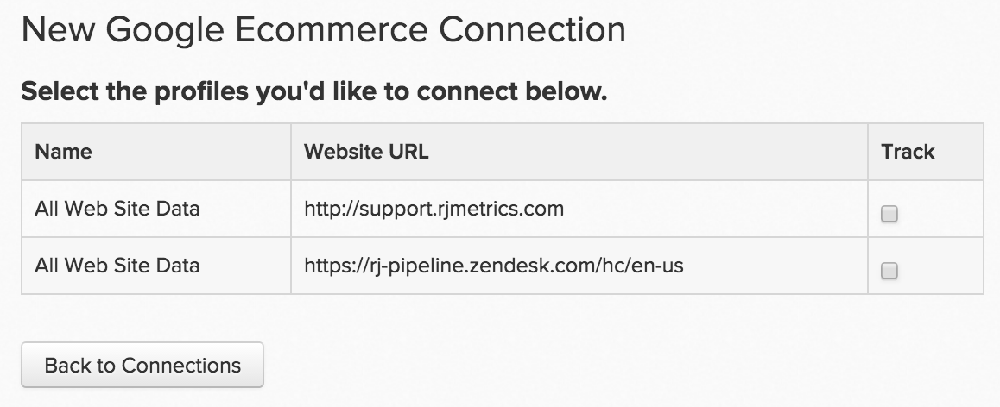

# Anslut [!DNL Google ECommerce]

>[!NOTE]
>
>Kräver [administratörsbehörighet](../../../administrator/user-management/user-management.md).

Ni har ett stadigt flöde av trafik och beställningar, vilket innebär att ni effektivt når och värvar kunder. Men vilka är era mest värdefulla hänvisningskanaler? Vilket är det genomsnittliga livstidsvärdet för kunder som förvärvats från en källa jämfört med en annan? Genom att ansluta dina källdata för orderreferenser från [!DNL Google ECommerce] till [!DNL Commerce Intelligence] kan du skapa analyser som hjälper dig att identifiera dina [mest värdefulla marknadsföringskanaler](../../../data-analyst/analysis/most-value-source-channel.md).

Kom igång genom att ange dina [!DNL Google ECommerce]-autentiseringsuppgifter i [!DNL Commerce Intelligence]:

1. Gå till sidan `Connections` under **[!UICONTROL Admin** > **Connections]**.

1. Klicka på **[!UICONTROL Add a New Source]**, som finns till höger på skärmen ovanför tabellen `Data Sources`.

1. Klicka på ikonen [!DNL Google ECommerce]. Då öppnas sidan med [!DNL Google ECommerce] inloggningsuppgifter.

1. Ange dina [!DNL Google Analytics]-autentiseringsuppgifter. När auktoriseringsprocessen har slutförts omdirigeras du tillbaka till [!DNL Commerce Intelligence].

1. En lista över profil-ID:n visas. Kontrollera de profiler som du vill ansluta till [!DNL Commerce Intelligence].

   Om du har flera profiler och behöver hjälp med att identifiera vilka som är vilka, se avsnittet **Ansluter flera [!DNL Google Analytics]-profiler nedan.

   <!--{: width="500"}-->

1. Ändringarna sparas automatiskt, så klicka på **[!UICONTROL Back to Connections]** när du är klar.

## Ansluter flera [!DNL Google Analytics]-profiler till [!DNL Commerce Intelligence]

Du kan ha flera webbplatser anslutna till ett enda [!DNL Google Analytics]-konto, som identifieras av deras eget profil-ID för [!DNL Google Analytics]. I det här fallet kan du välja att ta med alla dina profil-ID:n i [!DNL Commerce Intelligence]. Kontrollera de profil-ID som du vill inkludera under steget för profilval.

Så här identifierar du en viss webbplats profil-ID [!DNL Google Analytics]:

1. Logga in på [!DNL Google Analytics].
1. Gå till den aktuella webbplatsens [!DNL Google Analytics]-instrumentpanel.
1. Titta på URL:en - profil-ID:t motsvarar de åtta siffrorna efter `p` i slutet av raden.

   `www.google.com/analytics/web/#home/a11345062w43527078p**XXXXXXXX**/`

## Kopplar från [!DNL Google ECommerce] från [!DNL Commerce Intelligence] {#disconnect}

1. Gå till sidan med [!DNL Google Analytics] [kontoinställningar](https://www.google.com/account/about/?hl=en).
1. Klicka på **[!UICONTROL edit]** bredvid `Authorizing` program och webbplatser under avsnittet `Security`.
1. Klicka på **[!UICONTROL revoke access]** bredvid [!DNL Commerce Intelligence].

## Relaterat:

* [ [!DNL Google ECommerce] data förväntades](../integrations/google-ecommerce-data.md)
* [Återautentiserar integreringar](https://experienceleague.adobe.com/docs/commerce-knowledge-base/kb/how-to/mbi-reauthenticating-integrations.html)
* [Konfigurerar [!DNL Google ECommerce] spårning](https://support.google.com/analytics/answer/1009612?hl=en)
* [Upptäck era mest värdefulla förvärvskällor och kanaler](../../analysis/most-value-source-channel.md)
* [Öka avkastningen på era annonskampanjer](../../analysis/roi-ad-camp.md)
