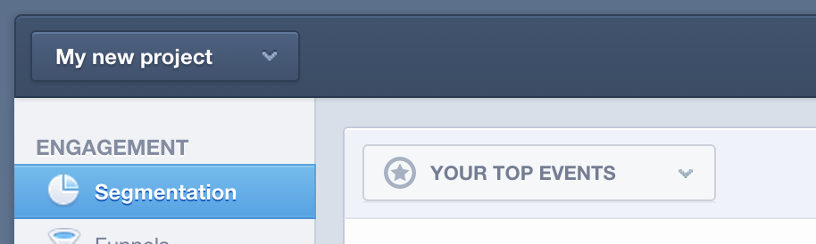

# Datavalidering i [!DNL Mixpanel]

När [!DNL Adobe Commerce Intelligence] ansluter först till din [!DNL Mixpanel] kan din kontohanterare eller analytiker begära att du tillhandahåller dataexporter från [!DNL Mixpanel] för validering. På så sätt kan du bekräfta att du har synkat alla data som är tillgängliga för dig direkt i [!DNL Mixpanel].

## Dataexportprocess: `Events`

1. Besök din `Segmentation` avsnitt och vy `Your Top Events`.

   

1. Välj `Past 96 Hours` för tidsintervallet

   

1. Bläddra till den nedre högra delen av rapporten och exportera en `.csv` fil:

   

1. Skicka `.csv` till den kontohanterare eller analytiker som du arbetar med under valideringsprocessen.
