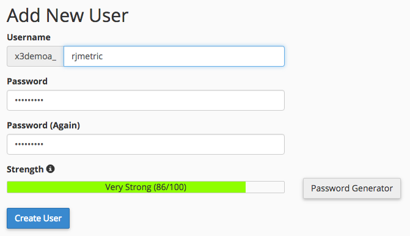

# Anslut MySQL via cPanel

* [Skapa en [!DNL MBI] MySQL-användare i cPanel](#cpanel)
* [Ange anslutning och användarinformation i MBI](#finish)

## Gå till

* [MySQL via SSH-tunnel](../integrations/mysql-via-ssh-tunnel.md)
* [MySQL via direktanslutning](../integrations/mysql-via-a-direct-connection.md)

* **`MySQL via cPanel`**

>[!IMPORTANT]
>
>Vi rekommenderar starkt att du använder SSH eller någon annan form av kryptering för att skydda dina data! Om detta inte är ett alternativ kan du fortfarande ansluta direkt [!DNL MBI] till databasen enligt instruktionerna i den här artikeln.

I den här artikeln får du hjälp med att ansluta din MySQL-databas direkt till [!DNL MBI] med cPanel&quot;. Den här processen kan även användas för att ansluta [!DNL Adobe Commerce] och andra MySQL-baserade e-handelsdatabaser till [!DNL MBI].

1. Skapa en [!DNL MBI] MySQL-användare i `cPanel`
1. Ange anslutning och användarinformation i [!DNL MBI]

Kom igång.

## Skapa en [!DNL MBI] MySQL-användare i `cPanel` {#cpanel}

1. Logga in på [`cPanel`](../../../data-analyst/importing-data/integrations/mysql-via-cpanel.md) via din värdleverantör.
1. Klicka **[!UICONTROL MySQL Databases]**, som finns i `Database` -avsnitt.
1. Bläddra nedåt till `Add New User` och skapa en användare för [!DNL MBI]:

   

1. Klicka **[!UICONTROL Create User]**.
1. Nu när du har skapat användaren måste du koppla den till en databas. Gå tillbaka till `Add New User` -avsnittet - se inställningarna för `Add User to Database?` Det är vad vi behöver.
1. I `User` väljer användaren som du skapade.
1. I `Database` i den här delen väljer du den databas som du vill ansluta till [!DNL MBI].
1. Klicka **[!UICONTROL Add]**.
1. Markera kryssrutan invid `SELECT` - det här är allt [!DNL MBI] måste ansluta till databasen.

## Ange anslutningen och användarinformationen i [!DNL MBI] {#finish}

Om du vill slå ihop allt måste vi ange anslutningen och användarinformationen i [!DNL MBI]. Lämna sidan MySQL-autentiseringsuppgifter öppen? Om inte, gå till **[!UICONTROL Manage Data** > **Connections]** och klicka **[!UICONTROL Add New Data Source]** och sedan ikonen MySQL.

Ange följande information på den här sidan i `Database Connection` avsnitt:

* `Username`: Användarnamnet för [!DNL MBI] MySQL-användare
* `Password`: Lösenordet för [!DNL MBI] MySQL-användare
* `Port`: MySQL-port på servern (`3306` som standard)
* `Host`: Den offentliga adressen till `MySQL` server [!DNL MBI] kommer att ansluta till. Det här är vanligtvis den URL som du använder för att logga in `cPanel`.

Om du använder en [`SSH tunnel`](../integrations/mysql-via-ssh-tunnel.md)måste du också ange krypteringsinformationen. Ange `Encrypted` växla till `Yes` för att visa formuläret.

* `Connection Type`: Ange detta till `SSH Tunnel`
* `Remote Address`: Serverns IP-adress eller värdnamn [!DNL MBI] tunnlar in i
* `Username`: Användarnamnet för [!DNL MBI] `SSH (Linux)` användare, se [instruktioner](../../../data-analyst/importing-data/integrations/mysql-via-ssh-tunnel.md) om hur du ska göra detta, om du inte redan gjort det)
* `SSH Port`: SSH-port på servern (`22` som standard)

Så ja! När du är klar klickar du på **[!UICONTROL Save & Test]** för att slutföra installationen.

## Relaterat:

* [Återautentisera integreringar](https://experienceleague.adobe.com/docs/commerce-knowledge-base/kb/how-to/mbi-reauthenticating-integrations.html?lang=en)
