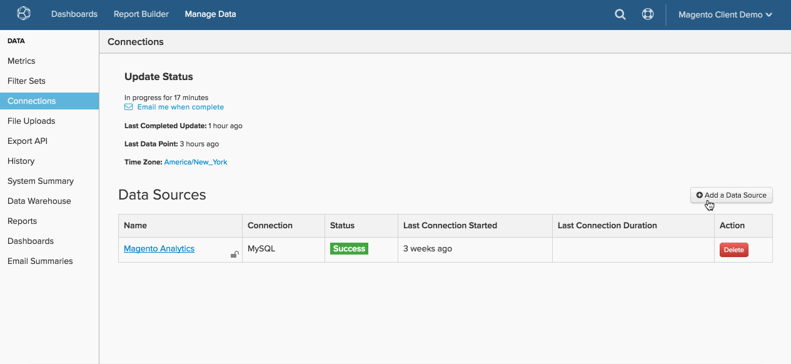

# Anslut [!DNL MySQL] via [!DNL SSH Tunnel]

* [Hämta [!DNL Commerce Intelligence] publik nyckel](#retrieve)
* [Tillåt åtkomst till [!DNL Commerce Intelligence] IP-adress](#allowlist)
* [Skapa en Linux-användare för [!DNL Commerce Intelligence]](#linux)
* [Skapa en [!DNL MySQL] användare för [!DNL Commerce Intelligence]](#mysql)
* [Ange anslutningen och användarinformationen i [!DNL Commerce Intelligence]](#finish)

## GÅ TILL

* [[!DNL MySQL] via ](../integrations/mysql-via-a-direct-connection.md)
* [[!DNL MySQL] via [!DNL cPanel]](../integrations/mysql-via-cpanel.md)

Koppla samman [!DNL MySQL] databas till [!DNL Commerce Intelligence] via `SSH tunnel`måste du göra några saker:

1. Hämta [!DNL Commerce Intelligence] `public key`
1. Tillåt åtkomst till [!DNL Commerce Intelligence] `IP address`
1. Skapa en `Linux` användare för [!DNL Commerce Intelligence]
1. Skapa en `MySQL` användare för [!DNL Commerce Intelligence]
1. Ange anslutningen och användarinformationen i [!DNL Commerce Intelligence]


## Hämtar [!DNL Commerce Intelligence] publik nyckel {#retrieve}

The `public key` används för att auktorisera [!DNL Commerce Intelligence] `Linux` användare. I nästa avsnitt skapar du användaren och importerar nyckeln.

1. Gå till **[!UICONTROL Manage Data** > **Connections]** och klicka **[!UICONTROL Add New Data Source]**.
1. Klicka på `MySQL` -ikon.
1. Efter `MySQL credentials` sidan öppnas, ange `Encrypted` växla till `Yes`. Då visas SSH-konfigurationsformuläret.
1. The `public key` finns under det här formuläret.

Lämna den här sidan öppen genom hela självstudiekursen - du behöver den i nästa avsnitt och i slutet.

Så här navigerar du [!DNL Commerce Intelligence] för att hämta nyckeln:

<!--{: width="770"}-->

## Tillåt åtkomst till [!DNL Commerce Intelligence] IP-adress {#allowlist}

För att anslutningen ska lyckas måste du konfigurera brandväggen så att den tillåter åtkomst från dina IP-adresser. De är `54.88.76.97` och `34.250.211.151` men de finns också på `MySQL credentials` sida. Se den blå rutan i GIF ovan.

## Skapa en [!DNL Linux] användare för [!DNL Commerce Intelligence] {#linux}

Detta kan vara en produktionsmaskin eller en sekundär maskin, förutsatt att den innehåller realtidsdata (eller ofta uppdaterade). Du kan [begränsa den här användaren](../../../administrator/account-management/restrict-db-access.md) på vilket sätt du vill, förutsatt att du behåller rätten att ansluta till `MySQL` server.

1. Om du vill lägga till den nya användaren kör du följande kommandon som rot på [!DNL Linux] server:

```bash
        adduser rjmetric -p<password>
        mkdir /home/rjmetric
        mkdir /home/rjmetric/.ssh
```

1. Kom ihåg `public key` hämtas du i första avsnittet? Om du vill vara säker på att användaren har åtkomst till databasen måste du importera nyckeln till `authorized\_keys`.

   Kopiera hela nyckeln till `authorized\_keys` på följande sätt:

```bash
        touch /home/rjmetric/.ssh/authorized_keys
        "<PASTE KEY HERE>" >> /home/rjmetric/.ssh/authorized_keys
```

1. Slutför skapandet av användaren genom att ändra behörigheterna för `/home/rjmetric` katalog som ger åtkomst via `SSH`:

```bash
        chown -R rjmetric:rjmetric /home/rjmetric
        chmod -R 700 /home/rjmetric/.ssh
        chmod 400 /home/rjmetric/.ssh/authorized_keys
```

>[!IMPORTANT]
>
>Om `sshd\_config` filen som är associerad med servern är inte inställd på standardalternativet, endast vissa användare har serveråtkomst - detta förhindrar att anslutningen till [!DNL Commerce Intelligence]. I dessa fall måste du köra ett kommando som `AllowUsers` för att `rjmetric` användaråtkomst till servern.

## Skapa en [!DNL MySQL] användare för [!DNL Commerce Intelligence] {#mysql}

Din organisation kan kräva en annan process, men det enklaste sättet att skapa den här användaren är att köra följande fråga när användaren är inloggad [!DNL MySQL] som en användare med behörighet att bevilja behörigheter:

```sql
    GRANT SELECT ON *.* TO 'rjmetric'@'localhost' IDENTIFIED BY '<secure password here>';
```

Ersätt `secure password here` med ett säkert lösenord, som kan skilja sig från `SSH` lösenord.

Om du vill hindra den här användaren från att komma åt data i specifika databaser, tabeller eller kolumner kan du köra GRANT-frågor som bara tillåter åtkomst till de data som du tillåter.

## Ange anslutningen och användarinformationen i [!DNL Commerce Intelligence] {#finish}

Om du vill slå ihop allt måste du ange anslutningen och användarinformationen i [!DNL Commerce Intelligence]. Gav du `MySQL credentials` öppnas sidan? Om inte, gå till **[!UICONTROL Data** > **Connections]** och klicka **[!UICONTROL Add New Data Source]** och sedan [!DNL MySQL] -ikon. Glöm inte att ställa in `Encrypted` växla till `Yes`.

Ange följande information på den här sidan, med början på `Database Connection` avsnitt:

* `Username`: Användarnamn för [!DNL Commerce Intelligence] [!DNL MySQL] användare
* `Password`: Lösenordet för [!DNL Commerce Intelligence] [!DNL MySQL] användare
* `Port`: [!DNL MySQL] port på servern (3306 som standard)
* `Host` Som standard är detta localhost. I allmänhet är det bind-adresvärdet för [!DNL MySQL] server, som är standard `127.0.0.1 (localhost)`, men kan också vara en lokal nätverksadress (till exempel `192.168.0.1`) eller serverns offentliga IP-adress.

  Värdet finns i `my.cnf` fil (finns på `/etc/my.cnf`) under raden som läser `\[mysqld\]`. Om bind-adresslinjen kommenteras ut i den filen skyddas servern från externa anslutningsförsök.

I `SSH Connection` avsnitt:

* `Remote Address`: Serverns IP-adress eller värdnamn [!DNL Commerce Intelligence] kommer att gå in i
* `Username`: Användarnamn för [!DNL Commerce Intelligence] SSH ([!DNL Linux]) användare
* `SSH Port`: SSH-port på servern (22 som standard)

När du är klar klickar du **[!UICONTROL Save & Test]** för att slutföra installationen.

## Relaterat:

* [Återautentisera integreringar](https://experienceleague.adobe.com/docs/commerce-knowledge-base/kb/how-to/mbi-reauthenticating-integrations.html)
