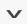

# Kontrollpaneler

[!DNL Adobe Commerce Intelligence] Kontrollpaneler ger dig en snabb överblick av butikens prestanda och försäljningsaktivitet. Enskilda kontrollpaneler kan delas med andra användare och organiseras i logiska grupper. Du kan också ange olika behörighetsnivåer för andra användare.

Det är enkelt att skapa en rapport, lägga till den på en kontrollpanel och exportera data till Excel. Du kan ändra storlek på diagram och rapporter och dra dem till rätt position på kontrollpanelen.

## Skapa instrumentpaneler {#createdash}

Instrumentpaneler kan delas med teman för de analyser du skapar i Report Builders. Så här kan du uppmuntra ditt team att samarbeta och upprätthålla en enda källa till sanning i hela organisationen.

*Om du är administratör eller standardanvändare* kan du skapa en instrumentpanel genom att klicka på listrutan `Dashboard Options` och välja `Create New dashboard`.

Hur de instrumentpaneler du skapar ser ut är helt upp till dig. Du kan ordna och ändra storlek på elementen på kontrollpanelen på det sätt som passar dina behov och ditt arbetsflöde.

### Skapa en instrumentpanel

1. Klicka på **[!UICONTROL Dashboards]** på menyn.

1. Namnet på standardkontrollpanelen visas i det övre vänstra hörnet av kontrollpanelens sidhuvud. Klicka på nedpilen () för att visa tillgängliga alternativ.

   

1. Klicka på **[!UICONTROL Create Dashboard]**. Gör sedan följande:

   * Ange `Name` som instrumentpanel.

   * Om du vill skapa en `Group` för instrumentpanelen anger du namnet på gruppen.

     Om din Commerce-installation till exempel har flera butiksvyer kan du skapa en grupp för varje butiksvy.

   * Klicka på **[!UICONTROL Create]**.

   

   * Namnet på den nya instrumentpanelen visas i det övre vänstra hörnet. Klicka på nedpilen () för att visa alternativen. Om du har skapat en grupp visas den nya kontrollpanelen under gruppen i listan.

### Lägg till en rapport

1. Gör något av följande om du vill lägga till en rapport:

   * Klicka på uppmaningen **[!UICONTROL Add a report]** på sidan.

   * Klicka på **[!UICONTROL Add Report]** i instrumentpanelens sidhuvud.

     

1. Klicka på **[!UICONTROL Create Report]** om du vill visa **[!UICONTROL Report Builder Options]**.

   

## Ordna objekt på en kontrollpanel

* Om du vill ändra storlek på ett diagram eller en rapport drar du det nedre högra hörnet till den nya storleken.

* Om du vill flytta ett diagram eller en rapport håller du pekaren över titeln eller rubriken tills markören ändras till ett kors. Dra den sedan till rätt plats.

## Hantera dina instrumentpaneler {#managedash}

I **[!DNL Manage Data** > **Dashboards]** kan du hantera användarbehörigheter för instrumentpaneler som du äger, ta bort instrumentpaneler som du inte längre behöver och ange en standardinstrumentpanel.

### Dela dina instrumentpaneler {#sharingdash}

Adobe rekommenderar att du delar instrumentpaneler som du skapar med andra teammedlemmar för att kunna skala [!DNL Commerce Intelligence] i hela organisationen och ge värdefulla insikter. *Du kan dela instrumentpaneler som du äger* genom att klicka på alternativet `Share Dashboard` överst på sidan.

När du delar en kontrollpanel kan du tilldela behörigheter i hela organisationen ELLER på individnivå, vilket innebär att du får bestämma vem som ska kunna visa och redigera dina rapporter.

>[!NOTE]
>
>`Read-Only`-användare har bara åtkomst till instrumentpaneler som delas direkt med dem - de kan inte söka efter och lägga till instrumentpaneler själva. Glöm inte att ha dem i slingan!

### Åtkomst till delade instrumentpaneler {#accessshared}

*Om du är administratör eller standardanvändare* och vill lägga till en delad instrumentpanel i ditt konto kan du göra det genom att klicka på **[!UICONTROL Dashboard Options]** och sedan på **[!UICONTROL Find]** i listrutan.

<!--{: width="1000" height="535"}-->

### Hantera panelinställningar

1. Klicka på **[!DNL Manage Data** > **Dashboards]** på menyn.

1. Ange en ny `Dashboard Name` om tillämpligt.

1. Om du vill tilldela instrumentpanelen till en specifik `Dashboard Group` väljer du i listan med grupper.

   **`Permissions`**

   Så här ger du alla användare samma åtkomstnivå till kontrollpanelen:

   1. Välj något av följande alternativ under **`Shared with`**:

      * `View`
      * `Edit`
      * `None`

   1. När du uppmanas att bekräfta klickar du på **[!UICONTROL OK]** för att uppdatera behörighetsnivån för varje användare.

   1. Om du vill ändra behörighetsnivån för en individ söker du efter användaren i listan och ändrar behörighetsnivån. Ändringen sparas automatiskt.

   **`Default`**

   1. Om du vill göra den här instrumentpanelen till standard för ditt [!DNL Commerce Intelligence]-konto klickar du på **[!UICONTROL Make Default]**.

   **`Remove`**

   1. Klicka på **[!UICONTROL Delete Dashboard]** om du vill ta bort instrumentpanelen.
