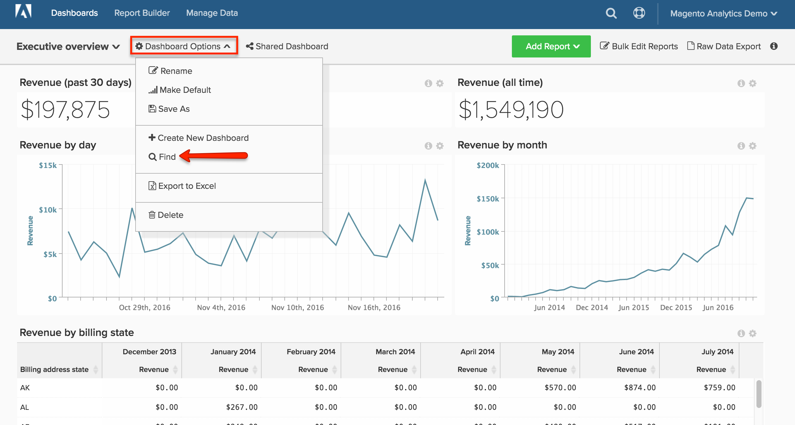

# Kontrollpaneler

[!DNL MBI] På kontrollpanelerna får du en snabb överblick över butikens resultat och försäljningsaktiviteter. Enskilda kontrollpaneler kan delas med andra användare och organiseras i logiska grupper. Du kan också ange olika behörighetsnivåer för andra användare.

Det är enkelt att skapa en ny rapport, lägga till den på en kontrollpanel och exportera data till Excel. Du kan ändra storlek på diagram och rapporter och dra dem till rätt position på kontrollpanelen.

## Skapa instrumentpaneler {#createdash}

Instrumentpaneler är i stort sett delbara, tematiska samlingar för de analyser du skapar i Report Builder. Så här kan du uppmuntra ditt team att samarbeta och upprätthålla en enda källa till sanning i hela organisationen.

*Om du är administratör eller standardanvändare* kan du skapa en kontrollpanel genom att klicka på `Dashboard Options` listruta och välja `Create New dashboard`.

Hur de instrumentpaneler du skapar ser ut beror helt på dig. Du kan ordna och ändra storlek på elementen på kontrollpanelen på det sätt som passar dina behov och ditt arbetsflöde.

### Skapa en ny instrumentpanel

1. På menyn klickar du på **[!UICONTROL Dashboards]**.

1. Namnet på standardkontrollpanelen visas i det övre vänstra hörnet av kontrollpanelens sidhuvud. Klicka på nedpilen () för att visa tillgängliga alternativ.

   

1. Klicka **[!UICONTROL Create Dashboard]**. Gör sedan följande:

   * Ange `Name` för din instrumentpanel.

   * Skapa en ny `Group` Ange namnet på gruppen för instrumentpanelen.

      Om din Commerce-installation till exempel har flera butiksvyer kan du skapa en grupp för varje butiksvy.

   * Klicka **[!UICONTROL Create]**.

   

   * Namnet på den nya instrumentpanelen visas i det övre vänstra hörnet. Klicka på nedpilen () för att visa alternativen. Om du har skapat en grupp visas den nya kontrollpanelen under gruppen i listan.

### Lägg till en rapport

1. Gör något av följande om du vill lägga till en rapport:

   * Klicka på **[!UICONTROL Add a report]** på sidan.

   * Klicka på **[!UICONTROL Add Report]**.

      

1. Klicka **[!UICONTROL Create Report]** för att visa **[!UICONTROL Report Builder Options]**.

   

## Ordna objekt på en kontrollpanel

* Om du vill ändra storlek på ett diagram eller en rapport drar du det nedre högra hörnet till den nya storleken.

* Om du vill flytta ett diagram eller en rapport håller du pekaren över titeln eller rubriken tills markören ändras till ett kors. Dra den sedan till rätt plats.

## Hantera dina instrumentpaneler {#managedash}

I **[!DNL Manage Data** > **Dashboards]** kan du hantera användarbehörigheter för kontrollpaneler som du äger, ta bort kontrollpaneler som du inte längre behöver och ange en standardkontrollpanel.

### Dela dina instrumentpaneler {#sharingdash}

Skala [!DNL MBI] i hela organisationen och ge värdefulla insikter rekommenderar vi att du delar kontrollpaneler som du skapar med andra teammedlemmar. *Du kan dela kontrollpaneler som du äger* genom att klicka på `Share Dashboard` längst upp på sidan.

När du delar en kontrollpanel kan du tilldela behörigheter i hela organisationen ELLER på individnivå, vilket innebär att du får bestämma vem som ska kunna visa och redigera dina rapporter.

>[!NOTE]
>
>`Read-Only` -användare har bara tillgång till kontrollpaneler som delas direkt med dem - de kan inte själva söka efter och lägga till kontrollpaneler. Glöm inte att ha dem i slingan!

### Åtkomst till delade instrumentpaneler {#accessshared}

*Om du är administratör eller standardanvändare* och om du vill lägga till en delad instrumentpanel i ditt konto kan du göra det genom att klicka på **[!UICONTROL Dashboard Options]** och sedan klicka **[!UICONTROL Find]** i listrutan.

<!--{: width="1000" height="535"}-->

### Hantera panelinställningar

1. På menyn klickar du på **[!DNL Manage Data** > **Dashboards]**.

1. Ange en ny `Dashboard Name`.

1. Så här tilldelar du kontrollpanelen till en specifik `Dashboard Group`väljer du i listan med grupper.

   **`Permissions`**

   Så här ger du alla användare samma åtkomstnivå till kontrollpanelen:

   1. Under **`Shared with`** väljer du något av följande alternativ:

      * `View`
      * `Edit`
      * `None`
   1. När du uppmanas att bekräfta klickar du på **[!UICONTROL OK]** för att uppdatera behörighetsnivån för varje användare.

   1. Om du vill ändra behörighetsnivån för en individ söker du efter användaren i listan och ändrar behörighetsnivån. Ändringen sparas automatiskt.

   **`Default`**

   1. Så här gör du den här instrumentpanelen till standard för [!DNL MBI] konto, klicka på **[!UICONTROL Make Default]**.

   **`Remove`**

   1. Om du vill ta bort kontrollpanelen klickar du på **[!UICONTROL Delete Dashboard]**.
