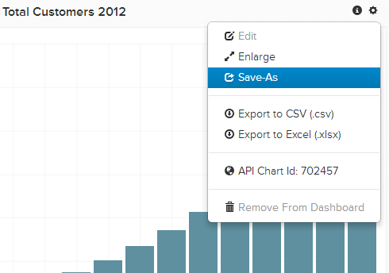

# Importera diagram från en annan användare

Du kanske vill redigera ett diagram som en annan användare äger eller skapa något liknande. Det är enkelt att importera ett diagram som en annan användare äger och spara det på din egen kontrollpanel.

## Hitta diagrammet

Leta först reda på diagrammet som du vill kopiera från den andra användaren. Alla instrumentpaneler som delas med dig finns i `Dashboard` sidofält där de är markerade med en delad ikon. Klicka på den kontrollpanel du vill använda.

## Klona diagrammet

På den delade kontrollpanelen väljer du det diagram som du vill kopiera till ditt eget konto. Klicka på kugghjulet () och sedan klicka på **[!UICONTROL Save As]**.

Du uppmanas att namnge din kopia av diagrammet och lägga till den på någon av dina befintliga instrumentpaneler. Om du inte väljer någon kontrollpanel läggs den till i listan över befintliga diagram och du kan [lägg till senare](../../data-user/dashboards/add-charts-dashboard.md).

