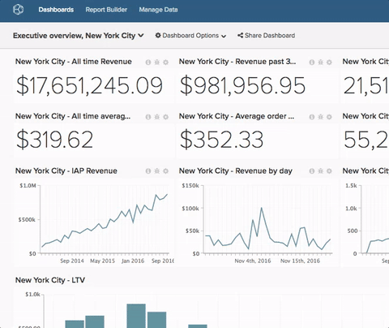

# Ta bort ett diagram från en kontrollpanel

>[!NOTE]
>
>Kräver [administratörsbehörighet](../../administrator/user-management/user-management.md) eller `Standard` för att utföra dessa funktioner. Om du är `Standard`-användare behöver du även `Edit`-behörigheter till instrumentpanelen.

Ibland passar inte namn längre. Det går snabbt och enkelt att byta namn på en kontrollpanel.

1. Klicka på menyn **[!UICONTROL Dashboard Options]** högst upp på skärmen bredvid menyn `Global Search` när du är i kontrollpanelen.

1. Klicka på **[!UICONTROL Rename]** i listrutan.

1. Ange det nya namnet på instrumentpanelen när du uppmanas till detta.

1. Klicka på **[!UICONTROL Save Changes]**.

Exempel:

