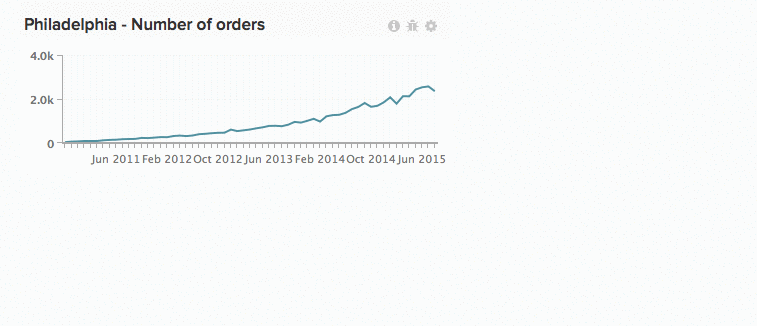

# Arbeta med diagram på kontrollpaneler

Skalärnummer. Stolpdiagram. Diagram som sträcker sig över långa perioder. Alla diagram visar information på olika sätt, vilket innebär att diagrammets storlek och plats inte är en lösning som passar alla. I [!DNL Commerce Intelligence]kan du ändra storlek på och ordna om diagram för att skapa en perfekt arbetsyta.

*Ändra storlek på ett diagram* klickar du och drar i det nedre högra hörnet av ett diagram.

*Flytta ett diagram* hovra över diagrammets övre del tills `Move` markören visas. Klicka och håll ned och dra sedan diagrammet till önskad plats. Placera diagrammet genom att klicka.

