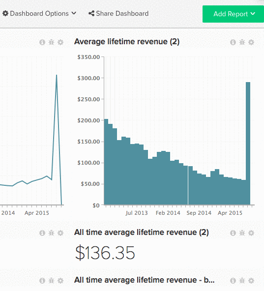

# Dela instrumentpaneler med andra användare

Att dela instrumentpaneler är ett bra sätt att se till att teamet är med och uppmuntra till samarbete. Genom att skapa och dela en central kontrollpanel kan du ge teamet den information de behöver samtidigt som ni behåller kontrollen. [[!DNL Adobe] rekommenderar](../../best-practices/share-dashboard-best-practice.md){: target=&quot;_blank&quot;} att du ger `Edit` behörighet till ett urval för att minimera oavsiktliga ändringar.

>[!NOTE]
>
>Om den instrumentpanel som du delar innehåller rapporter som skapats med mätvärden som en viss användare inte har åtkomst till, visas ett `Error Loading Data`-meddelande i rapporterna. Om du vill att data ska visas för den specifika användaren måste en [admin-användare](../../administrator/user-management/user-management.md) ge åtkomst till alla mätvärden som används i rapporterna.

## Dela en kontrollpanel

1. Klicka på **[!UICONTROL Share Dashboard]** högst upp på skärmen.

   En lista över alla användare i ditt [!DNL Commerce Intelligence]-konto visas.

1. Om du vill välja en användare att dela kontrollpanelen med markerar du kryssrutan till vänster om namnet.

   Om du vill markera/avmarkera alla användare klickar du på **[!UICONTROL Select]** och väljer `Everyone` respektive `None`.

1. Behörigheter kan anges per användare eller en kombination.

   *Om du vill ange enskilda behörigheter* klickar du på **[!UICONTROL None]** till höger om användarens namn. I den här listrutan väljer du vilken typ av behörigheter användaren ska ha.

   *Klicka på&#x200B;**[!UICONTROL Set Permissions]**&#x200B;om du vill ange behörigheter för masse*. I den här listrutan väljer du vilken typ av behörigheter de markerade användarna ska ha.

   >[!NOTE]
   >
   >Du kan också använda den här funktionen för att uppdatera tidigare angivna behörigheter. Om du till exempel vill sluta dela instrumentpanelen med någon anger du deras behörigheter till `None`.

1. Klicka på **[!UICONTROL Save Changes]** om du vill dela instrumentpanelen. De valda användarna får ett e-postmeddelande med en inbjudan om att visa kontrollpanelen.

Exempel:

