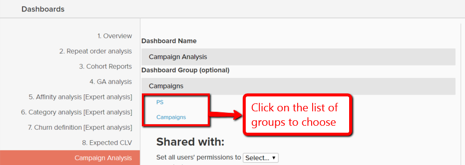

# Använda panelgrupper

Instrumentpanelsgrupper ger bättre ordning på kontrollpanelerna. Det vanligaste användningsområdet är att gruppera liknande kontrollpaneler under samma&quot;grupp&quot;. Till exempel kan alla kontrollpaneler som är relaterade till marknadsföring grupperas under en kontrollpanelsgrupp&quot;Marknadsföring&quot;.

I listrutan för val av kontrollpanel visas kontrollpanelsgrupper i alfabetisk ordning, med alla kontrollpaneler under Ingen grupp senast visade. Kontrollpaneler under samma grupp visas tillsammans och i alfabetisk ordning inom varje grupp.

## Gruppdelning på instrumentpanel

Instrumentpanelsgrupper kan inte delas direkt mellan användare. När en kontrollpanel delas med användare skapas den instrumentpanelsgrupp som den är underställd automatiskt för de användarna om den inte finns. Om kontrollpanelsgruppen finns läggs kontrollpanelen till i listan.

När en kontrollpanels grupp ändras av dess ägare återspeglas ändringen automatiskt för alla användare som kontrollpanelen har delats med. Användare kan inte ändra kontrollpanelsgruppen för kontrollpaneler som de inte äger.

## Skapa instrumentpanelsgrupper

Kontrollpanelsgrupper kan skapas på ett av två sätt:

1. När du skapar en kontrollpanel:

   

1. När du ändrar gruppen för en befintlig kontrollpanel går du till `Manage Data > Dashboards` sida:

   1. Klicka på den kontrollpanel som du vill skapa gruppen för.

   1. Under `Dashboard Group (optional)`visas den aktuella instrumentpanelsgruppen.

   1. Om du vill skapa en grupp skriver du namnet på den nya gruppen och klickar sedan utanför rutan.

      

## Lägg till befintliga instrumentpaneler i befintliga grupper

1. På `Manage Data > Dashboards` väljer du den kontrollpanel som gruppen ska ändras för.

1. Texten under `Dashboard Group (optional)` visar instrumentpanelsgruppen.

1. Om du vill ändra gruppen på kontrollpanelen väljer du en annan grupp i listan - i det här fallet `PS`, `Campaigns`.

   

## Ta bort panelgrupper

När det inte finns några kontrollpaneler i en kontrollpanelgrupp tas den bort automatiskt.
