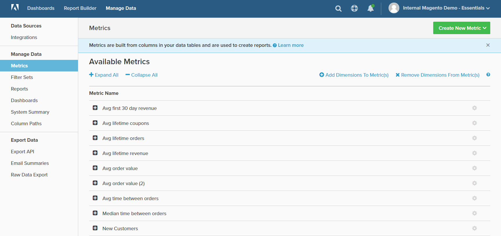

# Hantera data

Med Hantera data får du tillgång till olika verktyg för att hantera integreringar, rapporter och diagramdata, instrumentpaneler och exporter.

## För åtkomst `Manage Data`:

1. Klicka på **[!DNL Manage Data]**.

1. I sidlisten väljer du det ämne som du vill använda under följande rubriker:

   * `Data Sources`
   * `Manage Data`
   * `Export Data`
   <!--{: .zoom}-->
