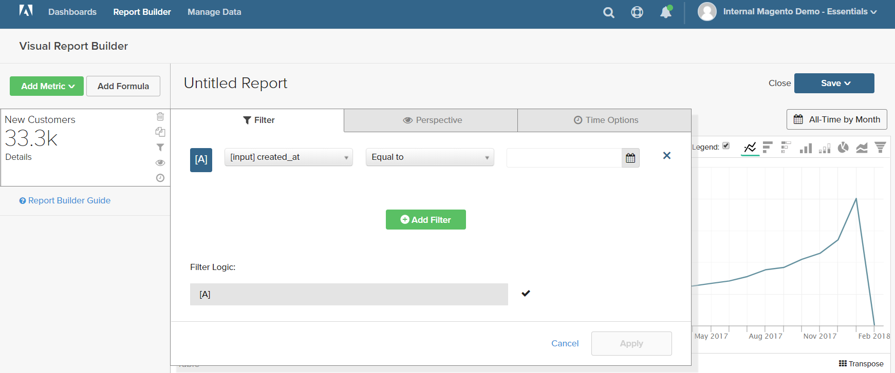
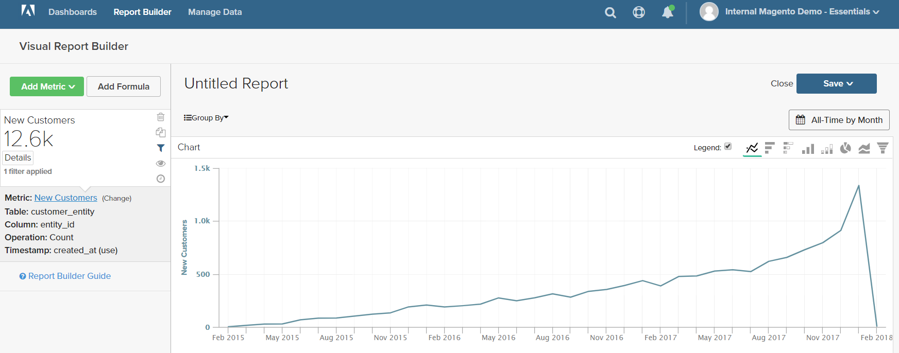

# Filter

Ett eller flera filter kan läggas till för att begränsa vilka data som används för att skapa en rapport. Varje filter är ett uttryck som innehåller en kolumn från den associerade tabellen, en operator och ett värde. Om du t.ex. bara vill inkludera återkommande kunder kan du skapa ett filter som endast innehåller kunder som har gjort mer än en beställning. Flera filter kan användas med logiska `AND/OR`-operatorer för att lägga till logik i rapporten.

>[!TIP]
>
>En rapport kan innehålla maximalt 3 500 datapunkter. Om du vill minska antalet datapunkter använder du ett filter för att minska mängden data som används för att generera rapporten.

[!DNL Adobe Commerce Intelligence] innehåller ett urval av filter som du kan använda &quot;out of the box (OTB)&quot; eller ändra efter behov. Det finns ingen gräns för hur många filter du kan skapa.

## Så här lägger du till ett filter:

1. Håll markören över varje datapunkt i diagrammet.

   I den här rapporten visar varje datapunkt det totala antalet kunder för månaden.

1. Klicka på ikonen Filter () i den vänstra panelen.

   

1. Klicka på **[!UICONTROL Add Filter]**.

   Filter numreras i bokstavsordning och det första är `[A]`. De första två delarna av filtret är listrutealternativ, och den tredje delen är ett värde.

   

   * Klicka på den första delen av filtret och välj den kolumn som du vill använda som ämne i uttrycket.

     

   * Klicka på den andra delen av filtret och välj operatorn.

     

   * I den tredje delen av filtret anger du det värde som behövs för att slutföra uttrycket.

     

   * När filtret är klart klickar du på **[!UICONTROL Apply]**.

     Rapporten innehåller nu bara återkommande kunder, och antalet kundposter som hämtats för rapporten har reducerats från 33 000 till 12 600.

     <!--{: .zoom}-->

1. Klicka på perspektivikonen ( ) i sidofältet.

   <!--{: .zoom}-->

1. Välj `Cumulative` i listan med inställningar. Klicka sedan på **[!UICONTROL Apply]**.

   

   Perspektivet `Cumulative` fördelar ändringen över tid i stället för att visa de ojämna upp- och nedgraderingarna för varje månad.

1. Ange en `Title` för rapporten och klicka på **[!UICONTROL Save]** som `Chart` på instrumentpanelen.

   
