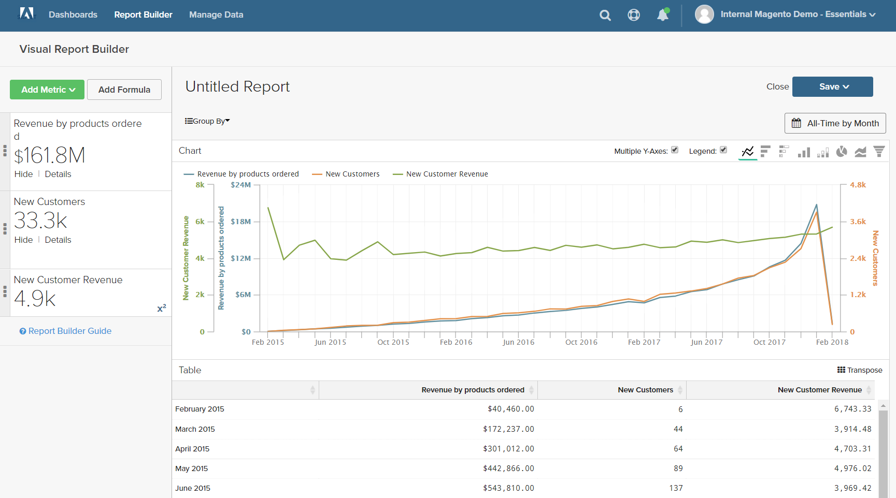

# Formler

En formel kombinerar flera mätvärden och matematisk logik för att besvara en fråga. Hur mycket av intäkterna per produkt under semestersäsongen genererades till exempel av nya kunder?

## Steg 1: Skapa den grundläggande rapporten

1. Välj `Report Builder` på menyn.

1. Klicka på **[!UICONTROL Add Metric]** och välj det första måttet för rapporten.

   I det här exemplet används måttet `Revenue by products ordered`.

1. Klicka på **[!UICONTROL Add Metric]** igen och välj det andra måttet för rapporten.

   I det här exemplet används måttet `New Customers`.

1. Klicka på **[!UICONTROL Details]** i sidofältet för att visa information om varje mätvärde.

   

1. Klicka på namnet på varje mätvärde i sidofältet för att öppna inställningssidan på en ny webbläsarflik. Bläddra nedåt för att se alla komponenter i måttet, inklusive måttfrågan, filtret och dimensionerna.

   

1. Om du vill återgå till rapporten klickar du på fliken för föregående webbläsare.

1. Håll markören över ett fåtal datapunkter på varje rad för att se hur mycket varje mätvärde har.

## Steg 2: Lägg till en formel

1. Klicka på **[!UICONTROL Add Formula]** högst upp i sidlisten.

   Formelrutan visar mätvärdena som tillgängliga indata `A` och `B`, och innehåller en indataruta där du kan ange formeln.

   Gör följande:

   * Ange `A/B` i indatarutan `Enter your Formula`.

     Detta dividerar intäkterna efter beställda produkter med antalet nya kunder.

   * Ange `Select format` till `123Number`.

   * Ersätt `Untitled` med ett namn för formeln i sidlisten.

   

1. Klicka på **[!UICONTROL Apply]** när du är klar.

   Rapporten har nu en ny rad för formeln `New Customer Revenue` och sidlisten visar det totala intäktsbeloppet som genererats av nya kunder.

   

## Steg 3: Lägg till ett datumintervall

1. Klicka på **[!UICONTROL Date Range]** i det övre högra hörnet.

1. Gör följande på fliken `Fixed Date Range`:

   * Välj datumintervall i kalendrarna.

     I det här exemplet är helgsäsongen från `November 1` till `December 31`.

   * Välj `Day` under `Select Time Interval`.

     

   * Klicka på **[!UICONTROL Apply]** när du är klar.

   Rapporten är nu begränsad till semestersäsongen, med en datapunkt för varje dag.

   

## Steg 4: Spara rapporten

I det här steget sparar du rapporten som ett diagram och som en tabell.

1. Klicka på `Untitled Report` överst på sidan och ange en beskrivande titel. I det här exemplet är rapporttiteln `2017 Holiday Sales`.

   Gör sedan följande:

   * Klicka på **[!UICONTROL Save]** i det övre högra hörnet.

   * Acceptera standardinställningen `Chart` för `Type`.

   * Välj `Dashboard` där rapporten ska vara tillgänglig.

   * Klicka på **[!UICONTROL Save to Dashboard]**.

1. Klicka på rapporttiteln och ändra namnet. I det här exemplet har rapporttiteln ändrats till `2017 Holiday Sales Data`.

   Gör sedan följande:

   * Klicka på **[!UICONTROL Save a Copy]** i det övre högra hörnet.

   * Ange `Type` till `Table`.

   * Välj `Dashboard` där rapporten ska vara tillgänglig.

   * Klicka på **[!UICONTROL Save a Copy to Dashboard]**.

1. Gör något av följande om du vill visa rapporterna på kontrollpanelen:

   * Klicka på **[!UICONTROL Go to Dashboard]** i meddelandet längst upp på sidan.

   * Välj **[!UICONTROL Dashboards]** på menyn. Klicka på namnet på den aktuella instrumentpanelen för att visa listan. Klicka sedan på namnet på kontrollpanelen där rapporten sparades.
