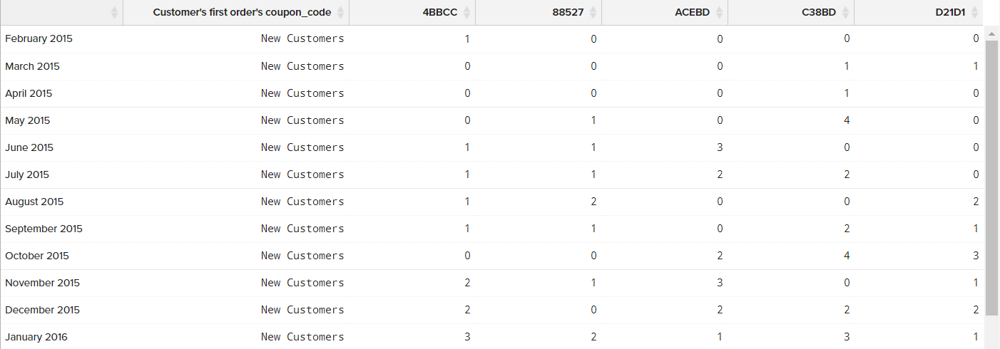

# `Visual Report Builder`

`Visual Report Builder` gör det enkelt att skapa snabba rapporter baserat på fördefinierade mätvärden. Varje mätvärde innehåller en fråga som definierar rapportens datauppsättning.

I följande exempel visas hur du skapar en enkel rapport, grupperar data efter ytterligare en dimension, anger datum och tidsintervall, ändrar diagramtyp och sparar rapporten på en kontrollpanel.

## Så här skapar du en enkel rapport:

1. I [!DNL MBI] meny, klicka **[!UICONTROL Report Builder]**.

1. Under `Visual Report Builder`, klicka **[!UICONTROL Create Report]** och gör följande:

   * Klicka **[!UICONTROL Add Metric]**.

      De tillgängliga måtten kan listas i bokstavsordning eller efter tabell.

      

   * Välj [mått](../../data-user/reports/ess-manage-data-metrics.md) som beskriver den uppsättning data som du vill använda för rapporten.

      The `New Customers` Det mått som används i det här exemplet räknar alla kunder och sorterar listan efter det datum då kunden registrerade sig för ett konto. Den inledande rapporten innehåller ett enkelt linjediagram följt av datatabellen.

      Sammanfattningen till vänster visar namnet på det aktuella måttet, följt av resultatet av eventuella beräkningar av kolumndata som har angetts i måttet. I det här exemplet visar sammanfattningen det totala antalet kunder.

      

1. Håll markören över varje datapunkt på raden i diagrammet. Varje datapunkt visar det totala antalet nya kunder som registrerat sig under den månaden.

1. Följ de här instruktionerna för att gruppera data, ändra datumintervall och diagramtyp.

   **`Group By`**

   The `Group By` kan du lägga till flera dimensioner per grupp eller segment. Dimensioner är kolumner i tabellen som kan användas för att gruppera data.

   * Välj en av de tillgängliga dimensionerna i listan över `Group By` alternativ.

      I det här exemplet hittade systemet fem kupongkoder som kunderna använde när de beställde för första gången.

      

      The `Group By` innehåller en detaljerad lista över varje kupong som används av kunderna. De kuponger som användes för att göra den initiala ordern är markerade med en kryssruta. Diagrammet har nu flera färgade rader som representerar varje kupong som användes för en första order. Förklaringen färgkodas för att motsvara varje datarad.

   * Klicka **[!UICONTROL Apply]** om du vill stänga Grupp efter detaljer.

      

   * Håll muspekaren över ett fåtal datapunkter på varje rad för att se hur många kunder under månaden som använde kupongen när de gjorde sin första beställning.

   * Datatabellen har nu en tilläggsdimension, med en kolumn för varje månad och en rad för varje kupongkod.

      

   * Klicka på Transponera () i tabellens övre högra hörn om du vill ändra orienteringen på data.

      Dataaxeln vänds och tabellen har nu en kolumn för varje kupongkod och en rad för varje månad. Den här orienteringen kan vara lättare att läsa.

      
   **`Date Range`**

   The `Date Range` -kontrollen visar de aktuella inställningarna för datumintervall och tidsintervall och är placerad precis ovanför diagrammet till höger.

   * Klicka på `Date Range` control, som i det här exemplet är inställt på `All-Time by Month`.

      

   * Gör följande ändringar:

      * Om du vill zooma in för en närmare vy ändrar du datumintervallet till `Last Full Quarter`.
      * Under `Select Time Interval`, välja `Week`.
      * När du är klar klickar du på **[!UICONTROL Save]**.

      Rapporten innehåller nu endast data för det sista kvartalet, per vecka.

      
   **Diagramtyp**

   * Klicka på kontrollerna i det övre högra hörnet för att hitta det bästa diagrammet för data.

      Vissa diagramtyper är inte kompatibla med flerdimensionella data.

      |  |  |
      |-----|-----|
      |  | Linjediagram |
      |  | Vågrätt streck |
      |  | Vågrät staplad liggande stapel |
      |  | Lodrätt streck |
      |  | Lodrät staplad liggande stapel |
      |  | Cirkel |
      |  | Yta |
      |  | Tratt |

      {style=&quot;table-layout:auto&quot;}

1. Ge rapporten en `title`, ersätt `Untitled Report` text högst upp på sidan med en beskrivande rubrik.

1. Klicka på i det övre högra hörnet **[!UICONTROL Save]** och gör följande:

   * För `Type`, acceptera standardinställningen, `Chart`.

   * Välj `Dashboard` om rapporten ska vara tillgänglig.

   * Klicka **[!UICONTROL Save to Dashboard]**.

      

1. Gör något av följande om du vill visa diagrammet på en kontrollpanel:

   * Klicka **[!UICONTROL Go to Dashboard]** i meddelandet längst upp på sidan.

   * Välj `Dashboards` och klicka på namnet på den aktuella instrumentpanelen för att visa listan. Klicka sedan på namnet på kontrollpanelen där rapporten sparades.

      
