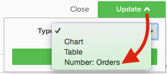
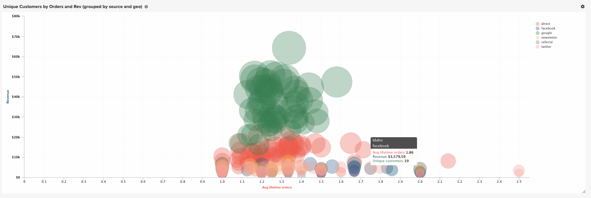

# Visualiseringsalternativ

Att välja rätt visualisering för en viss datauppsättning är en viktig del av analysprocessen. Alla datauppsättningar har en historia att berätta, men effekten av den berättelsen framhävs av dess visuella påverkan och läsbarhet.

[!DNL Commerce Intelligence] [!DNL Visual Report Builder] erbjuder 12 olika visualiseringsalternativ, vart och ett med sina egna fördelar och användningsfall. I det här avsnittet beskrivs de olika visualiseringsalternativen i [!DNL Commerce Intelligence], inklusive obligatoriska rapportkonfigurationer när det är tillämpligt, och ett exempel på ett användningsexempel. Följande visualiseringar är tillgängliga i [!DNL Commerce Intelligence]:

* `Scalar`
* `Table`
* `Line`
* `Bar`
* `Stacked Bar`
* `Column`
* `Stacked Column`
* `Pie`
* `Area`
* `Funnel`
* `Scatter plot`
* `Bubble`
* `Heatmap`

## `Scalar`

`Scalar` rapporter visas som ett numeriskt värde. Oftast används detta för att visa&quot;heltidsvärdet&quot; för ett nyckeltal som intäkt eller order, eller för att jämföra intäkt hittills jämfört med budget med två separata skalära rapporter. I exemplet nedan visar detta helt enkelt det totala antalet order för det angivna rapporteringsintervallet:

Om du vill spara en rapport som en skalär konfigurerar du dina filter och tidsinställningar och klickar sedan på **[!UICONTROL Save]** eller **[!UICONTROL Update]** i det övre högra avsnittet av rapporten. Välj namnet Nummer: Mått i listrutan `Type` om du vill spara rapporten som det värde som visas på den vänstra sidan av fältet.

**Krav**:

* `Time interval`: `None`
* `Group by`: `None`
* Endast ett mått

## `Table`

Som namnet antyder är `table` rapporter bra för att visa tabelldetaljer. När det finns ett behov av att visa många grupper utifrån värden eller mätvärden i en enda rapport är en tabell ofta det bästa sättet att gå. Nedan finns en tabell med&quot;Kundinformation&quot; som visar order och intäkter grupperade efter kundens e-postadress:

På liknande sätt som med skalära rapporter kan du spara en rapport som en tabell genom att klicka på **[!UICONTROL Save]** eller **[!UICONTROL Update]** i rapportverktyget och sedan välja alternativet Tabell i listrutan `Type`.

**Krav:**

* Även om det inte finns några krav på rapportkonfiguration är det viktigt att tänka på att tabeller är begränsade till 3 500 rader. Om din datauppsättning innehåller fler än 3 500 rader måste du antingen filtrera resultaten för att begränsa omfattningen eller exportera resultaten till `.csv` eller `Excel` för att se hela datauppsättningen.

## `Line`

`Line` diagram är det perfekta valet för att jämföra prestanda för liknande metriska kohorter. Analysera till exempel intäkterna för två regioner under samma tidsperiod eller jämföra årstillväxt för fullgjorda order enligt nedan:

Varje mätvärde och formel som läggs till i rapporten representeras av en egen rad. När du jämför mätvärden med liknande enheter och skalor ska du inte glömma bort att avmarkera kryssrutan för `Multiple Y-Axes` om du vill visa alla mätvärden på samma skala.

Om du vill spara en rapport som ett linjediagram justerar du rapporten `Type` till `Chart` och väljer lämplig visualisering i rapportverktyget enligt nedan:

**Krav:**

* Ingen

## `Bar`

`Bar` diagram visar dina data som en serie vågräta staplar och är bäst för att visa övergripande prestanda för ett begränsat antal mätvärden eller gruppera efter värden. Ett stapeldiagram kan till exempel användas för att jämföra intäkten per butik:

Alla distinkta mått, grupperade efter och tidsintervallkombinationer visas som en egen stapel. Om du har två mätvärden med en `group by`, som innehåller tre distinkta `group by`-värden, visar rapporten sex separata fält.

Om du vill spara en rapport som ett stapeldiagram justerar du rapporten `Type` till `Chart` och väljer alternativet `Bar` enligt nedan:

**Krav:**

* Ingen

## `Stacked Bar`

`Stacked bar` diagram liknar sina stapeldiagram, med möjlighet att visa den proportionella uppdelningen av varje stapel. Oftast skapas staplade stapeldiagram med två eller flera mätvärden och en grupp per, så att varje stapel representerar en unik grupp efter värde som delas mellan de olika måtten.

Rapporten nedan innehåller till exempel två identiska intäktsmått med en filtrerad order för första gången och den andra filtrerad för upprepade order. När du har grupperat efter butik kan du se både det totala intäktsbidraget för varje butik (som representeras av den totala bredden på stapeln) och första gången, jämfört med en upprepad intäktsfördelning för varje butik.

Kontrollera att rutan `Multiple Y-Axes` inte är markerad när du skapar en rapport som den ovan.

Om du vill spara en rapport som ett staplat stapeldiagram justerar du rapporten `Type` till `Chart` och väljer alternativet för staplade fält i rapportverktyget:

**Krav:**

* Ingen

## `Column`

`Column` diagram representerar varje datapunkt som en lodrät kolumn och är bättre för att visa tidsstyrda data än för den vågräta stapeldiagramvisningen. Varje unik mätmetod och gruppera efter kombination representeras i en egen serie med staplar. En kolumnrapport är bäst för rapporter med tre eller färre värden eller ett mått med en enda grupp genom att innehålla 1-3 grupper med värden.

I exemplet nedan ser du två intäktsmått, en filtrerad för första gången och den andra för upprepade intäkter, som trendar över tid per månad:

Du kan spara kolumnrapporter genom att ändra rapporten `Type` till `Chart` och välja alternativet för kolumnvisualisering:

**Krav:**

* Ingen

## `Stacked Column`

`Stacked column` rapporter är nästan identiska med kolumndiagram, förutom att liknande kolumner staplas ovanpå varandra så att den totala höjden representerar summan av värdena. Staplade kolumner är ännu bättre visualiserade med ett begränsat antal mätvärden eller gruppbyte.

Om du använder samma rapportkonfiguration som beskrivs i avsnittet `Column` ovan skulle en rapport med två intäktsmått (filtrerad för första gången och upprepad) se ut som nedan med en staplad kolumnvisualisering:

Återigen är det viktigt att kryssrutan `Multiple Y-Axes` är avmarkerad när flera mätvärden visas med den staplade kolumnvisualiseringen.

Om du vill spara en rapport som en staplad kolumn anger du rapporten `Type` till `Chart` och väljer alternativet `stacked column`:

**Krav:**

* Ingen

## `Pie`

`Pie` diagram är bäst för att visa ett enskilt mått med en eller flera gruppbyte, eller flera mått utan gruppbyte. I båda fallen måste tidsintervallet anges till ingen för att data ska kunna visas i ett cirkeldiagram. I exemplet nedan är ett enskilt ordermått en grupp efter butiksnamn för att visa uppdelningen av order efter butik:

Om du vill spara en rapport som ett cirkeldiagram anger du rapporten `Type` till `Chart` och väljer alternativet `pie` enligt nedan:

**Krav:**

* `Time interval`: `None`
* Något av följande:
   * `Single metric with one or more group bys`
   * `Multiple metrics with no group bys`

## `Area`

`Area` diagram är nästan identiska med staplade stapeldiagram, förutom att kolumnerna visas kontinuerligt. Precis som staplade kolumner är ytdiagram bäst att visualisera med ett begränsat antal gruppbyte eller mätvärden.

I rapporten nedan visas, med samma exempel från avsnittet `stacked column`, första gången jämfört med upprepade intäkter med ytdiagramsvisualisering:

Om du vill spara en rapport som ett ytdiagram justerar du `Type` till `Chart` och väljer områdesalternativet:

**Krav:**

* Ingen

## `Funnel`

`Funnel` diagram är perfekta för att visualisera konvertering i en förväntad händelsesekvens. Ett par exempel är att analysera de potentiella intäkterna i säljprocessen från lead till sluten affär eller mäta nedgången i kunder mellan första och andra ordern, andra och tredje ordern osv. Ett exempel på det senare visas nedan:

I en trattrapport återspeglas det relativa värdet för ett visst steg i tratten av stegets höjd. Rapportkonfigurationen avgör i vilken ordning stegen visas. Det finns två sätt att konfigurera en trattrapport:

* `Single metric with one group by`: - Stegen ordnas efter inställningen &quot;Visa överkant/underkant&quot; för gruppen efter. Som standard visas trattsteg i ordning från det största till det minsta värdet, men du kan också sortera dem i bokstavsordning efter gruppens namn.

* `Multiple metrics with no group by`: - Stegen i den ordning som måtten läggs till i rapporten.

Om du vill spara en rapport som ett trattdiagram justerar du rapporten `Type` till `Chart` och väljer lämplig visualisering i rapportverktyget.

**Krav:**

* `Time interval`: `None`
* Något av följande:
   * `Single metric with one group by`
   * `Multiple metrics with no group by`

## `Scatter plot`

En `scatter plot` används för att undersöka en metrisk relation med två olika variabler så att du enkelt kan identifiera relationer och avvikelser. Den här typen av visualisering används bäst med numeriska dimensioner - prova den med ordermåttet och dimensionerna `Customer's lifetime number of coupons` och `Customer's lifetime revenue` för att se hur kuponganvändningen är relaterad till intäkten. Du kan välja mellan en punktdiagram med och utan trendlinje:

**Krav:**

Alternativ 1:

* Två `metrics`
* En `group by`
* `Time interval`: `None`

Alternativ 2:

* Två `metrics`
* Ingen `group by`
* Ange `time interval`

## `Bubble` diagram

Ett `bubble`-diagram kan visa upp till fyra dimensioner av data där `X`- och `Y`-axlarna anger placeringen av bubblorna. `Z`-axeln är storleken på bubblorna, och genom att ta med två grupper kan du lägga till färg i bubblorna. Den här typen av visualisering används bäst när du vill rita upp flera datamängder i ett enda diagram.

I följande diagram visas antalet kunder (bubbelstorlek) grupperade efter en specifik anskaffningskälla (bubbelfärg) och tillstånd (olika bubblor i en viss färg), plottade mot total intäkt och genomsnittlig livstid.

Följande diagram visar antalet kunder (bubbelstorlek) grupperade efter anskaffningskälla (bubbelfärg) och tillstånd (olika bubblor i en viss färg), plottade mot genomsnittligt livstidsvärde och totala intäkter.

**Krav för bubbeldiagram i en serie:**

Alternativ 1

* Tre `metrics`
* En `group by`
* `Time interval`: `None`

Alternativ 2

* Tre `metrics`
* Ingen `group by`
* Ange `time interval`

**Krav för bubbeldiagram i flera serier:**

* Tre `metrics`
* Två `group by`
* `Time interval`: `None`

## `Heatmap`

Använd `heatmaps` för att visualisera aktiveringspunkter i dina data. En heatmap kan t.ex. visa var du regelbundet får högre volym. Genom att visualisera dessa data kan du justera lagernivåerna så att du kan tillgodose efterfrågan under dessa toppfönster.

Följande värmekarta visar order per veckodag per timma av dagen i aggregat, över flera veckor.

<!--{: width="650"}-->

**Krav:**

Alternativ 1

* En `metric`
* Två `group by`
* `Time interval`: `None`

Alternativ 2

* En `metric`
* En `group by`
* Ange `time interval`
