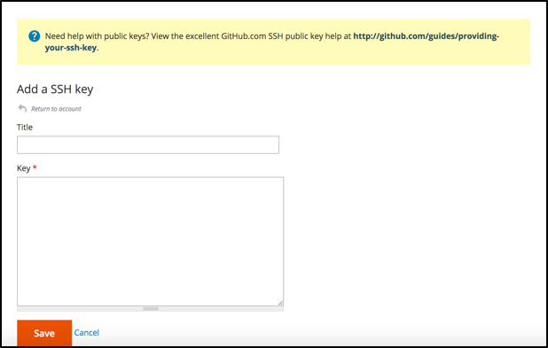

# Aktivera [!DNL MBI] Konto för `Cloud Starter` Prenumerationer

Aktivera [!DNL MBI] for `Cloud Starter` projekt, skapa först [!DNL MBI] skapa sedan ett `SSH` och sedan ansluta till din Commerce-databas. Se [aktivera lokala prenumerationer](../getting-started/onpremise-activation.md).

>[!NOTE]
>
>Hjälp med aktivering [!DNL MBI] for `Cloud Pro` ska du kontakta din Customer Success Manager eller kundens tekniska rådgivare.

1. Skapa [!DNL MBI] Konto.

   - Gå till [https://account.magento.com/customer/account/login](https://account.magento.com/customer/account/login)

   - Gå till **[!UICONTROL My Account** > **My [!DNL MBI] Instances]**.

   - Klicka **[!UICONTROL Create Instance]**. Om du inte ser den här knappen kontaktar du din Customer Success Manager eller kundens tekniska rådgivare.

   - Välj `Cloud Starter` prenumeration. Om du bara har en `cloud starter` den här prenumerationen väljs automatiskt.

   - Klicka **[!UICONTROL Continue]**.

   - Ange dina uppgifter för att skapa ditt konto.

   

   - Gå till din inkorg och verifiera din e-postadress.

   

   - Skapa ditt lösenord.

   

   - När du har skapat ditt konto kan du sedan lägga till användare till ditt nya konto. Nu kan tekniska administratörer läggas till för att utföra följande steg.

   

1. Ange information om din butik för att ange dina inställningar.

   

   Det finns viss information du behöver samla in innan du kan ansluta databasen för det tredje steget i startflödet. Du fyller i `Connect your database` sida i steg 9.

1. Skapa dedikerad [!DNL MBI] Användare.

   - Skapa en ny användare på [https://accounts.magento.com](https://accounts.magento.com).

   - _Varför en ny användare?_ [!DNL MBI] behöver en användare som har lagts till i projektet för att kontinuerligt hämta nya data som ska överföras till kontots [!DNL MBI] data warehouse. Den här användaren fungerar som den anslutningen. Om du lägger till den här användaren i projektet visas steg 4.

   - Orsaken till att du har en dedikerad [!DNL MBI] används för att förhindra att den tillagda användaren av misstag inaktiveras eller tas bort och för att stoppa [!DNL MBI] anslutning.

1. Lägg till den nyskapade användaren i projektets primära miljö som en `Contributor`.

   

1. Skaffa [!DNL MBI] `SSH` nycklar.

   - Gå till `Connect your database` sidan på [!DNL MBI] konfigurera användargränssnitt och rulla nedåt till `Encryption settings`.

   - För `Encryption Type` fält, välj `SSH Tunnel`.

   - I listrutan kan du kopiera och klistra in den [!DNL MBI] `Public Key`.

   

1. Lägg till dina nya [!DNL MBI] `Public key` till [!DNL MBI] som skapades i steg 5.

   - Gå till [https://accounts.magento.cloud/](https://accounts.magento.cloud/). Logga in med din kontoinloggningsinformation för den nya [!DNL MBI] har skapats. Gå sedan till `Account Settings` -fliken.

   - Bläddra nedåt på sidan och utöka listrutan för `SSH` nycklar. Klicka sedan på **[!UICONTROL Add a public key]**.

   

   - Lägg till [!DNL MBI] `SSH Public Key` ovanifrån.

   

1. Ange [!DNL MBI] MySQL-autentiseringsuppgifter.

   - Uppdatera dina `.magento/services.yaml`

   ```sql
   mysql:
       type: mysql:10.0
       disk: 2048
       configuration:
           schemas:
               - main
           endpoints:
               mysql:
                   default_schema: main
                   privileges:
                       main: admin
               mbi:
                   default_schema: main
                   privileges:
                       main: ro
   ```

   - Uppdatera dina `.magento.app.yaml`

   ```sql
           relationships:
               database: "mysql:mysql"
               mbi: "mysql:mbi"
               redis: "redis:redis"
   ```

1. Hämta information om hur du ansluter databasen till [!DNL MBI].

   Kör
   `echo $MAGENTO_CLOUD_RELATIONSHIPS | base64 --decode | json_pp`

   för att få information om hur du ansluter databasen.

   Du bör få information som liknar utdata nedan:

   ```json
           "mbi" : [
                 {
                    "scheme" : "mysql",
                    "rel" : "mbi",
                    "cluster" : "vfbfui4vmfez6-master-7rqtwti",
                    "query" : {
                       "is_master" : true
                    },
                    "ip" : "169.254.169.143",
                    "path" : "main",
                    "host" : "[!DNL MBI].internal",
                    "hostname" : "3m7xizydbomhnulyglx2ku4wpq.mysql.service._.magentosite.cloud",
                    "username" : "mbi",
                    "service" : "mysql",
                    "port" : 3306,
                    "password" : "[password]"
                 }
              ],
   ```

1. Anslut din Commerce Database

   

   - `Integration Name`: [Välj ett namn för integreringen.]

   - `Host`: `[!DNL MBI].internal`

   - `Port`: `3306`

   - `Username`: `mbi`

   - `Password`: [det indatatösenord som anges i utdata för steg 8.]

   - `Database Name`: `main`

   - `Table Prefixes`: [lämna tomt om det inte finns några tabellprefix]

1. Ange tidszonsinställningar.

   

   - `Database`: `Timezone: UTC`

   - `Desired Timezone`: [Välj den tidszon som du vill att dina data ska visas i.]

1. Hämta information om dina krypteringsinställningar.

   - Projektgränssnittet innehåller en `SSH` åtkomststräng. Strängen kan användas för att samla in information som behövs för `Remote Address` och `Username` när du konfigurerar `Encryption` inställningar. Använd `SSH Access` genom att klicka på åtkomstwebbplatsknappen på din Överordnad gren av ditt projektgränssnitt och hitta `User Name` och `Remote Address` enligt nedan.

   

   

1. Indatainformation för `Encryption` inställningar

   

   **Indata**

   - `Encryption Type`: `SSH Tunnel`

   - `Remote Address`: `ssh.us-3.magento.cloud`

   - `Username`: `vfbfui4vmfez6-master-7rqtwti--mymagento`

   - `Port`: `22`

1. Klicka **[!UICONTROL Save Integration]**.

1. Du har nu anslutit till [!DNL MBI] konto.

1. När du har anslutit [!DNL MBI] kontakta din Customer Success Manager för att koordinera nästa steg, till exempel konfigurera integreringar och andra konfigurationssteg, i din Commerce-databas.

1. När konfigurationen är klar kan du [logga in](../getting-started/sign-in.md) till [!DNL MBI] konto.
