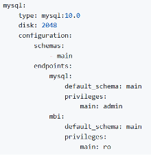

# Aktivera ditt [!DNL Commerce Intelligence]-konto för On-Premise- och Starter-prenumerationer

Om du vill aktivera [!DNL Commerce Intelligence] för lokala prenumerationer skapar du först ett [!DNL Commerce Intelligence]-konto, anger din inställningsinformation och ansluter sedan [!DNL Commerce Intelligence] till din [!DNL Commerce]-databas. <!-- For information about activation in `Cloud Starter` projects, see [Activating your [!DNL Commerce Intelligence] Account for `Cloud Starter` Subscriptions](../getting-started/cloud-activation.md).-->

## Skapa ditt [!DNL Commerce Intelligence]-konto

Om du vill skapa ett konto kontaktar du Adobe Account Team eller kundens tekniska rådgivare.

## Skapa ditt lösenord

När ditt konto har skapats kan du kontrollera din e-postadress för att få ett e-postmeddelande från [!DNL The Magento BI Team@rjmetrics.com]. Använd länken i e-postmeddelandet för att komma åt ditt [!DNL Commerce Intelligence]-konto och skapa ditt lösenord. Gå till din inkorg och verifiera din e-postadress.

[Kontakta support](https://experienceleague.adobe.com/docs/commerce-knowledge-base/kb/troubleshooting/miscellaneous/mbi-service-policies.html?lang=sv-SE) om du inte fått något e-postmeddelande.

## Ange dina butiksinställningar

Fyll i formuläret för lagringsinformation innan du konfigurerar databasanslutningen. Den här informationen krävs för att slutföra installationen av **[!UICONTROL Connect your Database]**.

## Lägg till [!DNL Commerce Intelligence] användare

När du har angett ditt lösenord och loggat in på [!DNL Commerce Intelligence] kan du lägga till andra användare i ditt [!DNL Commerce Intelligence]-konto. När du lägger till användare lägger du till administratörsanvändare med lämplig behörighet för att slutföra aktiveringsprocessen.

## Skapa en dedikerad [!DNL Commerce Intelligence]-användare i [!DNL Commerce]-administratören

Om du vill använda [!DNL Commerce Intelligence] måste du lägga till en permanent och dedikerad användare i [!DNL Commerce]-projektet. Den här dedikerade användaren fungerar som en permanent anslutning till [!DNL Commerce] som gör det möjligt att hämta och överföra nya data till kontots [!DNL Commerce Intelligence] Data Warehouse.

Om du konfigurerar en dedikerad [!DNL Commerce Intelligence]-användare försäkrar du dig om att kontot inte inaktiveras eller tas bort och därmed avbryts anslutningen till [!DNL Commerce Intelligence].

>[!NOTE]
>
>Adobe rekommenderar att du använder ett kontonamn som anger dess permanenta status (t.ex. ACI-dedikerad, ACI-database-connector).

När du har skapat den dedikerade användaren för [!DNL Commerce Intelligence] i Admin lägger du till samma användare i den primära miljön för [!DNL Commerce]-projektet med inställningen **[!UICONTROL Master]** för `Contributor`.

## Skaffa dina Commerce Intelligence SSH-nycklar

1. Bläddra nedåt och välj [!UICONTROL Connect your database] på sidan [!DNL Commerce Intelligence] för **[!UICONTROL Encryption settings]**-konfiguration.

1. För **krypteringstyp** väljer du `SSH Tunnel`.

1. Kopiera den offentliga nyckeln som anges i listrutan.

   

## Lägg till din offentliga nyckel i [!DNL Commerce Intelligence]

1. Logga in från [!DNL Commerce Admin] med inloggningsinformationen för den [!DNL Commerce Intelligence]-användare du just skapade.

1. Välj fliken **Kontoinställningar**.

1. Bläddra nedåt och utöka listrutan **[!UICONTROL SSH Keys]**. Välj sedan **[!UICONTROL Add a public key]**.

   

1. Klistra in den offentliga nyckeln som du kopierade i steget [!DNL Encryption Type] ovan.

   

## Ange autentiseringsuppgifter för [!DNL Commerce Intelligence] Essentials `MySQL`

1. Uppdatera din `.magento/services.yaml`.

   

1. Uppdatera din `.magento.app.yaml`.

   

## Hämta databasanslutningsinformation

Hämta databasanslutningsinformationen till databasen [!DNL Commerce] till [!DNL Commerce Intelligence]

1. Hämta dina uppgifter genom att köra följande.

   `echo $MAGENTO_CLOUD_RELATIONSHIPS | base64 --decode | json_pp`

1. Granska databasinformationen som ska se ut ungefär som i följande exempel.

   

## Anslut [!DNL Commerce Intelligence] till din [!DNL Commerce]-databas med en krypterad anslutning

>[!NOTE]
>
>Adobe rekommenderar att du använder en [`SSH tunnel`](../data-analyst/importing-data/integrations/mysql-via-ssh-tunnel.md)-tunnel för att skapa en databasanslutning. Om den här metoden inte är ett alternativ kan du ändå länka [!DNL Commerce Intelligence] till databasen med en [`direct connection`](../data-analyst/importing-data/integrations/mysql-via-a-direct-connection.md).

Ange din [!DNL Commerce Intelligence]-information på skärmen [!UICONTROL Connect your Magento Database].

**Indata:**

[!UICONTROL Integration Name]: [välj ett namn för din [!DNL Commerce Intelligence]-instans]

[!UICONTROL Host]: `mbi.internal`

[!UICONTROL Port]: `3306`

[!UICONTROL -användarnamn]: `mbi`

[!UICONTROL Password]: [indatalösenordet visas i föregående avsnitt]

[!UICONTROL Database Name]: `main`

[!UICONTROL Table Prefixes]: [lämna tomt om det inte finns några tabellprefix]

## Ange dina [!UICONTROL **tidszonsinställningar**]

**Indata:**

[!UICONTROL Database Timezone]: `UTC`

[!UICONTROL Desired Timezone]: [välj den tidszon som du vill att dina data ska visas för]

## Hämta information om krypteringsinställningarna

Projektgränssnittet tillhandahåller en SSH-åtkomststräng. Strängen kan användas för att samla in den information som krävs för [!UICONTROL **fjärradressen**] och [!UICONTROL **användarnamnet**]. Använd SSH-åtkomststrängen genom att markera åtkomstplatsknappen i huvudgrenen i projektgränssnittet. Leta sedan reda på din [!UICONTROL User Name] och [!UICONTROL Remote Address] så som visas nedan.

## Ange dina [!DNL Encryption]-inställningar

**Indata:**

[!UICONTROL Encryption Type]: `SSH Tunnel`

[!UICONTROL Remote Address]: `ssh.us-3.magento.cloud` [från föregående steg]

[!UICONTROL Username]: `vfbfui4vmfez6-master-7rqtwti—mymagento` [från föregående steg]

[!UICONTROL Port]: `22`

## Spara på integreringen.

När du är klar med konfigurationsstegen tillämpar du ändringarna genom att välja [!UICONTROL **Spara integrering**].

Du har nu anslutit din [!DNL Commerce]-databas till ditt [!DNL Commerce Intelligence]-konto.

>[!NOTE]
>
>Om du är [!DNL Adobe Commerce Intelligence Pro]-kund kontaktar du din Customer Success Manager eller kundens tekniska rådgivare för att koordinera nästa steg.

När du har slutfört konfigurationen [loggar du in](../getting-started/sign-in.md) på ditt [!DNL Commerce Intelligence]-konto.

<!---# Activate your [!DNL Commerce Intelligence] Account

To activate [!DNL Commerce Intelligence] for on-premise or `Cloud Pro` subscriptions, [contact support](https://experienceleague.adobe.com/docs/commerce-knowledge-base/kb/troubleshooting/miscellaneous/mbi-service-policies.html?lang=sv-SE).

>[!NOTE]
>
>Adobe no longer supports new `Cloud Starter` subscriptions.--->
