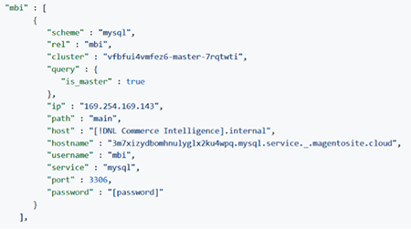

# Aktivera [!DNL Commerce Intelligence] Konto för On-Premise- och Starter-prenumerationer

Aktivera [!DNL Commerce Intelligence] för lokala prenumerationer måste du först skapa en [!DNL Commerce Intelligence] konto, ange din inställningsinformation och ansluta [!DNL Commerce Intelligence] till [!DNL Commerce] databas. <!-- For information about activation in `Cloud Starter` projects, see [Activating your [!DNL Commerce Intelligence] Account for `Cloud Starter` Subscriptions](../getting-started/cloud-activation.md).-->

## Skapa [!DNL Commerce Intelligence] konto

Om du vill skapa ett konto kontaktar du kontoteamet eller kundens tekniska rådgivare på Adobe.

## Skapa ditt lösenord

När ditt konto har skapats kan du kontrollera din e-postadress för att få ett e-postmeddelande från [!DNL The Magento BI Team@rjmetrics.com]. Använd länken i e-postmeddelandet för att komma åt [!DNL Commerce Intelligence] och skapa ditt lösenord. Gå till din inkorg och verifiera din e-postadress.

Om du inte har fått något e-postmeddelande [kontakta support](https://experienceleague.adobe.com/docs/commerce-knowledge-base/kb/troubleshooting/miscellaneous/mbi-service-policies.html?lang=en).

## Ange dina butiksinställningar

Fyll i formuläret för lagringsinformation innan du konfigurerar databasanslutningen. Den här informationen krävs för att slutföra **[!UICONTROL Connect your Database]** konfiguration.

## Lägg till [!DNL Commerce Intelligence] användare

När du har angett ditt lösenord och loggat in [!DNL Commerce Intelligence]kan du lägga till andra användare i [!DNL Commerce Intelligence] konto. När du lägger till användare lägger du till administratörsanvändare med lämplig behörighet för att slutföra aktiveringsprocessen.

## Skapa en dedikerad [!DNL Commerce Intelligence] användare i [!DNL Commerce] admin

Används [!DNL Commerce Intelligence]måste du lägga till en permanent och dedikerad användare i [!DNL Commerce] projekt. Den här dedikerade användaren fungerar som en permanent anslutning till [!DNL Commerce] som gör det möjligt att hämta och överföra nya data till kontots [!DNL Commerce Intelligence] Data Warehouse.

Konfigurera en dedikerad [!DNL Commerce Intelligence] användaren ser till att kontot inte inaktiveras eller tas bort och därmed stoppar [!DNL Commerce Intelligence] anslutning.

>[!NOTE]
>
>Adobe rekommenderar att du använder ett kontonamn som anger dess permanenta status (t.ex. ACI-dedikerad, ACI-database-connector).

När du har skapat en dedikerad användare för [!DNL Commerce Intelligence] i Admin lägger du till samma användare i den primära miljön i [!DNL Commerce] projekt med **[!UICONTROL Master]** inställning för `Contributor`.

## Hämta dina Commerce Intelligence SSH-nycklar

1. På [!UICONTROL Connect your database] sida för [!DNL Commerce Intelligence] konfigurera, rulla nedåt och välj **[!UICONTROL Encryption settings]**.

1. För **Krypteringstyp**, markera `SSH Tunnel`.

1. Kopiera den offentliga nyckeln som anges i listrutan.

   

## Lägg till din offentliga nyckel i [!DNL Commerce Intelligence]

1. Från [!DNL Commerce Admin], logga in med inloggningsinformationen för [!DNL Commerce Intelligence] användare som du just skapade.

1. Välj **Kontoinställningar** -fliken.

1. Bläddra nedåt och expandera **[!UICONTROL SSH Keys]** nedrullningsbar meny. Välj sedan **[!UICONTROL Add a public key]**.

   

1. Klistra in den offentliga nyckeln som du kopierade i [!DNL Encryption Type] steg ovanför.

   

## Ange [!DNL Commerce Intelligence] Grundläggande `MySQL` autentiseringsuppgifter

1. Uppdatera dina `.magento/services.yaml`.

   

1. Uppdatera dina `.magento.app.yaml`.

   

## Hämta databasanslutningsinformation

Hämta databasanslutningsinformationen till [!DNL Commerce] databas till [!DNL Commerce Intelligence]

1. Hämta dina uppgifter genom att köra följande.

   `echo $MAGENTO_CLOUD_RELATIONSHIPS | base64 --decode | json_pp`

1. Granska databasinformationen som ska se ut ungefär som i följande exempel.

   

## Anslut [!DNL Commerce Intelligence] till [!DNL Commerce] databas med krypterad anslutning

>[!NOTE]
>
>Adobe rekommenderar starkt att du använder en [`SSH tunnel`](../data-analyst/importing-data/integrations/mysql-via-ssh-tunnel.md) för att skapa databasanslutningen. Om den här metoden inte är ett alternativ kan du ändå länka [!DNL Commerce Intelligence] till databasen med en [`direct connection`](../data-analyst/importing-data/integrations/mysql-via-a-direct-connection.md).

Ange [!DNL Commerce Intelligence] information i [!UICONTROL Connect your Magento Database] skärm.

**Indata:**

[!UICONTROL Integration Name]: [ange ett namn för [!DNL Commerce Intelligence] instans]

[!UICONTROL Host]: `mbi.internal`

[!UICONTROL Port]: `3306`

[!UICONTROL-användarnamn]: `mbi`

[!UICONTROL Password]: [indatatösenord som visas i föregående avsnitt]

[!UICONTROL Database Name]: `main`

[!UICONTROL Table Prefixes]: [lämna tomt om det inte finns några tabellprefix]

## Ställ in [!UICONTROL **Tidszon**] inställningar

**Indata:**

[!UICONTROL Database Timezone]: `UTC`

[!UICONTROL Desired Timezone]: [välj den tidszon som dina data ska visas för]

## Hämta information om krypteringsinställningarna

Projektgränssnittet tillhandahåller en SSH-åtkomststräng. Strängen kan användas för att samla in den information som behövs för [!UICONTROL **Fjärradress**] och [!UICONTROL **Användarnamn**]. Använd SSH-åtkomststrängen genom att markera åtkomstplatsknappen i huvudgrenen i projektgränssnittet. Hitta sedan dina [!UICONTROL User Name] och [!UICONTROL Remote Address] enligt nedan.

## Ange dina [!DNL Encryption] inställningar

**Indata:**

[!UICONTROL Encryption Type]: `SSH Tunnel`

[!UICONTROL Remote Address]: `ssh.us-3.magento.cloud`  [från föregående steg]

[!UICONTROL Username]: `vfbfui4vmfez6-master-7rqtwti—mymagento`  [från föregående steg]

[!UICONTROL Port]: `22`

## Spara på integreringen.

När du är klar med konfigurationsstegen tillämpar du ändringarna genom att välja [!UICONTROL **Spara integrering**].

Du har nu anslutit din [!DNL Commerce] till din [!DNL Commerce Intelligence] konto.

>[!NOTE]
>
>Om du är [!DNL Adobe Commerce Intelligence Pro] kontakta kundens Customer Success Manager eller kundens tekniska rådgivare för att samordna nästa steg.

När du har slutfört konfigurationen [logga in](../getting-started/sign-in.md) till [!DNL Commerce Intelligence] konto.

<!---# Activate your [!DNL Commerce Intelligence] Account 

To activate [!DNL Commerce Intelligence] for on-premise or `Cloud Pro` subscriptions, [contact support](https://experienceleague.adobe.com/docs/commerce-knowledge-base/kb/troubleshooting/miscellaneous/mbi-service-policies.html).

>[!NOTE]
>
>Adobe no longer supports new `Cloud Starter` subscriptions.--->
