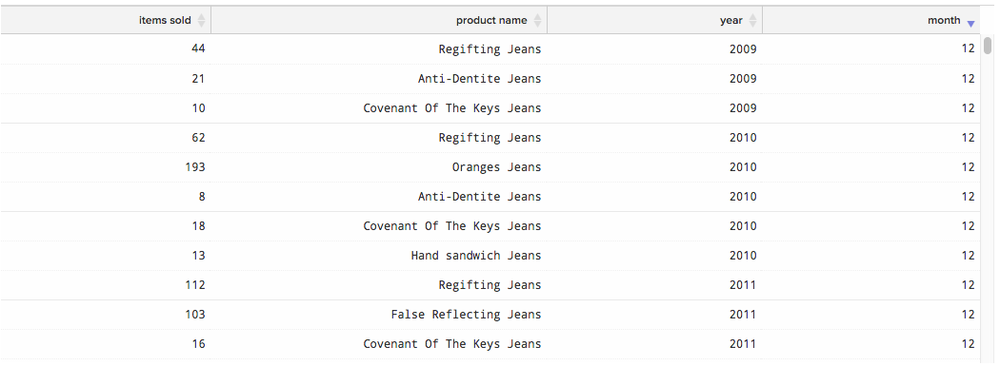

# Skapa visualiseringar från SQL-frågor

Målet med den här självstudiekursen är att bekanta dig med den terminologi som används i [!DNL SQL Report Builder] och ge dig en stabil grund för att skapa `SQL visualizations`.

[[!DNL SQL Report Builder]](../data-analyst/dev-reports/sql-rpt-bldr.md) är en rapportbyggare med alternativ: du kan köra en fråga enbart i syfte att hämta en datatabell, eller så kan du omvandla dessa resultat till en rapport. I den här självstudiekursen beskrivs hur du skapar en visualisering från en SQL-fråga.

## Terminologi

Innan du börjar den här självstudiekursen bör du läsa om följande terminologi som används i `SQL Report Builder`.

- `Series`: Kolumnen som du vill mäta kallas en serie i SQL Report Builder. Vanliga exempel är `revenue`, `items sold` och `marketing spend`. Minst en kolumn måste anges som `Series` för att en visualisering ska kunna skapas.

- `Category`: Kolumnen som du vill använda för att segmentera data kallas `Category` Det här är precis som funktionen `Group By` i [`Visual Report Builder`](../data-user/reports/ess-rpt-build-visual.md). Om du till exempel vill segmentera dina kunders livstidsintäkt efter deras anskaffningskälla, anges kolumnen som innehåller anskaffningskällan `Category`. Mer än en kolumn kan anges som `Category`.

>[!NOTE]
>
>Datum och tidsstämplar kan också användas som `Categories`. De är bara en annan datakolumn i frågan och måste formateras och ordnas som du vill i själva frågan.

- `Labels`: Dessa används som x-axeletiketter. När du analyserar datatrender över tid anges år- och månadskolumnerna som etiketter. Mer än en kolumn kan anges till Label.

## Steg 1: Skriv frågan

Tänk på följande:

- [!DNL SQL Report Builder] använder [`Redshift SQL`](https://docs.aws.amazon.com/redshift/latest/dg/c_redshift-and-postgres-sql.html).

- Om du skapar en rapport med en tidsserie måste du `ORDER BY` tidsstämpelkolumnerna. Detta garanterar att tidsstämplarna ritas i rätt ordning i rapporten.

- Funktionen `EXTRACT` är bra att använda för att analysera dag, vecka, månad eller år i tidsstämpeln. Detta är användbart när `time interval` som du vill använda i rapporten är `daily`, `weekly`, `monthly` eller `yearly`.

Öppna [!DNL SQL Report Builder] genom att klicka på **[!UICONTROL Report Builder** > **SQL Report Builder]** för att komma igång.

Ta som exempel den här frågan som returnerar det totala antalet artiklar som sålts per månad för varje produkt:

```sql
    SELECT SUM("qty") AS "Items Sold", "products's name" AS "product name",
    EXTRACT(year from "Order date") AS "year",
    EXTRACT(month from "Order date") AS "month"
    FROM "items"
    WHERE "products's name" LIKE '%Jeans'
    GROUP BY  "products's name", "year","month"
    ORDER BY "year" ASC,"month" ASC
    LIMIT 3500
```

Den här frågan returnerar den här resultattabellen:



## Steg 2: Skapa visualiseringen

Med dessa resultat *hur skapar du visualiseringen?* Klicka på fliken **[!UICONTROL Chart]** i rutan `Results` för att komma igång. Fliken `Chart settings` visas.

När en fråga körs för första gången kan rapporten se ogenomskinlig ut eftersom alla kolumner i frågan är plottade som en serie:


I det här exemplet vill du att det här ska vara ett linjediagram som utvecklas över tid. Använd följande inställningar för att skapa den:

- `Series`: Välj kolumnen `Items sold` som `Series` eftersom du vill mäta den. När du har definierat en `Series`-kolumn visas en enda rad i rapporten.

- `Category`: I det här exemplet vill du visa alla produkter som olika rader i rapporten. För att göra detta anger du `Product name` som `Category`.

- `Labels`: Använd kolumnerna `year` och `month` som etiketter på x-axeln för att kunna visa `Items Sold` som trender över tid.

>[!NOTE]
>
>Frågan måste innehålla en `ORDER BY`-sats på etiketterna om de är `date`/`time`-kolumner.

Nedan följer en kort titt på hur du skapade den här visualiseringen, från att köra frågan till att konfigurera rapporten:


## Steg 3: Välj en `Chart Type`

I det här exemplet används diagramtypen `Line`. Om du vill använda en annan `chart type` klickar du på ikonerna ovanför avsnittet med diagramalternativ för att ändra den:


## Steg 4: Spara visualiseringen

Om du vill använda den här rapporten igen ger du rapporten ett namn och klickar på **[!UICONTROL Save]** i det övre högra hörnet.

I listrutan väljer du `Chart` som `Type` och sedan en instrumentpanel att spara rapporten på.

## Radbrytning

Vill du ta ett steg längre? Ta en titt på de [bästa metoderna för frågeoptimering](../best-practices/optimizing-your-sql-queries.md).
