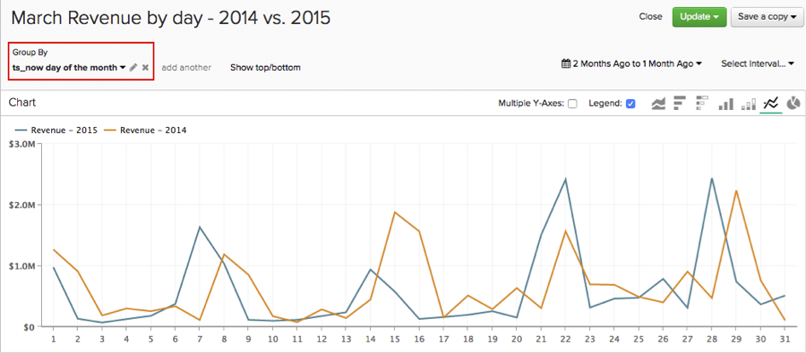

# Använd [!DNL Time] Alternativ i [!DNL Visual Report Builder]

En av funktionerna i [!DNL Visual Report Builder] är den globala `Time Range` och `Interval` inställningar. Med de här inställningarna kan du analysera data i rapporten under en viss tidsperiod.

För vissa analyser kan du dock behöva ta hänsyn till olika tidsintervall eller tidsintervall i samma rapport. Det är där `Time` Alternativ kommer in. Så här får du en bättre uppfattning om hur du använder `Time` i dina rapporter omfattar den här självstudiekursen följande användningsområden:

* [Analyserar mätvärden utan tidsstämplar](#notimestamp)
* [Ger ett mätvärde och ett oberoende tidsintervall](#independenttimeinterval)
* [Jämföra samma mått över olika tidsintervall](#difftimerange)

Om du vill följa med i några av exempelrapporterna som beskrivs i det här avsnittet öppnar du [[!DNL Visual Report Builder]](../data-user/reports/ess-rpt-build-visual.md) innan du fortsätter.

## Analyserar mätvärden utan tidsstämplar {#notimestamp}

Vissa mätvärden kan inte trendas över tid eftersom data inte samlas in eller lagras med en associerad tidsstämpel. En inventeringstabell innehåller till exempel ofta bara en rad för varje SKU. I så fall bör du [skapa måttet](../data-user/reports/ess-manage-data-metrics.md) utan att ange en tidsstämpel.

När du använder ett sådant mått i din rapportering, märker du att om du lägger till det här måttet i en rapport anges ett oberoende värde automatiskt `Time Interval` av `None` och `Time Range` av `Global`:

## Ger ett mätvärde och ett oberoende tidsintervall {#independenttimeinterval}

`Time` Med alternativen kan du skapa tidsbaserade 100 %-diagram för att identifiera vilken dag, vecka, månad eller år som har bidragit mest till värdet under ett visst tidsintervall. I det här avsnittet skapar du ett diagram som visar hur stor procentandel av intäkterna som genereras under varje kalendermånad på ett år.

Den här typen av rapport kan vara användbar om du vill jämföra intäkter som genereras år för år. Ett diagram för 2015 visar t.ex. att januari bidrog med 18 procent av årets intäkter och att ett diagram för 2016 bara visade 8 procent. Du kan börja undersöka vad som kan ha hänt.

1. Lägg till `Revenue` mätvärden till rapporten.
1. Klicka **[!UICONTROL Duplicate]** för att göra en kopia av måttet.
1. Klicka på den globala **[!UICONTROL Time Range]** alternativ, sedan **[!UICONTROL Moving Time Range]**. Ange detta till `Last Year`.
1. Klicka på den globala **[!UICONTROL Time Interval]** och ange `Monthly`.
1. Report Builder lägger automatiskt till en andra Y-axel för ett andra mått. Avmarkera `Multiple Y-Axes` box.
1. Sedan använder du en oberoende `Time Interval` till det första måttet. Klicka **[!UICONTROL Time Options]** (klockikon) till höger om `first Revenue metric`.
1. Klicka **[!UICONTROL Time Options]** i det utökade fönstret som visas ovanför rapporten.
1. Ange följande i listrutan:

   * `Time Interval`: ange detta till `None`.

   * `Time Range`: ange detta till `Last Year` genom att först klicka **[!UICONTROL Custom]** sedan **[!UICONTROL Moving Range]** och väljer `Last Year` alternativ.

   * Klicka **[!UICONTROL Apply]** om du vill spara intervall- och intervallinställningarna. Detta skapar ett mätvärde som beräknar den totala intäkten för föregående år. Därefter använder du det här måttet som nämnare i en formel.

   * Om du vill se procentandelen av intäkten för varje månad måste du lägga till en formel i rapporten. Klicka **[!UICONTROL Add Formula]**.

   * Retur `B/A` i formelfältet och välj `% Percent` i listrutan bredvid textfältet. I denna formel delas intäktsbeloppet från en viss månad förra året upp med det totala intäktsbeloppet förra året.

   * Klicka **[!UICONTROL Apply Changes]**.

   * Dölj båda indatavärdena och byt namn på formeln.

Nu kan du se hur effektfullt varje månad var förra året:

## Jämföra samma mått över olika tidsintervall {#difftimerange}

I det här exemplet används en anpassad dimension som kallas `Day number of the month`. Om du vill skapa den här rapporten och inte redan har den här dimensionen i Data warehouse, [kontakta support](https://experienceleague.adobe.com/docs/commerce-knowledge-base/kb/troubleshooting/miscellaneous/mbi-service-policies.html) om du behöver hjälp.

De två vanligaste exemplen i den här kategorin är (1) att jämföra tillväxtstatistik (intäkter år för år eller månad för månad) och (2) att bättre förstå de senaste trenderna inom lager- eller artikelförsäljning.

Titta på de dagliga intäkterna för föregående månad jämfört med samma månad från föregående år för att visa hur detta används. Säg att ni vill se på intäkterna för varje dag i januari 2016 och sedan jämföra dem med januari 2015, januari 2014 och så vidare - så visar den här rapporten oss det.

1. Lägg till `Revenue` mätvärden till rapporten.
1. Klicka **[!UICONTROL Duplicate]** för att göra en kopia av måttet.
1. Byt namn på det första måttet till `Items sold last 7 days` och det andra måttet till `Items sold last 28 days`.
1. Klicka **[!UICONTROL Time Range]** sedan **[!UICONTROL Moving Time Range]**. Ange detta till `Last Month`.
1. Klicka **[!UICONTROL Time Interval]** och ange `None`.
1. Klicka **[!UICONTROL Time Options]** (klockikon) intill den andra `Revenue` mätvärden.
1. Klicka **[!UICONTROL Time Options]** i det utökade fönstret som visas ovanför rapporten.
1. Ange följande i listrutan:

   * `Time Interval`: ange detta till `None`.

   * `Time Range`: ange detta till `From 14 Months Ago To 13 Months Ago` genom att först klicka **[!UICONTROL Custom]** sedan **[!UICONTROL Moving Range]**. Använd fälten och listrutorna högst upp på menyn för att ange intervallet. Med den här inställningen kan vi se intäkterna för föregående månad, men föregående år.
   Oroa dig inte om mätvärdena försvinner från rapporten. Om du ställer in ett oberoende tidsalternativ döljs mätvärdena automatiskt från rapporten. Om du vill visa den igen klickar du på **[!UICONTROL Show]** bredvid måtten.

   

   * Klicka **[!UICONTROL Apply]** om du vill spara intervall- och intervallinställningarna.

   * Sedan lägger du till din egen `Day number of the month` dimension genom att klicka **[!UICONTROL Group By]** och välja dimension. Detta returnerar dagsnumret för månaden i en order, t.ex. en beställning som gjorts den 2 mars returnerar `2`.

   * I `Group By` listruta, välja `Show All` och klicka **[!UICONTROL Apply]**. Detta skapar rapportens X-axelvärden:

   

   * Byt namn på måtten. I exemplet är det första måttet `Revenue - 2015` och den andra är `Revenue - 2014`.

En annan vanlig användning av `Time Options` skall bestämma leveransveckor. I synnerhet under semestersäsongen eller en särskild kampanjperiod kanske du vill överväga produkter som sålts under den sista veckan, månaden och föregående kampanjperiod för att fatta välgrundade beslut när det gäller inköp.

Kom ihåg att ange tidsintervall till vad du behöver när du skapar den här rapporten själv.

1. Lägg till `Items Sold` mätvärden till rapporten.
1. Klicka **[!UICONTROL Duplicate]** för att göra en kopia av måttet.
1. Byt namn på måtten. Du kan använda samma namn eller något liknande:
   1. Byt namn på det första måttet till `Items sold last 7 days`.
   1. Byt namn på det andra måttet till `Items sold last 28 days`.
1. På `Items sold last 7 days` , klicka på den globala **[!UICONTROL Time Range]** option then **[!UICONTROL Moving Time Range]**. I det här exemplet ställer du in det på `Last 7 Days`.
1. Klicka **[!UICONTROL Time Interval]** och ange `None`.
1. Sedan definierar du `Time Options` för `Items sold last 28 days` mätvärden. Klicka **[!UICONTROL Time Options]** (klockikon) till höger om `second Items sold` mätvärden.
1. Klicka **[!UICONTROL Time Options]** i det utökade fönstret som visas ovanför rapporten.
1. Ange följande i listrutan:

   * `Time Interval`: ange detta till `None`.
   * `Time Range`: ange detta till `From 29 days to 1 day ago` genom att först klicka **[!UICONTROL Custom]** sedan **[!UICONTROL Moving Range]**. Använd fälten och listrutorna högst upp på menyn för att ange intervallet.
   * Klicka **[!UICONTROL Apply]** om du vill spara intervall- och intervallinställningarna.
   * Duplicera `Items sold last 28 days` och öppna de nya måtten `Time Options`. Ange följande alternativ:

      * `Time Interval`: lämna det här som `None`.
      * `Time Range`: ändra detta till det datumintervall som är anpassat till kampanjen du är intresserad av genom att klicka på **[!UICONTROL Specific Date Range]** och ange sedan lämpliga datum.
      * Ändra namn på måttet `Items sold during last promotion` eller något liknande.
      * Lägg till `Units on hand` mätvärden.
      * Därefter måste du lägga till de beräkningar som visar de aktuella veckorna, med tanke på försäljningstrender, för tidsperioderna (`last 7 days`, `last 28 days`och `last promo` punkt) som du tar med i rapporten. Du måste göra detta en gång för varje tidsperiod.

Om du vill skapa formlerna klickar du på **[!UICONTROL Add Formula]**. Ange formeln nedan och klicka på **[!UICONTROL Apply Changes]** när du är klar. Upprepa detta för var och en av de tre tidsperioderna:

* För `last 7 days time period`, ange `D / A` i `Formula` fält.
* För `last 28 days time period`, ange `D / (B/4)` i `Formula` fält.

   >[!NOTE]
   >
   >Det är viktigt att normalisera de valda tidsintervallen här. Bryt 28 dagar i fyra veckor i det här exemplet. Du kan behöva använda en annan logik för formeln.

* För `last promo period`, ange `D / C` i `Formula` fält.

   

* Skräddarsy rapporten genom att dölja mätvärdena och lägga till en `SKU` eller en liknande dimension till rapporten som `Group By`.

Det här exemplet visar att nuvarande lagernivåer var väl placerade för en produktövergripande 14-dagarsförsäljning. Om man lägger till en jämförbar kampanjperiod behöver företaget dock göra vissa ändringar, antingen genom att beställa mer lager och bara befordra artiklar med tillräckligt många enheter i lager.

Eftersom kunderna beter sig olika över tid kan ni förvänta er att olika data ska visas vid analyser. Genom att ställa in anpassade tidsalternativ kan du snabbt skapa komplexa analyser, vilket möjliggör datadrivna beslut som tar hänsyn till historiska trender.

